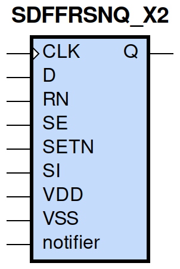
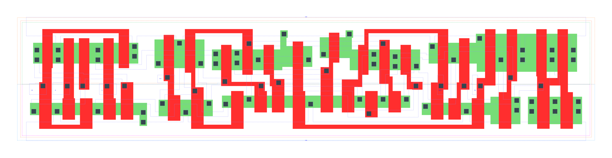

====================================
gf180mcu_fd_sc_mcu9t5v0__sdffrsnq_x2
====================================

**gf180mcu_fd_sc_mcu9t5v0__sdffrsnq_x2 symbol**

**gf180mcu_fd_sc_mcu9t5v0__sdffrsnq_x2 schematic**

.. image:: sc9_sch/SDFFRSNQ_X2_sch.png
    :height: 250px
    :width: 450 px
    :align: center
    :alt: gf180mcu_fd_sc_mcu9t5v0__sdffrsnq_x2 schematic

**gf180mcu_fd_sc_mcu9t5v0__sdffrsnq_x2 layout**

.. include:: images.rst
| SDFFRSNQ_X2 is a positive edge triggered scan D-type flip flop with active low reset and 2X drive strength

|
| Attributes

============= =======================
**Attribute** **Value**
area          135.475200 µm\ :sup:`2`
============= =======================

|

TRUTH TABLE

===== ==== == == = === ======
Input                  Output
RN    SETN SE SI D CLK Q
H     H    L  X  L ↑   L
H     H    L  X  H ↑   H
H     H    H  L  X ↑   L
H     H    H  H  X ↑   H
H     L    X  X  X X   H
L     H    X  X  X X   L
L     L    X  X  X X   L
===== ==== == == = === ======

|
| FUNCTIONAL SCHEMATIC
| |image638|
| CONSTRAINTS

================== =============== ============= ============
**Constraint Pin** **Related Pin** **setup(ns)** **hold(ns)**
SE(LH)             CLK(LH)         0.4980        -0.1890
SE(LH)             CLK(LH)         0.6980        -0.0970
SE(HL)             CLK(LH)         0.5780        -0.0630
SE(HL)             CLK(LH)         0.5730        -0.2920
SI(HL)             CLK(LH)         0.6640        -0.0970
SI(HL)             CLK(LH)         0.6700        -0.0630
SI(LH)             CLK(LH)         0.5440        -0.2350
SI(LH)             CLK(LH)         0.5320        -0.2350
D(HL)              CLK(LH)         0.5670        -0.0460
D(HL)              CLK(LH)         0.5670        -0.0460
D(LH)              CLK(LH)         0.4690        -0.1830
D(LH)              CLK(LH)         0.4690        -0.1830
SETN(LH)           RN(LH)          -0.0290       0.1090
SETN(LH)           RN(LH)          -0.0290       0.1090
SETN(LH)           RN(LH)          -0.0290       0.1090
SETN(LH)           RN(LH)          -0.0290       0.1090
SETN(LH)           RN(LH)          -0.0400       0.1030
SETN(LH)           RN(LH)          -0.0400       0.1030
SETN(LH)           RN(LH)          -0.0400       0.1030
SETN(LH)           RN(LH)          -0.0400       0.1030
SETN(LH)           RN(LH)          -0.0290       0.1090
SETN(LH)           RN(LH)          -0.0290       0.1090
SETN(LH)           RN(LH)          -0.0290       0.1090
SETN(LH)           RN(LH)          -0.0400       0.1030
SETN(LH)           RN(LH)          -0.0400       0.1030
SETN(LH)           RN(LH)          -0.0400       0.1030
SETN(LH)           RN(LH)          -0.0400       0.1030
SETN(LH)           RN(LH)          -0.0290       0.1090
RN(LH)             SETN(LH)        0.1090        -0.0290
RN(LH)             SETN(LH)        0.1090        -0.0290
RN(LH)             SETN(LH)        0.1090        -0.0290
RN(LH)             SETN(LH)        0.1090        -0.0290
RN(LH)             SETN(LH)        0.1030        -0.0400
RN(LH)             SETN(LH)        0.1030        -0.0400
RN(LH)             SETN(LH)        0.1030        -0.0400
RN(LH)             SETN(LH)        0.1030        -0.0400
RN(LH)             SETN(LH)        0.1090        -0.0290
RN(LH)             SETN(LH)        0.1090        -0.0290
RN(LH)             SETN(LH)        0.1090        -0.0290
RN(LH)             SETN(LH)        0.1030        -0.0400
RN(LH)             SETN(LH)        0.1030        -0.0400
RN(LH)             SETN(LH)        0.1030        -0.0400
RN(LH)             SETN(LH)        0.1030        -0.0400
RN(LH)             SETN(LH)        0.1090        -0.0290
================== =============== ============= ============

|

================== =============== ================ ===============
**Constraint Pin** **Related Pin** **recovery(ns)** **removal(ns)**
SETN(LH)           CLK(LH)         0.0290           0.2120
SETN(LH)           CLK(LH)         0.0290           0.2120
SETN(LH)           CLK(LH)         0.0290           0.2120
SETN(LH)           CLK(LH)         0.0290           0.2120
RN(LH)             CLK(LH)         -0.2000          0.3430
RN(LH)             CLK(LH)         -0.2000          0.3440
RN(LH)             CLK(LH)         -0.2000          0.3430
RN(LH)             CLK(LH)         -0.2000          0.3430
================== =============== ================ ===============

|

================== =============== ===========================
**Constraint Pin** **Related Pin** **Minimum Pulse Width(ns)**
CLK(HLH)           CLK(HL)         0.6870
CLK(HLH)           CLK(HL)         0.7170
CLK(HLH)           CLK(HL)         0.6870
CLK(HLH)           CLK(HL)         0.6080
CLK(HLH)           CLK(HL)         0.5400
CLK(HLH)           CLK(HL)         0.7780
CLK(HLH)           CLK(HL)         0.5400
CLK(HLH)           CLK(HL)         0.5770
CLK(LHL)           CLK(LH)         0.4070
CLK(LHL)           CLK(LH)         0.4070
CLK(LHL)           CLK(LH)         0.4070
CLK(LHL)           CLK(LH)         0.4370
CLK(LHL)           CLK(LH)         0.4370
CLK(LHL)           CLK(LH)         0.4070
CLK(LHL)           CLK(LH)         0.4370
CLK(LHL)           CLK(LH)         0.4370
SETN(HLH)          SETN(HL)        0.4070
SETN(HLH)          SETN(HL)        0.4070
SETN(HLH)          SETN(HL)        0.4070
SETN(HLH)          SETN(HL)        0.4070
SETN(HLH)          SETN(HL)        0.4170
SETN(HLH)          SETN(HL)        0.4170
SETN(HLH)          SETN(HL)        0.4170
SETN(HLH)          SETN(HL)        0.4170
SETN(HLH)          SETN(HL)        0.4070
SETN(HLH)          SETN(HL)        0.4070
SETN(HLH)          SETN(HL)        0.4070
SETN(HLH)          SETN(HL)        0.4170
SETN(HLH)          SETN(HL)        0.4170
SETN(HLH)          SETN(HL)        0.4170
SETN(HLH)          SETN(HL)        0.4170
SETN(HLH)          SETN(HL)        0.4070
RN(HLH)            RN(HL)          0.2710
RN(HLH)            RN(HL)          0.2710
RN(HLH)            RN(HL)          0.2710
RN(HLH)            RN(HL)          0.2710
RN(HLH)            RN(HL)          0.3980
RN(HLH)            RN(HL)          0.3980
RN(HLH)            RN(HL)          0.3980
RN(HLH)            RN(HL)          0.3980
RN(HLH)            RN(HL)          0.2710
RN(HLH)            RN(HL)          0.2710
RN(HLH)            RN(HL)          0.2710
RN(HLH)            RN(HL)          0.3980
RN(HLH)            RN(HL)          0.3980
RN(HLH)            RN(HL)          0.3980
RN(HLH)            RN(HL)          0.3980
RN(HLH)            RN(HL)          0.2710
================== =============== ===========================

|
| PIN CAPACITANCE (pf)

======= ======== ====================
**Pin** **Type** **Capacitance (pf)**
SE      input    0.0084
SI      input    0.0040
D       input    0.0040
CLK     input    0.0050
SETN    input    0.0084
RN      input    0.0102
======= ======== ====================

|
| DELAY AND OUTPUT TRANSITION TIME corresponding to min slew and load

+---------------+------------+-----------------------+--------------+-------------------+----------------+---------------+
| **Input Pin** | **Output** | **When Condition**    | **Tin (ns)** | **Out Load (pf)** | **Delay (ns)** | **Tout (ns)** |
+---------------+------------+-----------------------+--------------+-------------------+----------------+---------------+
| CLK(LH)       | Q(HL)      | !D&RN&!SE&SETN&!SI    | 0.0100       | 0.0010            | 0.6079         | 0.0333        |
+---------------+------------+-----------------------+--------------+-------------------+----------------+---------------+
| CLK(LH)       | Q(HL)      | !D&RN&!SE&SETN&SI     | 0.0100       | 0.0010            | 0.6079         | 0.0333        |
+---------------+------------+-----------------------+--------------+-------------------+----------------+---------------+
| CLK(LH)       | Q(HL)      | !D&RN&SE&SETN&!SI     | 0.0100       | 0.0010            | 0.6080         | 0.0333        |
+---------------+------------+-----------------------+--------------+-------------------+----------------+---------------+
| CLK(LH)       | Q(HL)      | D&RN&SE&SETN&!SI      | 0.0100       | 0.0010            | 0.6079         | 0.0333        |
+---------------+------------+-----------------------+--------------+-------------------+----------------+---------------+
| CLK(LH)       | Q(LH)      | !D&RN&SE&SETN&SI      | 0.0100       | 0.0010            | 0.6586         | 0.0443        |
+---------------+------------+-----------------------+--------------+-------------------+----------------+---------------+
| CLK(LH)       | Q(LH)      | D&RN&!SE&SETN&!SI     | 0.0100       | 0.0010            | 0.6587         | 0.0443        |
+---------------+------------+-----------------------+--------------+-------------------+----------------+---------------+
| CLK(LH)       | Q(LH)      | D&RN&!SE&SETN&SI      | 0.0100       | 0.0010            | 0.6586         | 0.0443        |
+---------------+------------+-----------------------+--------------+-------------------+----------------+---------------+
| CLK(LH)       | Q(LH)      | D&RN&SE&SETN&SI       | 0.0100       | 0.0010            | 0.6586         | 0.0443        |
+---------------+------------+-----------------------+--------------+-------------------+----------------+---------------+
| SETN(HL)      | Q(LH)      | !CLK&!D&RN&!SE&!SI    | 0.0100       | 0.0010            | 0.5715         | 0.0444        |
+---------------+------------+-----------------------+--------------+-------------------+----------------+---------------+
| SETN(HL)      | Q(LH)      | !CLK&D&RN&SE&!SI      | 0.0100       | 0.0010            | 0.5715         | 0.0444        |
+---------------+------------+-----------------------+--------------+-------------------+----------------+---------------+
| SETN(HL)      | Q(LH)      | !CLK&D&RN&!SE&SI      | 0.0100       | 0.0010            | 0.5719         | 0.0440        |
+---------------+------------+-----------------------+--------------+-------------------+----------------+---------------+
| SETN(HL)      | Q(LH)      | !CLK&D&RN&SE&SI       | 0.0100       | 0.0010            | 0.5719         | 0.0440        |
+---------------+------------+-----------------------+--------------+-------------------+----------------+---------------+
| SETN(HL)      | Q(LH)      | CLK&D&RN&!SE&!SI      | 0.0100       | 0.0010            | 0.6171         | 0.0443        |
+---------------+------------+-----------------------+--------------+-------------------+----------------+---------------+
| SETN(HL)      | Q(LH)      | CLK&D&RN&SE&!SI       | 0.0100       | 0.0010            | 0.6170         | 0.0441        |
+---------------+------------+-----------------------+--------------+-------------------+----------------+---------------+
| SETN(HL)      | Q(LH)      | CLK&D&RN&!SE&SI       | 0.0100       | 0.0010            | 0.6171         | 0.0443        |
+---------------+------------+-----------------------+--------------+-------------------+----------------+---------------+
| SETN(HL)      | Q(LH)      | CLK&D&RN&SE&SI        | 0.0100       | 0.0010            | 0.6171         | 0.0443        |
+---------------+------------+-----------------------+--------------+-------------------+----------------+---------------+
| SETN(HL)      | Q(LH)      | !CLK&!D&RN&SE&!SI     | 0.0100       | 0.0010            | 0.5715         | 0.0444        |
+---------------+------------+-----------------------+--------------+-------------------+----------------+---------------+
| SETN(HL)      | Q(LH)      | !CLK&!D&RN&!SE&SI     | 0.0100       | 0.0010            | 0.5715         | 0.0444        |
+---------------+------------+-----------------------+--------------+-------------------+----------------+---------------+
| SETN(HL)      | Q(LH)      | !CLK&!D&RN&SE&SI      | 0.0100       | 0.0010            | 0.5719         | 0.0440        |
+---------------+------------+-----------------------+--------------+-------------------+----------------+---------------+
| SETN(HL)      | Q(LH)      | CLK&!D&RN&!SE&!SI     | 0.0100       | 0.0010            | 0.6170         | 0.0441        |
+---------------+------------+-----------------------+--------------+-------------------+----------------+---------------+
| SETN(HL)      | Q(LH)      | CLK&!D&RN&SE&!SI      | 0.0100       | 0.0010            | 0.6170         | 0.0441        |
+---------------+------------+-----------------------+--------------+-------------------+----------------+---------------+
| SETN(HL)      | Q(LH)      | CLK&!D&RN&!SE&SI      | 0.0100       | 0.0010            | 0.6170         | 0.0441        |
+---------------+------------+-----------------------+--------------+-------------------+----------------+---------------+
| SETN(HL)      | Q(LH)      | CLK&!D&RN&SE&SI       | 0.0100       | 0.0010            | 0.6171         | 0.0443        |
+---------------+------------+-----------------------+--------------+-------------------+----------------+---------------+
| SETN(HL)      | Q(LH)      | !CLK&D&RN&!SE&!SI     | 0.0100       | 0.0010            | 0.5719         | 0.0440        |
+---------------+------------+-----------------------+--------------+-------------------+----------------+---------------+
| RN(HL)        | Q(HL)      | !CLK&!D&!SE&SETN&!SI  | 0.0100       | 0.0010            | 0.1768         | 0.0311        |
+---------------+------------+-----------------------+--------------+-------------------+----------------+---------------+
| RN(HL)        | Q(HL)      | !CLK&D&SE&SETN&!SI    | 0.0100       | 0.0010            | 0.1768         | 0.0311        |
+---------------+------------+-----------------------+--------------+-------------------+----------------+---------------+
| RN(HL)        | Q(HL)      | !CLK&D&!SE&SETN&SI    | 0.0100       | 0.0010            | 0.1768         | 0.0311        |
+---------------+------------+-----------------------+--------------+-------------------+----------------+---------------+
| RN(HL)        | Q(HL)      | !CLK&D&SE&SETN&SI     | 0.0100       | 0.0010            | 0.1768         | 0.0311        |
+---------------+------------+-----------------------+--------------+-------------------+----------------+---------------+
| RN(HL)        | Q(HL)      | CLK&D&!SE&SETN&!SI    | 0.0100       | 0.0010            | 0.1770         | 0.0309        |
+---------------+------------+-----------------------+--------------+-------------------+----------------+---------------+
| RN(HL)        | Q(HL)      | CLK&D&SE&SETN&!SI     | 0.0100       | 0.0010            | 0.1770         | 0.0310        |
+---------------+------------+-----------------------+--------------+-------------------+----------------+---------------+
| RN(HL)        | Q(HL)      | CLK&D&!SE&SETN&SI     | 0.0100       | 0.0010            | 0.1770         | 0.0309        |
+---------------+------------+-----------------------+--------------+-------------------+----------------+---------------+
| RN(HL)        | Q(HL)      | CLK&D&SE&SETN&SI      | 0.0100       | 0.0010            | 0.1770         | 0.0309        |
+---------------+------------+-----------------------+--------------+-------------------+----------------+---------------+
| RN(HL)        | Q(HL)      | !CLK&!D&!SE&!SETN&!SI | 0.0100       | 0.0010            | 0.1769         | 0.0308        |
+---------------+------------+-----------------------+--------------+-------------------+----------------+---------------+
| RN(HL)        | Q(HL)      | !CLK&!D&!SE&!SETN&SI  | 0.0100       | 0.0010            | 0.1769         | 0.0308        |
+---------------+------------+-----------------------+--------------+-------------------+----------------+---------------+
| RN(HL)        | Q(HL)      | !CLK&!D&SE&!SETN&!SI  | 0.0100       | 0.0010            | 0.1769         | 0.0308        |
+---------------+------------+-----------------------+--------------+-------------------+----------------+---------------+
| RN(HL)        | Q(HL)      | !CLK&!D&SE&!SETN&SI   | 0.0100       | 0.0010            | 0.1769         | 0.0308        |
+---------------+------------+-----------------------+--------------+-------------------+----------------+---------------+
| RN(HL)        | Q(HL)      | !CLK&D&!SE&!SETN&!SI  | 0.0100       | 0.0010            | 0.1769         | 0.0308        |
+---------------+------------+-----------------------+--------------+-------------------+----------------+---------------+
| RN(HL)        | Q(HL)      | !CLK&D&!SE&!SETN&SI   | 0.0100       | 0.0010            | 0.1769         | 0.0308        |
+---------------+------------+-----------------------+--------------+-------------------+----------------+---------------+
| RN(HL)        | Q(HL)      | !CLK&D&SE&!SETN&!SI   | 0.0100       | 0.0010            | 0.1769         | 0.0308        |
+---------------+------------+-----------------------+--------------+-------------------+----------------+---------------+
| RN(HL)        | Q(HL)      | !CLK&D&SE&!SETN&SI    | 0.0100       | 0.0010            | 0.1769         | 0.0308        |
+---------------+------------+-----------------------+--------------+-------------------+----------------+---------------+
| RN(HL)        | Q(HL)      | CLK&!D&!SE&!SETN&!SI  | 0.0100       | 0.0010            | 0.1771         | 0.0308        |
+---------------+------------+-----------------------+--------------+-------------------+----------------+---------------+
| RN(HL)        | Q(HL)      | CLK&!D&!SE&!SETN&SI   | 0.0100       | 0.0010            | 0.1771         | 0.0308        |
+---------------+------------+-----------------------+--------------+-------------------+----------------+---------------+
| RN(HL)        | Q(HL)      | CLK&!D&SE&!SETN&!SI   | 0.0100       | 0.0010            | 0.1771         | 0.0308        |
+---------------+------------+-----------------------+--------------+-------------------+----------------+---------------+
| RN(HL)        | Q(HL)      | CLK&!D&SE&!SETN&SI    | 0.0100       | 0.0010            | 0.1771         | 0.0308        |
+---------------+------------+-----------------------+--------------+-------------------+----------------+---------------+
| RN(HL)        | Q(HL)      | CLK&D&!SE&!SETN&!SI   | 0.0100       | 0.0010            | 0.1771         | 0.0308        |
+---------------+------------+-----------------------+--------------+-------------------+----------------+---------------+
| RN(HL)        | Q(HL)      | CLK&D&!SE&!SETN&SI    | 0.0100       | 0.0010            | 0.1771         | 0.0308        |
+---------------+------------+-----------------------+--------------+-------------------+----------------+---------------+
| RN(HL)        | Q(HL)      | CLK&D&SE&!SETN&!SI    | 0.0100       | 0.0010            | 0.1771         | 0.0308        |
+---------------+------------+-----------------------+--------------+-------------------+----------------+---------------+
| RN(HL)        | Q(HL)      | CLK&D&SE&!SETN&SI     | 0.0100       | 0.0010            | 0.1771         | 0.0308        |
+---------------+------------+-----------------------+--------------+-------------------+----------------+---------------+
| RN(HL)        | Q(HL)      | !CLK&!D&SE&SETN&!SI   | 0.0100       | 0.0010            | 0.1768         | 0.0311        |
+---------------+------------+-----------------------+--------------+-------------------+----------------+---------------+
| RN(HL)        | Q(HL)      | !CLK&!D&!SE&SETN&SI   | 0.0100       | 0.0010            | 0.1768         | 0.0311        |
+---------------+------------+-----------------------+--------------+-------------------+----------------+---------------+
| RN(HL)        | Q(HL)      | !CLK&!D&SE&SETN&SI    | 0.0100       | 0.0010            | 0.1768         | 0.0311        |
+---------------+------------+-----------------------+--------------+-------------------+----------------+---------------+
| RN(HL)        | Q(HL)      | CLK&!D&!SE&SETN&!SI   | 0.0100       | 0.0010            | 0.1770         | 0.0310        |
+---------------+------------+-----------------------+--------------+-------------------+----------------+---------------+
| RN(HL)        | Q(HL)      | CLK&!D&SE&SETN&!SI    | 0.0100       | 0.0010            | 0.1770         | 0.0310        |
+---------------+------------+-----------------------+--------------+-------------------+----------------+---------------+
| RN(HL)        | Q(HL)      | CLK&!D&!SE&SETN&SI    | 0.0100       | 0.0010            | 0.1770         | 0.0310        |
+---------------+------------+-----------------------+--------------+-------------------+----------------+---------------+
| RN(HL)        | Q(HL)      | CLK&!D&SE&SETN&SI     | 0.0100       | 0.0010            | 0.1770         | 0.0309        |
+---------------+------------+-----------------------+--------------+-------------------+----------------+---------------+
| RN(HL)        | Q(HL)      | !CLK&D&!SE&SETN&!SI   | 0.0100       | 0.0010            | 0.1768         | 0.0311        |
+---------------+------------+-----------------------+--------------+-------------------+----------------+---------------+
| RN(LH)        | Q(LH)      | !CLK&!D&!SE&!SETN&!SI | 0.0100       | 0.0010            | 0.3098         | 0.0431        |
+---------------+------------+-----------------------+--------------+-------------------+----------------+---------------+
| RN(LH)        | Q(LH)      | !CLK&!D&!SE&!SETN&SI  | 0.0100       | 0.0010            | 0.3100         | 0.0431        |
+---------------+------------+-----------------------+--------------+-------------------+----------------+---------------+
| RN(LH)        | Q(LH)      | !CLK&!D&SE&!SETN&!SI  | 0.0100       | 0.0010            | 0.3100         | 0.0428        |
+---------------+------------+-----------------------+--------------+-------------------+----------------+---------------+
| RN(LH)        | Q(LH)      | !CLK&!D&SE&!SETN&SI   | 0.0100       | 0.0010            | 0.3100         | 0.0429        |
+---------------+------------+-----------------------+--------------+-------------------+----------------+---------------+
| RN(LH)        | Q(LH)      | !CLK&D&!SE&!SETN&!SI  | 0.0100       | 0.0010            | 0.3100         | 0.0431        |
+---------------+------------+-----------------------+--------------+-------------------+----------------+---------------+
| RN(LH)        | Q(LH)      | !CLK&D&!SE&!SETN&SI   | 0.0100       | 0.0010            | 0.3098         | 0.0431        |
+---------------+------------+-----------------------+--------------+-------------------+----------------+---------------+
| RN(LH)        | Q(LH)      | !CLK&D&SE&!SETN&!SI   | 0.0100       | 0.0010            | 0.3100         | 0.0429        |
+---------------+------------+-----------------------+--------------+-------------------+----------------+---------------+
| RN(LH)        | Q(LH)      | !CLK&D&SE&!SETN&SI    | 0.0100       | 0.0010            | 0.3100         | 0.0429        |
+---------------+------------+-----------------------+--------------+-------------------+----------------+---------------+
| RN(LH)        | Q(LH)      | CLK&!D&!SE&!SETN&!SI  | 0.0100       | 0.0010            | 0.3118         | 0.0431        |
+---------------+------------+-----------------------+--------------+-------------------+----------------+---------------+
| RN(LH)        | Q(LH)      | CLK&!D&!SE&!SETN&SI   | 0.0100       | 0.0010            | 0.3118         | 0.0431        |
+---------------+------------+-----------------------+--------------+-------------------+----------------+---------------+
| RN(LH)        | Q(LH)      | CLK&!D&SE&!SETN&!SI   | 0.0100       | 0.0010            | 0.3118         | 0.0431        |
+---------------+------------+-----------------------+--------------+-------------------+----------------+---------------+
| RN(LH)        | Q(LH)      | CLK&!D&SE&!SETN&SI    | 0.0100       | 0.0010            | 0.3118         | 0.0431        |
+---------------+------------+-----------------------+--------------+-------------------+----------------+---------------+
| RN(LH)        | Q(LH)      | CLK&D&!SE&!SETN&!SI   | 0.0100       | 0.0010            | 0.3118         | 0.0431        |
+---------------+------------+-----------------------+--------------+-------------------+----------------+---------------+
| RN(LH)        | Q(LH)      | CLK&D&!SE&!SETN&SI    | 0.0100       | 0.0010            | 0.3118         | 0.0431        |
+---------------+------------+-----------------------+--------------+-------------------+----------------+---------------+
| RN(LH)        | Q(LH)      | CLK&D&SE&!SETN&!SI    | 0.0100       | 0.0010            | 0.3118         | 0.0431        |
+---------------+------------+-----------------------+--------------+-------------------+----------------+---------------+
| RN(LH)        | Q(LH)      | CLK&D&SE&!SETN&SI     | 0.0100       | 0.0010            | 0.3118         | 0.0431        |
+---------------+------------+-----------------------+--------------+-------------------+----------------+---------------+

|
| DYNAMIC ENERGY

+---------------+------------------------+--------------+------------+-------------------+---------------------+
| **Input Pin** | **When Condition**     | **Tin (ns)** | **Output** | **Out Load (pf)** | **Energy (uW/MHz)** |
+---------------+------------------------+--------------+------------+-------------------+---------------------+
| CLK           | !D&RN&!SE&SETN&!SI     | 0.0100       | Q(HL)      | 0.0010            | 1.0734              |
+---------------+------------------------+--------------+------------+-------------------+---------------------+
| CLK           | !D&RN&!SE&SETN&SI      | 0.0100       | Q(HL)      | 0.0010            | 1.0734              |
+---------------+------------------------+--------------+------------+-------------------+---------------------+
| CLK           | !D&RN&SE&SETN&!SI      | 0.0100       | Q(HL)      | 0.0010            | 1.0734              |
+---------------+------------------------+--------------+------------+-------------------+---------------------+
| CLK           | D&RN&SE&SETN&!SI       | 0.0100       | Q(HL)      | 0.0010            | 1.0734              |
+---------------+------------------------+--------------+------------+-------------------+---------------------+
| CLK           | !D&RN&SE&SETN&SI       | 0.0100       | Q(LH)      | 0.0010            | 1.1767              |
+---------------+------------------------+--------------+------------+-------------------+---------------------+
| CLK           | D&RN&!SE&SETN&!SI      | 0.0100       | Q(LH)      | 0.0010            | 1.1768              |
+---------------+------------------------+--------------+------------+-------------------+---------------------+
| CLK           | D&RN&!SE&SETN&SI       | 0.0100       | Q(LH)      | 0.0010            | 1.1766              |
+---------------+------------------------+--------------+------------+-------------------+---------------------+
| CLK           | D&RN&SE&SETN&SI        | 0.0100       | Q(LH)      | 0.0010            | 1.1767              |
+---------------+------------------------+--------------+------------+-------------------+---------------------+
| SETN          | !CLK&!D&RN&!SE&!SI     | 0.0100       | Q(LH)      | 0.0010            | 1.0139              |
+---------------+------------------------+--------------+------------+-------------------+---------------------+
| SETN          | !CLK&D&RN&SE&!SI       | 0.0100       | Q(LH)      | 0.0010            | 1.0140              |
+---------------+------------------------+--------------+------------+-------------------+---------------------+
| SETN          | !CLK&D&RN&!SE&SI       | 0.0100       | Q(LH)      | 0.0010            | 0.8771              |
+---------------+------------------------+--------------+------------+-------------------+---------------------+
| SETN          | !CLK&D&RN&SE&SI        | 0.0100       | Q(LH)      | 0.0010            | 0.8772              |
+---------------+------------------------+--------------+------------+-------------------+---------------------+
| SETN          | CLK&D&RN&!SE&!SI       | 0.0100       | Q(LH)      | 0.0010            | 1.1578              |
+---------------+------------------------+--------------+------------+-------------------+---------------------+
| SETN          | CLK&D&RN&SE&!SI        | 0.0100       | Q(LH)      | 0.0010            | 1.1579              |
+---------------+------------------------+--------------+------------+-------------------+---------------------+
| SETN          | CLK&D&RN&!SE&SI        | 0.0100       | Q(LH)      | 0.0010            | 1.1578              |
+---------------+------------------------+--------------+------------+-------------------+---------------------+
| SETN          | CLK&D&RN&SE&SI         | 0.0100       | Q(LH)      | 0.0010            | 1.1578              |
+---------------+------------------------+--------------+------------+-------------------+---------------------+
| SETN          | !CLK&!D&RN&SE&!SI      | 0.0100       | Q(LH)      | 0.0010            | 1.0140              |
+---------------+------------------------+--------------+------------+-------------------+---------------------+
| SETN          | !CLK&!D&RN&!SE&SI      | 0.0100       | Q(LH)      | 0.0010            | 1.0140              |
+---------------+------------------------+--------------+------------+-------------------+---------------------+
| SETN          | !CLK&!D&RN&SE&SI       | 0.0100       | Q(LH)      | 0.0010            | 0.8772              |
+---------------+------------------------+--------------+------------+-------------------+---------------------+
| SETN          | CLK&!D&RN&!SE&!SI      | 0.0100       | Q(LH)      | 0.0010            | 1.1579              |
+---------------+------------------------+--------------+------------+-------------------+---------------------+
| SETN          | CLK&!D&RN&SE&!SI       | 0.0100       | Q(LH)      | 0.0010            | 1.1579              |
+---------------+------------------------+--------------+------------+-------------------+---------------------+
| SETN          | CLK&!D&RN&!SE&SI       | 0.0100       | Q(LH)      | 0.0010            | 1.1579              |
+---------------+------------------------+--------------+------------+-------------------+---------------------+
| SETN          | CLK&!D&RN&SE&SI        | 0.0100       | Q(LH)      | 0.0010            | 1.1578              |
+---------------+------------------------+--------------+------------+-------------------+---------------------+
| SETN          | !CLK&D&RN&!SE&!SI      | 0.0100       | Q(LH)      | 0.0010            | 0.8771              |
+---------------+------------------------+--------------+------------+-------------------+---------------------+
| RN            | !CLK&!D&!SE&SETN&!SI   | 0.0100       | Q(HL)      | 0.0010            | 0.8105              |
+---------------+------------------------+--------------+------------+-------------------+---------------------+
| RN            | !CLK&D&SE&SETN&!SI     | 0.0100       | Q(HL)      | 0.0010            | 0.8105              |
+---------------+------------------------+--------------+------------+-------------------+---------------------+
| RN            | !CLK&D&!SE&SETN&SI     | 0.0100       | Q(HL)      | 0.0010            | 0.8108              |
+---------------+------------------------+--------------+------------+-------------------+---------------------+
| RN            | !CLK&D&SE&SETN&SI      | 0.0100       | Q(HL)      | 0.0010            | 0.8108              |
+---------------+------------------------+--------------+------------+-------------------+---------------------+
| RN            | CLK&D&!SE&SETN&!SI     | 0.0100       | Q(HL)      | 0.0010            | 1.0980              |
+---------------+------------------------+--------------+------------+-------------------+---------------------+
| RN            | CLK&D&SE&SETN&!SI      | 0.0100       | Q(HL)      | 0.0010            | 1.0988              |
+---------------+------------------------+--------------+------------+-------------------+---------------------+
| RN            | CLK&D&!SE&SETN&SI      | 0.0100       | Q(HL)      | 0.0010            | 1.0980              |
+---------------+------------------------+--------------+------------+-------------------+---------------------+
| RN            | CLK&D&SE&SETN&SI       | 0.0100       | Q(HL)      | 0.0010            | 1.0980              |
+---------------+------------------------+--------------+------------+-------------------+---------------------+
| RN            | !CLK&!D&!SE&!SETN&!SI  | 0.0100       | Q(HL)      | 0.0010            | 0.5949              |
+---------------+------------------------+--------------+------------+-------------------+---------------------+
| RN            | !CLK&!D&!SE&!SETN&SI   | 0.0100       | Q(HL)      | 0.0010            | 0.5949              |
+---------------+------------------------+--------------+------------+-------------------+---------------------+
| RN            | !CLK&!D&SE&!SETN&!SI   | 0.0100       | Q(HL)      | 0.0010            | 0.5949              |
+---------------+------------------------+--------------+------------+-------------------+---------------------+
| RN            | !CLK&!D&SE&!SETN&SI    | 0.0100       | Q(HL)      | 0.0010            | 0.5925              |
+---------------+------------------------+--------------+------------+-------------------+---------------------+
| RN            | !CLK&D&!SE&!SETN&!SI   | 0.0100       | Q(HL)      | 0.0010            | 0.5925              |
+---------------+------------------------+--------------+------------+-------------------+---------------------+
| RN            | !CLK&D&!SE&!SETN&SI    | 0.0100       | Q(HL)      | 0.0010            | 0.5925              |
+---------------+------------------------+--------------+------------+-------------------+---------------------+
| RN            | !CLK&D&SE&!SETN&!SI    | 0.0100       | Q(HL)      | 0.0010            | 0.5949              |
+---------------+------------------------+--------------+------------+-------------------+---------------------+
| RN            | !CLK&D&SE&!SETN&SI     | 0.0100       | Q(HL)      | 0.0010            | 0.5925              |
+---------------+------------------------+--------------+------------+-------------------+---------------------+
| RN            | CLK&!D&!SE&!SETN&!SI   | 0.0100       | Q(HL)      | 0.0010            | 0.7684              |
+---------------+------------------------+--------------+------------+-------------------+---------------------+
| RN            | CLK&!D&!SE&!SETN&SI    | 0.0100       | Q(HL)      | 0.0010            | 0.7684              |
+---------------+------------------------+--------------+------------+-------------------+---------------------+
| RN            | CLK&!D&SE&!SETN&!SI    | 0.0100       | Q(HL)      | 0.0010            | 0.7684              |
+---------------+------------------------+--------------+------------+-------------------+---------------------+
| RN            | CLK&!D&SE&!SETN&SI     | 0.0100       | Q(HL)      | 0.0010            | 0.7684              |
+---------------+------------------------+--------------+------------+-------------------+---------------------+
| RN            | CLK&D&!SE&!SETN&!SI    | 0.0100       | Q(HL)      | 0.0010            | 0.7684              |
+---------------+------------------------+--------------+------------+-------------------+---------------------+
| RN            | CLK&D&!SE&!SETN&SI     | 0.0100       | Q(HL)      | 0.0010            | 0.7684              |
+---------------+------------------------+--------------+------------+-------------------+---------------------+
| RN            | CLK&D&SE&!SETN&!SI     | 0.0100       | Q(HL)      | 0.0010            | 0.7684              |
+---------------+------------------------+--------------+------------+-------------------+---------------------+
| RN            | CLK&D&SE&!SETN&SI      | 0.0100       | Q(HL)      | 0.0010            | 0.7684              |
+---------------+------------------------+--------------+------------+-------------------+---------------------+
| RN            | !CLK&!D&SE&SETN&!SI    | 0.0100       | Q(HL)      | 0.0010            | 0.8105              |
+---------------+------------------------+--------------+------------+-------------------+---------------------+
| RN            | !CLK&!D&!SE&SETN&SI    | 0.0100       | Q(HL)      | 0.0010            | 0.8105              |
+---------------+------------------------+--------------+------------+-------------------+---------------------+
| RN            | !CLK&!D&SE&SETN&SI     | 0.0100       | Q(HL)      | 0.0010            | 0.8108              |
+---------------+------------------------+--------------+------------+-------------------+---------------------+
| RN            | CLK&!D&!SE&SETN&!SI    | 0.0100       | Q(HL)      | 0.0010            | 1.0988              |
+---------------+------------------------+--------------+------------+-------------------+---------------------+
| RN            | CLK&!D&SE&SETN&!SI     | 0.0100       | Q(HL)      | 0.0010            | 1.0988              |
+---------------+------------------------+--------------+------------+-------------------+---------------------+
| RN            | CLK&!D&!SE&SETN&SI     | 0.0100       | Q(HL)      | 0.0010            | 1.0988              |
+---------------+------------------------+--------------+------------+-------------------+---------------------+
| RN            | CLK&!D&SE&SETN&SI      | 0.0100       | Q(HL)      | 0.0010            | 1.0980              |
+---------------+------------------------+--------------+------------+-------------------+---------------------+
| RN            | !CLK&D&!SE&SETN&!SI    | 0.0100       | Q(HL)      | 0.0010            | 0.8108              |
+---------------+------------------------+--------------+------------+-------------------+---------------------+
| RN            | !CLK&!D&!SE&!SETN&!SI  | 0.0100       | Q(LH)      | 0.0010            | 0.4437              |
+---------------+------------------------+--------------+------------+-------------------+---------------------+
| RN            | !CLK&!D&!SE&!SETN&SI   | 0.0100       | Q(LH)      | 0.0010            | 0.4440              |
+---------------+------------------------+--------------+------------+-------------------+---------------------+
| RN            | !CLK&!D&SE&!SETN&!SI   | 0.0100       | Q(LH)      | 0.0010            | 0.4437              |
+---------------+------------------------+--------------+------------+-------------------+---------------------+
| RN            | !CLK&!D&SE&!SETN&SI    | 0.0100       | Q(LH)      | 0.0010            | 0.4463              |
+---------------+------------------------+--------------+------------+-------------------+---------------------+
| RN            | !CLK&D&!SE&!SETN&!SI   | 0.0100       | Q(LH)      | 0.0010            | 0.4465              |
+---------------+------------------------+--------------+------------+-------------------+---------------------+
| RN            | !CLK&D&!SE&!SETN&SI    | 0.0100       | Q(LH)      | 0.0010            | 0.4460              |
+---------------+------------------------+--------------+------------+-------------------+---------------------+
| RN            | !CLK&D&SE&!SETN&!SI    | 0.0100       | Q(LH)      | 0.0010            | 0.4437              |
+---------------+------------------------+--------------+------------+-------------------+---------------------+
| RN            | !CLK&D&SE&!SETN&SI     | 0.0100       | Q(LH)      | 0.0010            | 0.4463              |
+---------------+------------------------+--------------+------------+-------------------+---------------------+
| RN            | CLK&!D&!SE&!SETN&!SI   | 0.0100       | Q(LH)      | 0.0010            | 0.5854              |
+---------------+------------------------+--------------+------------+-------------------+---------------------+
| RN            | CLK&!D&!SE&!SETN&SI    | 0.0100       | Q(LH)      | 0.0010            | 0.5854              |
+---------------+------------------------+--------------+------------+-------------------+---------------------+
| RN            | CLK&!D&SE&!SETN&!SI    | 0.0100       | Q(LH)      | 0.0010            | 0.5854              |
+---------------+------------------------+--------------+------------+-------------------+---------------------+
| RN            | CLK&!D&SE&!SETN&SI     | 0.0100       | Q(LH)      | 0.0010            | 0.5854              |
+---------------+------------------------+--------------+------------+-------------------+---------------------+
| RN            | CLK&D&!SE&!SETN&!SI    | 0.0100       | Q(LH)      | 0.0010            | 0.5854              |
+---------------+------------------------+--------------+------------+-------------------+---------------------+
| RN            | CLK&D&!SE&!SETN&SI     | 0.0100       | Q(LH)      | 0.0010            | 0.5854              |
+---------------+------------------------+--------------+------------+-------------------+---------------------+
| RN            | CLK&D&SE&!SETN&!SI     | 0.0100       | Q(LH)      | 0.0010            | 0.5854              |
+---------------+------------------------+--------------+------------+-------------------+---------------------+
| RN            | CLK&D&SE&!SETN&SI      | 0.0100       | Q(LH)      | 0.0010            | 0.5854              |
+---------------+------------------------+--------------+------------+-------------------+---------------------+
| SETN(HL)      | !CLK&!D&!RN&!SE&!SI    | 0.0100       | n/a        | n/a               | 0.4376              |
+---------------+------------------------+--------------+------------+-------------------+---------------------+
| SETN(HL)      | !CLK&!D&!RN&!SE&SI     | 0.0100       | n/a        | n/a               | 0.4376              |
+---------------+------------------------+--------------+------------+-------------------+---------------------+
| SETN(HL)      | !CLK&!D&!RN&SE&!SI     | 0.0100       | n/a        | n/a               | 0.4376              |
+---------------+------------------------+--------------+------------+-------------------+---------------------+
| SETN(HL)      | !CLK&!D&!RN&SE&SI      | 0.0100       | n/a        | n/a               | 0.3106              |
+---------------+------------------------+--------------+------------+-------------------+---------------------+
| SETN(HL)      | !CLK&D&!RN&!SE&!SI     | 0.0100       | n/a        | n/a               | 0.3106              |
+---------------+------------------------+--------------+------------+-------------------+---------------------+
| SETN(HL)      | !CLK&D&!RN&!SE&SI      | 0.0100       | n/a        | n/a               | 0.3106              |
+---------------+------------------------+--------------+------------+-------------------+---------------------+
| SETN(HL)      | !CLK&D&!RN&SE&!SI      | 0.0100       | n/a        | n/a               | 0.4376              |
+---------------+------------------------+--------------+------------+-------------------+---------------------+
| SETN(HL)      | !CLK&D&!RN&SE&SI       | 0.0100       | n/a        | n/a               | 0.3106              |
+---------------+------------------------+--------------+------------+-------------------+---------------------+
| SETN(HL)      | CLK&!D&!RN&!SE&!SI     | 0.0100       | n/a        | n/a               | 0.4385              |
+---------------+------------------------+--------------+------------+-------------------+---------------------+
| SETN(HL)      | CLK&!D&!RN&!SE&SI      | 0.0100       | n/a        | n/a               | 0.4385              |
+---------------+------------------------+--------------+------------+-------------------+---------------------+
| SETN(HL)      | CLK&!D&!RN&SE&!SI      | 0.0100       | n/a        | n/a               | 0.4385              |
+---------------+------------------------+--------------+------------+-------------------+---------------------+
| SETN(HL)      | CLK&!D&!RN&SE&SI       | 0.0100       | n/a        | n/a               | 0.4385              |
+---------------+------------------------+--------------+------------+-------------------+---------------------+
| SETN(HL)      | CLK&D&!RN&!SE&!SI      | 0.0100       | n/a        | n/a               | 0.4385              |
+---------------+------------------------+--------------+------------+-------------------+---------------------+
| SETN(HL)      | CLK&D&!RN&!SE&SI       | 0.0100       | n/a        | n/a               | 0.4385              |
+---------------+------------------------+--------------+------------+-------------------+---------------------+
| SETN(HL)      | CLK&D&!RN&SE&!SI       | 0.0100       | n/a        | n/a               | 0.4385              |
+---------------+------------------------+--------------+------------+-------------------+---------------------+
| SETN(HL)      | CLK&D&!RN&SE&SI        | 0.0100       | n/a        | n/a               | 0.4385              |
+---------------+------------------------+--------------+------------+-------------------+---------------------+
| SETN(HL)      | CLK&!D&RN&!SE&!SI      | 0.0100       | n/a        | n/a               | 0.0709              |
+---------------+------------------------+--------------+------------+-------------------+---------------------+
| SETN(HL)      | CLK&!D&RN&SE&!SI       | 0.0100       | n/a        | n/a               | 0.0709              |
+---------------+------------------------+--------------+------------+-------------------+---------------------+
| SETN(HL)      | CLK&!D&RN&!SE&SI       | 0.0100       | n/a        | n/a               | 0.0709              |
+---------------+------------------------+--------------+------------+-------------------+---------------------+
| SETN(HL)      | CLK&!D&RN&SE&SI        | 0.0100       | n/a        | n/a               | 0.0709              |
+---------------+------------------------+--------------+------------+-------------------+---------------------+
| SETN(HL)      | !CLK&D&RN&!SE&!SI      | 0.0100       | n/a        | n/a               | 0.0708              |
+---------------+------------------------+--------------+------------+-------------------+---------------------+
| SETN(HL)      | !CLK&D&RN&SE&!SI       | 0.0100       | n/a        | n/a               | 0.2074              |
+---------------+------------------------+--------------+------------+-------------------+---------------------+
| SETN(HL)      | !CLK&D&RN&!SE&SI       | 0.0100       | n/a        | n/a               | 0.0708              |
+---------------+------------------------+--------------+------------+-------------------+---------------------+
| SETN(HL)      | !CLK&D&RN&SE&SI        | 0.0100       | n/a        | n/a               | 0.0708              |
+---------------+------------------------+--------------+------------+-------------------+---------------------+
| SETN(HL)      | CLK&D&RN&!SE&!SI       | 0.0100       | n/a        | n/a               | 0.0709              |
+---------------+------------------------+--------------+------------+-------------------+---------------------+
| SETN(HL)      | CLK&D&RN&SE&!SI        | 0.0100       | n/a        | n/a               | 0.0709              |
+---------------+------------------------+--------------+------------+-------------------+---------------------+
| SETN(HL)      | !CLK&!D&RN&!SE&!SI     | 0.0100       | n/a        | n/a               | 0.2074              |
+---------------+------------------------+--------------+------------+-------------------+---------------------+
| SETN(HL)      | CLK&D&RN&!SE&SI        | 0.0100       | n/a        | n/a               | 0.0709              |
+---------------+------------------------+--------------+------------+-------------------+---------------------+
| SETN(HL)      | CLK&D&RN&SE&SI         | 0.0100       | n/a        | n/a               | 0.0709              |
+---------------+------------------------+--------------+------------+-------------------+---------------------+
| SETN(HL)      | !CLK&!D&RN&SE&!SI      | 0.0100       | n/a        | n/a               | 0.2074              |
+---------------+------------------------+--------------+------------+-------------------+---------------------+
| SETN(HL)      | !CLK&!D&RN&!SE&SI      | 0.0100       | n/a        | n/a               | 0.2074              |
+---------------+------------------------+--------------+------------+-------------------+---------------------+
| SETN(HL)      | !CLK&!D&RN&SE&SI       | 0.0100       | n/a        | n/a               | 0.0708              |
+---------------+------------------------+--------------+------------+-------------------+---------------------+
| D(HL)         | !CLK&!RN&!SE&!SETN&!SI | 0.0100       | n/a        | n/a               | 0.2711              |
+---------------+------------------------+--------------+------------+-------------------+---------------------+
| D(HL)         | !CLK&!RN&!SE&!SETN&SI  | 0.0100       | n/a        | n/a               | 0.2711              |
+---------------+------------------------+--------------+------------+-------------------+---------------------+
| D(HL)         | !CLK&!RN&!SE&SETN&!SI  | 0.0100       | n/a        | n/a               | 0.4227              |
+---------------+------------------------+--------------+------------+-------------------+---------------------+
| D(HL)         | !CLK&!RN&!SE&SETN&SI   | 0.0100       | n/a        | n/a               | 0.4226              |
+---------------+------------------------+--------------+------------+-------------------+---------------------+
| D(HL)         | !CLK&!RN&SE&!SETN&!SI  | 0.0100       | n/a        | n/a               | 0.0328              |
+---------------+------------------------+--------------+------------+-------------------+---------------------+
| D(HL)         | !CLK&!RN&SE&!SETN&SI   | 0.0100       | n/a        | n/a               | 0.0153              |
+---------------+------------------------+--------------+------------+-------------------+---------------------+
| D(HL)         | !CLK&!RN&SE&SETN&!SI   | 0.0100       | n/a        | n/a               | 0.0328              |
+---------------+------------------------+--------------+------------+-------------------+---------------------+
| D(HL)         | !CLK&!RN&SE&SETN&SI    | 0.0100       | n/a        | n/a               | 0.0153              |
+---------------+------------------------+--------------+------------+-------------------+---------------------+
| D(HL)         | CLK&!RN&!SE&!SETN&!SI  | 0.0100       | n/a        | n/a               | 0.0367              |
+---------------+------------------------+--------------+------------+-------------------+---------------------+
| D(HL)         | CLK&!RN&!SE&!SETN&SI   | 0.0100       | n/a        | n/a               | 0.0367              |
+---------------+------------------------+--------------+------------+-------------------+---------------------+
| D(HL)         | CLK&!RN&!SE&SETN&!SI   | 0.0100       | n/a        | n/a               | 0.0367              |
+---------------+------------------------+--------------+------------+-------------------+---------------------+
| D(HL)         | CLK&!RN&!SE&SETN&SI    | 0.0100       | n/a        | n/a               | 0.0367              |
+---------------+------------------------+--------------+------------+-------------------+---------------------+
| D(HL)         | CLK&!RN&SE&!SETN&!SI   | 0.0100       | n/a        | n/a               | 0.0391              |
+---------------+------------------------+--------------+------------+-------------------+---------------------+
| D(HL)         | CLK&!RN&SE&!SETN&SI    | 0.0100       | n/a        | n/a               | 0.0166              |
+---------------+------------------------+--------------+------------+-------------------+---------------------+
| D(HL)         | CLK&!RN&SE&SETN&!SI    | 0.0100       | n/a        | n/a               | 0.0391              |
+---------------+------------------------+--------------+------------+-------------------+---------------------+
| D(HL)         | CLK&!RN&SE&SETN&SI     | 0.0100       | n/a        | n/a               | 0.0166              |
+---------------+------------------------+--------------+------------+-------------------+---------------------+
| D(HL)         | !CLK&RN&!SE&SETN&!SI   | 0.0100       | n/a        | n/a               | 0.4079              |
+---------------+------------------------+--------------+------------+-------------------+---------------------+
| D(HL)         | !CLK&RN&SE&SETN&!SI    | 0.0100       | n/a        | n/a               | 0.0328              |
+---------------+------------------------+--------------+------------+-------------------+---------------------+
| D(HL)         | !CLK&RN&!SE&SETN&SI    | 0.0100       | n/a        | n/a               | 0.4079              |
+---------------+------------------------+--------------+------------+-------------------+---------------------+
| D(HL)         | !CLK&RN&SE&SETN&SI     | 0.0100       | n/a        | n/a               | 0.0153              |
+---------------+------------------------+--------------+------------+-------------------+---------------------+
| D(HL)         | CLK&RN&!SE&SETN&!SI    | 0.0100       | n/a        | n/a               | 0.0644              |
+---------------+------------------------+--------------+------------+-------------------+---------------------+
| D(HL)         | CLK&RN&SE&SETN&!SI     | 0.0100       | n/a        | n/a               | 0.0321              |
+---------------+------------------------+--------------+------------+-------------------+---------------------+
| D(HL)         | !CLK&RN&!SE&!SETN&!SI  | 0.0100       | n/a        | n/a               | 0.2711              |
+---------------+------------------------+--------------+------------+-------------------+---------------------+
| D(HL)         | !CLK&RN&!SE&!SETN&SI   | 0.0100       | n/a        | n/a               | 0.2711              |
+---------------+------------------------+--------------+------------+-------------------+---------------------+
| D(HL)         | !CLK&RN&SE&!SETN&!SI   | 0.0100       | n/a        | n/a               | 0.0328              |
+---------------+------------------------+--------------+------------+-------------------+---------------------+
| D(HL)         | !CLK&RN&SE&!SETN&SI    | 0.0100       | n/a        | n/a               | 0.0153              |
+---------------+------------------------+--------------+------------+-------------------+---------------------+
| D(HL)         | CLK&RN&!SE&!SETN&!SI   | 0.0100       | n/a        | n/a               | 0.0322              |
+---------------+------------------------+--------------+------------+-------------------+---------------------+
| D(HL)         | CLK&RN&!SE&!SETN&SI    | 0.0100       | n/a        | n/a               | 0.0322              |
+---------------+------------------------+--------------+------------+-------------------+---------------------+
| D(HL)         | CLK&RN&SE&!SETN&!SI    | 0.0100       | n/a        | n/a               | 0.0321              |
+---------------+------------------------+--------------+------------+-------------------+---------------------+
| D(HL)         | CLK&RN&SE&!SETN&SI     | 0.0100       | n/a        | n/a               | 0.0166              |
+---------------+------------------------+--------------+------------+-------------------+---------------------+
| D(HL)         | CLK&RN&!SE&SETN&SI     | 0.0100       | n/a        | n/a               | 0.0644              |
+---------------+------------------------+--------------+------------+-------------------+---------------------+
| D(HL)         | CLK&RN&SE&SETN&SI      | 0.0100       | n/a        | n/a               | 0.0137              |
+---------------+------------------------+--------------+------------+-------------------+---------------------+
| SE(HL)        | !CLK&!D&!RN&!SETN&!SI  | 0.0100       | n/a        | n/a               | 0.1942              |
+---------------+------------------------+--------------+------------+-------------------+---------------------+
| SE(HL)        | !CLK&!D&!RN&!SETN&SI   | 0.0100       | n/a        | n/a               | 0.4565              |
+---------------+------------------------+--------------+------------+-------------------+---------------------+
| SE(HL)        | !CLK&!D&!RN&SETN&!SI   | 0.0100       | n/a        | n/a               | 0.1942              |
+---------------+------------------------+--------------+------------+-------------------+---------------------+
| SE(HL)        | !CLK&!D&!RN&SETN&SI    | 0.0100       | n/a        | n/a               | 0.6080              |
+---------------+------------------------+--------------+------------+-------------------+---------------------+
| SE(HL)        | !CLK&D&!RN&!SETN&!SI   | 0.0100       | n/a        | n/a               | 0.3247              |
+---------------+------------------------+--------------+------------+-------------------+---------------------+
| SE(HL)        | !CLK&D&!RN&!SETN&SI    | 0.0100       | n/a        | n/a               | 0.1971              |
+---------------+------------------------+--------------+------------+-------------------+---------------------+
| SE(HL)        | !CLK&D&!RN&SETN&!SI    | 0.0100       | n/a        | n/a               | 0.5031              |
+---------------+------------------------+--------------+------------+-------------------+---------------------+
| SE(HL)        | !CLK&D&!RN&SETN&SI     | 0.0100       | n/a        | n/a               | 0.1971              |
+---------------+------------------------+--------------+------------+-------------------+---------------------+
| SE(HL)        | CLK&!D&!RN&!SETN&!SI   | 0.0100       | n/a        | n/a               | 0.2023              |
+---------------+------------------------+--------------+------------+-------------------+---------------------+
| SE(HL)        | CLK&!D&!RN&!SETN&SI    | 0.0100       | n/a        | n/a               | 0.1986              |
+---------------+------------------------+--------------+------------+-------------------+---------------------+
| SE(HL)        | CLK&!D&!RN&SETN&!SI    | 0.0100       | n/a        | n/a               | 0.2022              |
+---------------+------------------------+--------------+------------+-------------------+---------------------+
| SE(HL)        | CLK&!D&!RN&SETN&SI     | 0.0100       | n/a        | n/a               | 0.1987              |
+---------------+------------------------+--------------+------------+-------------------+---------------------+
| SE(HL)        | CLK&D&!RN&!SETN&!SI    | 0.0100       | n/a        | n/a               | 0.1981              |
+---------------+------------------------+--------------+------------+-------------------+---------------------+
| SE(HL)        | CLK&D&!RN&!SETN&SI     | 0.0100       | n/a        | n/a               | 0.1991              |
+---------------+------------------------+--------------+------------+-------------------+---------------------+
| SE(HL)        | CLK&D&!RN&SETN&!SI     | 0.0100       | n/a        | n/a               | 0.1981              |
+---------------+------------------------+--------------+------------+-------------------+---------------------+
| SE(HL)        | CLK&D&!RN&SETN&SI      | 0.0100       | n/a        | n/a               | 0.1991              |
+---------------+------------------------+--------------+------------+-------------------+---------------------+
| SE(HL)        | CLK&!D&RN&SETN&!SI     | 0.0100       | n/a        | n/a               | 0.1936              |
+---------------+------------------------+--------------+------------+-------------------+---------------------+
| SE(HL)        | CLK&!D&RN&SETN&SI      | 0.0100       | n/a        | n/a               | 0.2504              |
+---------------+------------------------+--------------+------------+-------------------+---------------------+
| SE(HL)        | !CLK&!D&RN&!SETN&!SI   | 0.0100       | n/a        | n/a               | 0.1943              |
+---------------+------------------------+--------------+------------+-------------------+---------------------+
| SE(HL)        | !CLK&!D&RN&!SETN&SI    | 0.0100       | n/a        | n/a               | 0.4564              |
+---------------+------------------------+--------------+------------+-------------------+---------------------+
| SE(HL)        | !CLK&D&RN&!SETN&!SI    | 0.0100       | n/a        | n/a               | 0.3247              |
+---------------+------------------------+--------------+------------+-------------------+---------------------+
| SE(HL)        | !CLK&D&RN&!SETN&SI     | 0.0100       | n/a        | n/a               | 0.1971              |
+---------------+------------------------+--------------+------------+-------------------+---------------------+
| SE(HL)        | CLK&!D&RN&!SETN&!SI    | 0.0100       | n/a        | n/a               | 0.1936              |
+---------------+------------------------+--------------+------------+-------------------+---------------------+
| SE(HL)        | CLK&!D&RN&!SETN&SI     | 0.0100       | n/a        | n/a               | 0.1942              |
+---------------+------------------------+--------------+------------+-------------------+---------------------+
| SE(HL)        | CLK&D&RN&!SETN&!SI     | 0.0100       | n/a        | n/a               | 0.1979              |
+---------------+------------------------+--------------+------------+-------------------+---------------------+
| SE(HL)        | CLK&D&RN&!SETN&SI      | 0.0100       | n/a        | n/a               | 0.2052              |
+---------------+------------------------+--------------+------------+-------------------+---------------------+
| SE(HL)        | !CLK&D&RN&SETN&!SI     | 0.0100       | n/a        | n/a               | 0.5128              |
+---------------+------------------------+--------------+------------+-------------------+---------------------+
| SE(HL)        | !CLK&D&RN&SETN&SI      | 0.0100       | n/a        | n/a               | 0.1969              |
+---------------+------------------------+--------------+------------+-------------------+---------------------+
| SE(HL)        | CLK&D&RN&SETN&!SI      | 0.0100       | n/a        | n/a               | 0.2001              |
+---------------+------------------------+--------------+------------+-------------------+---------------------+
| SE(HL)        | CLK&D&RN&SETN&SI       | 0.0100       | n/a        | n/a               | 0.1966              |
+---------------+------------------------+--------------+------------+-------------------+---------------------+
| SE(HL)        | !CLK&!D&RN&SETN&!SI    | 0.0100       | n/a        | n/a               | 0.1943              |
+---------------+------------------------+--------------+------------+-------------------+---------------------+
| SE(HL)        | !CLK&!D&RN&SETN&SI     | 0.0100       | n/a        | n/a               | 0.5930              |
+---------------+------------------------+--------------+------------+-------------------+---------------------+
| SE(LH)        | !CLK&!D&!RN&!SETN&!SI  | 0.0100       | n/a        | n/a               | 0.0029              |
+---------------+------------------------+--------------+------------+-------------------+---------------------+
| SE(LH)        | !CLK&!D&!RN&!SETN&SI   | 0.0100       | n/a        | n/a               | 0.1253              |
+---------------+------------------------+--------------+------------+-------------------+---------------------+
| SE(LH)        | !CLK&!D&!RN&SETN&!SI   | 0.0100       | n/a        | n/a               | 0.0029              |
+---------------+------------------------+--------------+------------+-------------------+---------------------+
| SE(LH)        | !CLK&!D&!RN&SETN&SI    | 0.0100       | n/a        | n/a               | 0.3103              |
+---------------+------------------------+--------------+------------+-------------------+---------------------+
| SE(LH)        | !CLK&D&!RN&!SETN&!SI   | 0.0100       | n/a        | n/a               | 0.2835              |
+---------------+------------------------+--------------+------------+-------------------+---------------------+
| SE(LH)        | !CLK&D&!RN&!SETN&SI    | 0.0100       | n/a        | n/a               | -0.0119             |
+---------------+------------------------+--------------+------------+-------------------+---------------------+
| SE(LH)        | !CLK&D&!RN&SETN&!SI    | 0.0100       | n/a        | n/a               | 0.4509              |
+---------------+------------------------+--------------+------------+-------------------+---------------------+
| SE(LH)        | !CLK&D&!RN&SETN&SI     | 0.0100       | n/a        | n/a               | -0.0119             |
+---------------+------------------------+--------------+------------+-------------------+---------------------+
| SE(LH)        | CLK&!D&!RN&!SETN&!SI   | 0.0100       | n/a        | n/a               | 0.0000              |
+---------------+------------------------+--------------+------------+-------------------+---------------------+
| SE(LH)        | CLK&!D&!RN&!SETN&SI    | 0.0100       | n/a        | n/a               | -0.0088             |
+---------------+------------------------+--------------+------------+-------------------+---------------------+
| SE(LH)        | CLK&!D&!RN&SETN&!SI    | 0.0100       | n/a        | n/a               | 0.0000              |
+---------------+------------------------+--------------+------------+-------------------+---------------------+
| SE(LH)        | CLK&!D&!RN&SETN&SI     | 0.0100       | n/a        | n/a               | -0.0088             |
+---------------+------------------------+--------------+------------+-------------------+---------------------+
| SE(LH)        | CLK&D&!RN&!SETN&!SI    | 0.0100       | n/a        | n/a               | 0.0009              |
+---------------+------------------------+--------------+------------+-------------------+---------------------+
| SE(LH)        | CLK&D&!RN&!SETN&SI     | 0.0100       | n/a        | n/a               | -0.0128             |
+---------------+------------------------+--------------+------------+-------------------+---------------------+
| SE(LH)        | CLK&D&!RN&SETN&!SI     | 0.0100       | n/a        | n/a               | 0.0009              |
+---------------+------------------------+--------------+------------+-------------------+---------------------+
| SE(LH)        | CLK&D&!RN&SETN&SI      | 0.0100       | n/a        | n/a               | -0.0128             |
+---------------+------------------------+--------------+------------+-------------------+---------------------+
| SE(LH)        | CLK&!D&RN&SETN&!SI     | 0.0100       | n/a        | n/a               | 0.0000              |
+---------------+------------------------+--------------+------------+-------------------+---------------------+
| SE(LH)        | CLK&!D&RN&SETN&SI      | 0.0100       | n/a        | n/a               | -0.0088             |
+---------------+------------------------+--------------+------------+-------------------+---------------------+
| SE(LH)        | !CLK&!D&RN&!SETN&!SI   | 0.0100       | n/a        | n/a               | 0.0029              |
+---------------+------------------------+--------------+------------+-------------------+---------------------+
| SE(LH)        | !CLK&!D&RN&!SETN&SI    | 0.0100       | n/a        | n/a               | 0.1253              |
+---------------+------------------------+--------------+------------+-------------------+---------------------+
| SE(LH)        | !CLK&D&RN&!SETN&!SI    | 0.0100       | n/a        | n/a               | 0.2835              |
+---------------+------------------------+--------------+------------+-------------------+---------------------+
| SE(LH)        | !CLK&D&RN&!SETN&SI     | 0.0100       | n/a        | n/a               | -0.0119             |
+---------------+------------------------+--------------+------------+-------------------+---------------------+
| SE(LH)        | CLK&!D&RN&!SETN&!SI    | 0.0100       | n/a        | n/a               | 0.0000              |
+---------------+------------------------+--------------+------------+-------------------+---------------------+
| SE(LH)        | CLK&!D&RN&!SETN&SI     | 0.0100       | n/a        | n/a               | -0.0088             |
+---------------+------------------------+--------------+------------+-------------------+---------------------+
| SE(LH)        | CLK&D&RN&!SETN&!SI     | 0.0100       | n/a        | n/a               | 0.0009              |
+---------------+------------------------+--------------+------------+-------------------+---------------------+
| SE(LH)        | CLK&D&RN&!SETN&SI      | 0.0100       | n/a        | n/a               | -0.0128             |
+---------------+------------------------+--------------+------------+-------------------+---------------------+
| SE(LH)        | !CLK&D&RN&SETN&!SI     | 0.0100       | n/a        | n/a               | 0.4352              |
+---------------+------------------------+--------------+------------+-------------------+---------------------+
| SE(LH)        | !CLK&D&RN&SETN&SI      | 0.0100       | n/a        | n/a               | -0.0119             |
+---------------+------------------------+--------------+------------+-------------------+---------------------+
| SE(LH)        | CLK&D&RN&SETN&!SI      | 0.0100       | n/a        | n/a               | 0.0358              |
+---------------+------------------------+--------------+------------+-------------------+---------------------+
| SE(LH)        | CLK&D&RN&SETN&SI       | 0.0100       | n/a        | n/a               | -0.0153             |
+---------------+------------------------+--------------+------------+-------------------+---------------------+
| SE(LH)        | !CLK&!D&RN&SETN&!SI    | 0.0100       | n/a        | n/a               | 0.0029              |
+---------------+------------------------+--------------+------------+-------------------+---------------------+
| SE(LH)        | !CLK&!D&RN&SETN&SI     | 0.0100       | n/a        | n/a               | 0.3198              |
+---------------+------------------------+--------------+------------+-------------------+---------------------+
| CLK(LH)       | !D&!RN&!SE&!SETN&!SI   | 0.0100       | n/a        | n/a               | 0.3172              |
+---------------+------------------------+--------------+------------+-------------------+---------------------+
| CLK(LH)       | !D&!RN&!SE&!SETN&SI    | 0.0100       | n/a        | n/a               | 0.3172              |
+---------------+------------------------+--------------+------------+-------------------+---------------------+
| CLK(LH)       | !D&!RN&!SE&SETN&!SI    | 0.0100       | n/a        | n/a               | 0.2995              |
+---------------+------------------------+--------------+------------+-------------------+---------------------+
| CLK(LH)       | !D&!RN&!SE&SETN&SI     | 0.0100       | n/a        | n/a               | 0.2995              |
+---------------+------------------------+--------------+------------+-------------------+---------------------+
| CLK(LH)       | !D&!RN&SE&!SETN&!SI    | 0.0100       | n/a        | n/a               | 0.3172              |
+---------------+------------------------+--------------+------------+-------------------+---------------------+
| CLK(LH)       | !D&!RN&SE&!SETN&SI     | 0.0100       | n/a        | n/a               | 0.4363              |
+---------------+------------------------+--------------+------------+-------------------+---------------------+
| CLK(LH)       | !D&!RN&SE&SETN&!SI     | 0.0100       | n/a        | n/a               | 0.2994              |
+---------------+------------------------+--------------+------------+-------------------+---------------------+
| CLK(LH)       | !D&!RN&SE&SETN&SI      | 0.0100       | n/a        | n/a               | 0.6457              |
+---------------+------------------------+--------------+------------+-------------------+---------------------+
| CLK(LH)       | D&!RN&!SE&!SETN&!SI    | 0.0100       | n/a        | n/a               | 0.4362              |
+---------------+------------------------+--------------+------------+-------------------+---------------------+
| CLK(LH)       | D&!RN&!SE&!SETN&SI     | 0.0100       | n/a        | n/a               | 0.4362              |
+---------------+------------------------+--------------+------------+-------------------+---------------------+
| CLK(LH)       | D&!RN&!SE&SETN&!SI     | 0.0100       | n/a        | n/a               | 0.6454              |
+---------------+------------------------+--------------+------------+-------------------+---------------------+
| CLK(LH)       | D&!RN&!SE&SETN&SI      | 0.0100       | n/a        | n/a               | 0.6454              |
+---------------+------------------------+--------------+------------+-------------------+---------------------+
| CLK(LH)       | D&!RN&SE&!SETN&!SI     | 0.0100       | n/a        | n/a               | 0.3172              |
+---------------+------------------------+--------------+------------+-------------------+---------------------+
| CLK(LH)       | D&!RN&SE&!SETN&SI      | 0.0100       | n/a        | n/a               | 0.4364              |
+---------------+------------------------+--------------+------------+-------------------+---------------------+
| CLK(LH)       | D&!RN&SE&SETN&!SI      | 0.0100       | n/a        | n/a               | 0.2995              |
+---------------+------------------------+--------------+------------+-------------------+---------------------+
| CLK(LH)       | D&!RN&SE&SETN&SI       | 0.0100       | n/a        | n/a               | 0.6456              |
+---------------+------------------------+--------------+------------+-------------------+---------------------+
| CLK(LH)       | !D&RN&!SE&SETN&!SI     | 0.0100       | n/a        | n/a               | 0.2993              |
+---------------+------------------------+--------------+------------+-------------------+---------------------+
| CLK(LH)       | !D&RN&SE&SETN&!SI      | 0.0100       | n/a        | n/a               | 0.2993              |
+---------------+------------------------+--------------+------------+-------------------+---------------------+
| CLK(LH)       | !D&RN&!SE&SETN&SI      | 0.0100       | n/a        | n/a               | 0.2993              |
+---------------+------------------------+--------------+------------+-------------------+---------------------+
| CLK(LH)       | !D&RN&SE&SETN&SI       | 0.0100       | n/a        | n/a               | 0.3217              |
+---------------+------------------------+--------------+------------+-------------------+---------------------+
| CLK(LH)       | D&RN&!SE&SETN&!SI      | 0.0100       | n/a        | n/a               | 0.3215              |
+---------------+------------------------+--------------+------------+-------------------+---------------------+
| CLK(LH)       | D&RN&SE&SETN&!SI       | 0.0100       | n/a        | n/a               | 0.2993              |
+---------------+------------------------+--------------+------------+-------------------+---------------------+
| CLK(LH)       | !D&RN&!SE&!SETN&!SI    | 0.0100       | n/a        | n/a               | 0.4084              |
+---------------+------------------------+--------------+------------+-------------------+---------------------+
| CLK(LH)       | !D&RN&!SE&!SETN&SI     | 0.0100       | n/a        | n/a               | 0.4084              |
+---------------+------------------------+--------------+------------+-------------------+---------------------+
| CLK(LH)       | !D&RN&SE&!SETN&!SI     | 0.0100       | n/a        | n/a               | 0.4087              |
+---------------+------------------------+--------------+------------+-------------------+---------------------+
| CLK(LH)       | !D&RN&SE&!SETN&SI      | 0.0100       | n/a        | n/a               | 0.3219              |
+---------------+------------------------+--------------+------------+-------------------+---------------------+
| CLK(LH)       | D&RN&!SE&!SETN&!SI     | 0.0100       | n/a        | n/a               | 0.3216              |
+---------------+------------------------+--------------+------------+-------------------+---------------------+
| CLK(LH)       | D&RN&!SE&!SETN&SI      | 0.0100       | n/a        | n/a               | 0.3217              |
+---------------+------------------------+--------------+------------+-------------------+---------------------+
| CLK(LH)       | D&RN&SE&!SETN&!SI      | 0.0100       | n/a        | n/a               | 0.4084              |
+---------------+------------------------+--------------+------------+-------------------+---------------------+
| CLK(LH)       | D&RN&SE&!SETN&SI       | 0.0100       | n/a        | n/a               | 0.3218              |
+---------------+------------------------+--------------+------------+-------------------+---------------------+
| CLK(LH)       | D&RN&!SE&SETN&SI       | 0.0100       | n/a        | n/a               | 0.3216              |
+---------------+------------------------+--------------+------------+-------------------+---------------------+
| CLK(LH)       | D&RN&SE&SETN&SI        | 0.0100       | n/a        | n/a               | 0.3217              |
+---------------+------------------------+--------------+------------+-------------------+---------------------+
| SI(LH)        | !CLK&!D&!RN&!SE&!SETN  | 0.0100       | n/a        | n/a               | -0.0316             |
+---------------+------------------------+--------------+------------+-------------------+---------------------+
| SI(LH)        | !CLK&!D&!RN&!SE&SETN   | 0.0100       | n/a        | n/a               | -0.0316             |
+---------------+------------------------+--------------+------------+-------------------+---------------------+
| SI(LH)        | !CLK&!D&!RN&SE&!SETN   | 0.0100       | n/a        | n/a               | 0.1240              |
+---------------+------------------------+--------------+------------+-------------------+---------------------+
| SI(LH)        | !CLK&!D&!RN&SE&SETN    | 0.0100       | n/a        | n/a               | 0.3110              |
+---------------+------------------------+--------------+------------+-------------------+---------------------+
| SI(LH)        | !CLK&D&!RN&!SE&!SETN   | 0.0100       | n/a        | n/a               | -0.0293             |
+---------------+------------------------+--------------+------------+-------------------+---------------------+
| SI(LH)        | !CLK&D&!RN&!SE&SETN    | 0.0100       | n/a        | n/a               | -0.0293             |
+---------------+------------------------+--------------+------------+-------------------+---------------------+
| SI(LH)        | !CLK&D&!RN&SE&!SETN    | 0.0100       | n/a        | n/a               | 0.1081              |
+---------------+------------------------+--------------+------------+-------------------+---------------------+
| SI(LH)        | !CLK&D&!RN&SE&SETN     | 0.0100       | n/a        | n/a               | 0.2919              |
+---------------+------------------------+--------------+------------+-------------------+---------------------+
| SI(LH)        | CLK&!D&!RN&!SE&!SETN   | 0.0100       | n/a        | n/a               | -0.0316             |
+---------------+------------------------+--------------+------------+-------------------+---------------------+
| SI(LH)        | CLK&!D&!RN&!SE&SETN    | 0.0100       | n/a        | n/a               | -0.0316             |
+---------------+------------------------+--------------+------------+-------------------+---------------------+
| SI(LH)        | CLK&!D&!RN&SE&!SETN    | 0.0100       | n/a        | n/a               | -0.0258             |
+---------------+------------------------+--------------+------------+-------------------+---------------------+
| SI(LH)        | CLK&!D&!RN&SE&SETN     | 0.0100       | n/a        | n/a               | -0.0259             |
+---------------+------------------------+--------------+------------+-------------------+---------------------+
| SI(LH)        | CLK&D&!RN&!SE&!SETN    | 0.0100       | n/a        | n/a               | -0.0304             |
+---------------+------------------------+--------------+------------+-------------------+---------------------+
| SI(LH)        | CLK&D&!RN&!SE&SETN     | 0.0100       | n/a        | n/a               | -0.0304             |
+---------------+------------------------+--------------+------------+-------------------+---------------------+
| SI(LH)        | CLK&D&!RN&SE&!SETN     | 0.0100       | n/a        | n/a               | -0.0260             |
+---------------+------------------------+--------------+------------+-------------------+---------------------+
| SI(LH)        | CLK&D&!RN&SE&SETN      | 0.0100       | n/a        | n/a               | -0.0261             |
+---------------+------------------------+--------------+------------+-------------------+---------------------+
| SI(LH)        | CLK&!D&RN&!SE&SETN     | 0.0100       | n/a        | n/a               | -0.0316             |
+---------------+------------------------+--------------+------------+-------------------+---------------------+
| SI(LH)        | CLK&!D&RN&SE&SETN      | 0.0100       | n/a        | n/a               | -0.0259             |
+---------------+------------------------+--------------+------------+-------------------+---------------------+
| SI(LH)        | !CLK&D&RN&!SE&SETN     | 0.0100       | n/a        | n/a               | -0.0293             |
+---------------+------------------------+--------------+------------+-------------------+---------------------+
| SI(LH)        | !CLK&D&RN&SE&SETN      | 0.0100       | n/a        | n/a               | 0.3013              |
+---------------+------------------------+--------------+------------+-------------------+---------------------+
| SI(LH)        | !CLK&!D&RN&!SE&!SETN   | 0.0100       | n/a        | n/a               | -0.0316             |
+---------------+------------------------+--------------+------------+-------------------+---------------------+
| SI(LH)        | !CLK&!D&RN&SE&!SETN    | 0.0100       | n/a        | n/a               | 0.1240              |
+---------------+------------------------+--------------+------------+-------------------+---------------------+
| SI(LH)        | !CLK&D&RN&!SE&!SETN    | 0.0100       | n/a        | n/a               | -0.0293             |
+---------------+------------------------+--------------+------------+-------------------+---------------------+
| SI(LH)        | !CLK&D&RN&SE&!SETN     | 0.0100       | n/a        | n/a               | 0.1081              |
+---------------+------------------------+--------------+------------+-------------------+---------------------+
| SI(LH)        | CLK&!D&RN&!SE&!SETN    | 0.0100       | n/a        | n/a               | -0.0316             |
+---------------+------------------------+--------------+------------+-------------------+---------------------+
| SI(LH)        | CLK&!D&RN&SE&!SETN     | 0.0100       | n/a        | n/a               | -0.0258             |
+---------------+------------------------+--------------+------------+-------------------+---------------------+
| SI(LH)        | CLK&D&RN&!SE&!SETN     | 0.0100       | n/a        | n/a               | -0.0304             |
+---------------+------------------------+--------------+------------+-------------------+---------------------+
| SI(LH)        | CLK&D&RN&SE&!SETN      | 0.0100       | n/a        | n/a               | -0.0260             |
+---------------+------------------------+--------------+------------+-------------------+---------------------+
| SI(LH)        | CLK&D&RN&!SE&SETN      | 0.0100       | n/a        | n/a               | -0.0297             |
+---------------+------------------------+--------------+------------+-------------------+---------------------+
| SI(LH)        | CLK&D&RN&SE&SETN       | 0.0100       | n/a        | n/a               | -0.0261             |
+---------------+------------------------+--------------+------------+-------------------+---------------------+
| SI(LH)        | !CLK&!D&RN&!SE&SETN    | 0.0100       | n/a        | n/a               | -0.0316             |
+---------------+------------------------+--------------+------------+-------------------+---------------------+
| SI(LH)        | !CLK&!D&RN&SE&SETN     | 0.0100       | n/a        | n/a               | 0.3205              |
+---------------+------------------------+--------------+------------+-------------------+---------------------+
| CLK(HL)       | !D&!RN&!SE&!SETN&!SI   | 0.0100       | n/a        | n/a               | 0.4777              |
+---------------+------------------------+--------------+------------+-------------------+---------------------+
| CLK(HL)       | !D&!RN&!SE&!SETN&SI    | 0.0100       | n/a        | n/a               | 0.4777              |
+---------------+------------------------+--------------+------------+-------------------+---------------------+
| CLK(HL)       | !D&!RN&!SE&SETN&!SI    | 0.0100       | n/a        | n/a               | 0.4708              |
+---------------+------------------------+--------------+------------+-------------------+---------------------+
| CLK(HL)       | !D&!RN&!SE&SETN&SI     | 0.0100       | n/a        | n/a               | 0.4708              |
+---------------+------------------------+--------------+------------+-------------------+---------------------+
| CLK(HL)       | !D&!RN&SE&!SETN&!SI    | 0.0100       | n/a        | n/a               | 0.5062              |
+---------------+------------------------+--------------+------------+-------------------+---------------------+
| CLK(HL)       | !D&!RN&SE&!SETN&SI     | 0.0100       | n/a        | n/a               | 0.5497              |
+---------------+------------------------+--------------+------------+-------------------+---------------------+
| CLK(HL)       | !D&!RN&SE&SETN&!SI     | 0.0100       | n/a        | n/a               | 0.4999              |
+---------------+------------------------+--------------+------------+-------------------+---------------------+
| CLK(HL)       | !D&!RN&SE&SETN&SI      | 0.0100       | n/a        | n/a               | 0.7332              |
+---------------+------------------------+--------------+------------+-------------------+---------------------+
| CLK(HL)       | D&!RN&!SE&!SETN&!SI    | 0.0100       | n/a        | n/a               | 0.5205              |
+---------------+------------------------+--------------+------------+-------------------+---------------------+
| CLK(HL)       | D&!RN&!SE&!SETN&SI     | 0.0100       | n/a        | n/a               | 0.5205              |
+---------------+------------------------+--------------+------------+-------------------+---------------------+
| CLK(HL)       | D&!RN&!SE&SETN&!SI     | 0.0100       | n/a        | n/a               | 0.6925              |
+---------------+------------------------+--------------+------------+-------------------+---------------------+
| CLK(HL)       | D&!RN&!SE&SETN&SI      | 0.0100       | n/a        | n/a               | 0.6925              |
+---------------+------------------------+--------------+------------+-------------------+---------------------+
| CLK(HL)       | D&!RN&SE&!SETN&!SI     | 0.0100       | n/a        | n/a               | 0.5346              |
+---------------+------------------------+--------------+------------+-------------------+---------------------+
| CLK(HL)       | D&!RN&SE&!SETN&SI      | 0.0100       | n/a        | n/a               | 0.5340              |
+---------------+------------------------+--------------+------------+-------------------+---------------------+
| CLK(HL)       | D&!RN&SE&SETN&!SI      | 0.0100       | n/a        | n/a               | 0.5333              |
+---------------+------------------------+--------------+------------+-------------------+---------------------+
| CLK(HL)       | D&!RN&SE&SETN&SI       | 0.0100       | n/a        | n/a               | 0.7126              |
+---------------+------------------------+--------------+------------+-------------------+---------------------+
| CLK(HL)       | !D&RN&!SE&SETN&!SI     | 0.0100       | n/a        | n/a               | 0.4093              |
+---------------+------------------------+--------------+------------+-------------------+---------------------+
| CLK(HL)       | !D&RN&SE&SETN&!SI      | 0.0100       | n/a        | n/a               | 0.4093              |
+---------------+------------------------+--------------+------------+-------------------+---------------------+
| CLK(HL)       | !D&RN&!SE&SETN&SI      | 0.0100       | n/a        | n/a               | 0.4093              |
+---------------+------------------------+--------------+------------+-------------------+---------------------+
| CLK(HL)       | !D&RN&SE&SETN&SI       | 0.0100       | n/a        | n/a               | 0.4084              |
+---------------+------------------------+--------------+------------+-------------------+---------------------+
| CLK(HL)       | D&RN&!SE&SETN&!SI      | 0.0100       | n/a        | n/a               | 0.4086              |
+---------------+------------------------+--------------+------------+-------------------+---------------------+
| CLK(HL)       | D&RN&SE&SETN&!SI       | 0.0100       | n/a        | n/a               | 0.4093              |
+---------------+------------------------+--------------+------------+-------------------+---------------------+
| CLK(HL)       | !D&RN&!SE&!SETN&!SI    | 0.0100       | n/a        | n/a               | 0.6062              |
+---------------+------------------------+--------------+------------+-------------------+---------------------+
| CLK(HL)       | !D&RN&!SE&!SETN&SI     | 0.0100       | n/a        | n/a               | 0.6062              |
+---------------+------------------------+--------------+------------+-------------------+---------------------+
| CLK(HL)       | !D&RN&SE&!SETN&!SI     | 0.0100       | n/a        | n/a               | 0.6340              |
+---------------+------------------------+--------------+------------+-------------------+---------------------+
| CLK(HL)       | !D&RN&SE&!SETN&SI      | 0.0100       | n/a        | n/a               | 0.4692              |
+---------------+------------------------+--------------+------------+-------------------+---------------------+
| CLK(HL)       | D&RN&!SE&!SETN&!SI     | 0.0100       | n/a        | n/a               | 0.4400              |
+---------------+------------------------+--------------+------------+-------------------+---------------------+
| CLK(HL)       | D&RN&!SE&!SETN&SI      | 0.0100       | n/a        | n/a               | 0.4400              |
+---------------+------------------------+--------------+------------+-------------------+---------------------+
| CLK(HL)       | D&RN&SE&!SETN&!SI      | 0.0100       | n/a        | n/a               | 0.6613              |
+---------------+------------------------+--------------+------------+-------------------+---------------------+
| CLK(HL)       | D&RN&SE&!SETN&SI       | 0.0100       | n/a        | n/a               | 0.4534              |
+---------------+------------------------+--------------+------------+-------------------+---------------------+
| CLK(HL)       | D&RN&!SE&SETN&SI       | 0.0100       | n/a        | n/a               | 0.4086              |
+---------------+------------------------+--------------+------------+-------------------+---------------------+
| CLK(HL)       | D&RN&SE&SETN&SI        | 0.0100       | n/a        | n/a               | 0.4084              |
+---------------+------------------------+--------------+------------+-------------------+---------------------+
| SI(HL)        | !CLK&!D&!RN&!SE&!SETN  | 0.0100       | n/a        | n/a               | 0.0324              |
+---------------+------------------------+--------------+------------+-------------------+---------------------+
| SI(HL)        | !CLK&!D&!RN&!SE&SETN   | 0.0100       | n/a        | n/a               | 0.0324              |
+---------------+------------------------+--------------+------------+-------------------+---------------------+
| SI(HL)        | !CLK&!D&!RN&SE&!SETN   | 0.0100       | n/a        | n/a               | 0.3438              |
+---------------+------------------------+--------------+------------+-------------------+---------------------+
| SI(HL)        | !CLK&!D&!RN&SE&SETN    | 0.0100       | n/a        | n/a               | 0.5059              |
+---------------+------------------------+--------------+------------+-------------------+---------------------+
| SI(HL)        | !CLK&D&!RN&!SE&!SETN   | 0.0100       | n/a        | n/a               | 0.0320              |
+---------------+------------------------+--------------+------------+-------------------+---------------------+
| SI(HL)        | !CLK&D&!RN&!SE&SETN    | 0.0100       | n/a        | n/a               | 0.0321              |
+---------------+------------------------+--------------+------------+-------------------+---------------------+
| SI(HL)        | !CLK&D&!RN&SE&!SETN    | 0.0100       | n/a        | n/a               | 0.3490              |
+---------------+------------------------+--------------+------------+-------------------+---------------------+
| SI(HL)        | !CLK&D&!RN&SE&SETN     | 0.0100       | n/a        | n/a               | 0.5164              |
+---------------+------------------------+--------------+------------+-------------------+---------------------+
| SI(HL)        | CLK&!D&!RN&!SE&!SETN   | 0.0100       | n/a        | n/a               | 0.0321              |
+---------------+------------------------+--------------+------------+-------------------+---------------------+
| SI(HL)        | CLK&!D&!RN&!SE&SETN    | 0.0100       | n/a        | n/a               | 0.0321              |
+---------------+------------------------+--------------+------------+-------------------+---------------------+
| SI(HL)        | CLK&!D&!RN&SE&!SETN    | 0.0100       | n/a        | n/a               | 0.0323              |
+---------------+------------------------+--------------+------------+-------------------+---------------------+
| SI(HL)        | CLK&!D&!RN&SE&SETN     | 0.0100       | n/a        | n/a               | 0.0323              |
+---------------+------------------------+--------------+------------+-------------------+---------------------+
| SI(HL)        | CLK&D&!RN&!SE&!SETN    | 0.0100       | n/a        | n/a               | 0.0321              |
+---------------+------------------------+--------------+------------+-------------------+---------------------+
| SI(HL)        | CLK&D&!RN&!SE&SETN     | 0.0100       | n/a        | n/a               | 0.0321              |
+---------------+------------------------+--------------+------------+-------------------+---------------------+
| SI(HL)        | CLK&D&!RN&SE&!SETN     | 0.0100       | n/a        | n/a               | 0.0322              |
+---------------+------------------------+--------------+------------+-------------------+---------------------+
| SI(HL)        | CLK&D&!RN&SE&SETN      | 0.0100       | n/a        | n/a               | 0.0322              |
+---------------+------------------------+--------------+------------+-------------------+---------------------+
| SI(HL)        | CLK&!D&RN&!SE&SETN     | 0.0100       | n/a        | n/a               | 0.0321              |
+---------------+------------------------+--------------+------------+-------------------+---------------------+
| SI(HL)        | CLK&!D&RN&SE&SETN      | 0.0100       | n/a        | n/a               | 0.1135              |
+---------------+------------------------+--------------+------------+-------------------+---------------------+
| SI(HL)        | !CLK&D&RN&!SE&SETN     | 0.0100       | n/a        | n/a               | 0.0321              |
+---------------+------------------------+--------------+------------+-------------------+---------------------+
| SI(HL)        | !CLK&D&RN&SE&SETN      | 0.0100       | n/a        | n/a               | 0.5007              |
+---------------+------------------------+--------------+------------+-------------------+---------------------+
| SI(HL)        | !CLK&!D&RN&!SE&!SETN   | 0.0100       | n/a        | n/a               | 0.0324              |
+---------------+------------------------+--------------+------------+-------------------+---------------------+
| SI(HL)        | !CLK&!D&RN&SE&!SETN    | 0.0100       | n/a        | n/a               | 0.3438              |
+---------------+------------------------+--------------+------------+-------------------+---------------------+
| SI(HL)        | !CLK&D&RN&!SE&!SETN    | 0.0100       | n/a        | n/a               | 0.0321              |
+---------------+------------------------+--------------+------------+-------------------+---------------------+
| SI(HL)        | !CLK&D&RN&SE&!SETN     | 0.0100       | n/a        | n/a               | 0.3490              |
+---------------+------------------------+--------------+------------+-------------------+---------------------+
| SI(HL)        | CLK&!D&RN&!SE&!SETN    | 0.0100       | n/a        | n/a               | 0.0321              |
+---------------+------------------------+--------------+------------+-------------------+---------------------+
| SI(HL)        | CLK&!D&RN&SE&!SETN     | 0.0100       | n/a        | n/a               | 0.0322              |
+---------------+------------------------+--------------+------------+-------------------+---------------------+
| SI(HL)        | CLK&D&RN&!SE&!SETN     | 0.0100       | n/a        | n/a               | 0.0321              |
+---------------+------------------------+--------------+------------+-------------------+---------------------+
| SI(HL)        | CLK&D&RN&SE&!SETN      | 0.0100       | n/a        | n/a               | 0.0322              |
+---------------+------------------------+--------------+------------+-------------------+---------------------+
| SI(HL)        | CLK&D&RN&!SE&SETN      | 0.0100       | n/a        | n/a               | 0.0320              |
+---------------+------------------------+--------------+------------+-------------------+---------------------+
| SI(HL)        | CLK&D&RN&SE&SETN       | 0.0100       | n/a        | n/a               | 0.0903              |
+---------------+------------------------+--------------+------------+-------------------+---------------------+
| SI(HL)        | !CLK&!D&RN&!SE&SETN    | 0.0100       | n/a        | n/a               | 0.0324              |
+---------------+------------------------+--------------+------------+-------------------+---------------------+
| SI(HL)        | !CLK&!D&RN&SE&SETN     | 0.0100       | n/a        | n/a               | 0.4905              |
+---------------+------------------------+--------------+------------+-------------------+---------------------+
| D(LH)         | !CLK&!RN&!SE&!SETN&!SI | 0.0100       | n/a        | n/a               | 0.0981              |
+---------------+------------------------+--------------+------------+-------------------+---------------------+
| D(LH)         | !CLK&!RN&!SE&!SETN&SI  | 0.0100       | n/a        | n/a               | 0.0981              |
+---------------+------------------------+--------------+------------+-------------------+---------------------+
| D(LH)         | !CLK&!RN&!SE&SETN&!SI  | 0.0100       | n/a        | n/a               | 0.2766              |
+---------------+------------------------+--------------+------------+-------------------+---------------------+
| D(LH)         | !CLK&!RN&!SE&SETN&SI   | 0.0100       | n/a        | n/a               | 0.2766              |
+---------------+------------------------+--------------+------------+-------------------+---------------------+
| D(LH)         | !CLK&!RN&SE&!SETN&!SI  | 0.0100       | n/a        | n/a               | -0.0289             |
+---------------+------------------------+--------------+------------+-------------------+---------------------+
| D(LH)         | !CLK&!RN&SE&!SETN&SI   | 0.0100       | n/a        | n/a               | -0.0103             |
+---------------+------------------------+--------------+------------+-------------------+---------------------+
| D(LH)         | !CLK&!RN&SE&SETN&!SI   | 0.0100       | n/a        | n/a               | -0.0289             |
+---------------+------------------------+--------------+------------+-------------------+---------------------+
| D(LH)         | !CLK&!RN&SE&SETN&SI    | 0.0100       | n/a        | n/a               | -0.0103             |
+---------------+------------------------+--------------+------------+-------------------+---------------------+
| D(LH)         | CLK&!RN&!SE&!SETN&!SI  | 0.0100       | n/a        | n/a               | -0.0277             |
+---------------+------------------------+--------------+------------+-------------------+---------------------+
| D(LH)         | CLK&!RN&!SE&!SETN&SI   | 0.0100       | n/a        | n/a               | -0.0275             |
+---------------+------------------------+--------------+------------+-------------------+---------------------+
| D(LH)         | CLK&!RN&!SE&SETN&!SI   | 0.0100       | n/a        | n/a               | -0.0277             |
+---------------+------------------------+--------------+------------+-------------------+---------------------+
| D(LH)         | CLK&!RN&!SE&SETN&SI    | 0.0100       | n/a        | n/a               | -0.0275             |
+---------------+------------------------+--------------+------------+-------------------+---------------------+
| D(LH)         | CLK&!RN&SE&!SETN&!SI   | 0.0100       | n/a        | n/a               | -0.0313             |
+---------------+------------------------+--------------+------------+-------------------+---------------------+
| D(LH)         | CLK&!RN&SE&!SETN&SI    | 0.0100       | n/a        | n/a               | -0.0221             |
+---------------+------------------------+--------------+------------+-------------------+---------------------+
| D(LH)         | CLK&!RN&SE&SETN&!SI    | 0.0100       | n/a        | n/a               | -0.0313             |
+---------------+------------------------+--------------+------------+-------------------+---------------------+
| D(LH)         | CLK&!RN&SE&SETN&SI     | 0.0100       | n/a        | n/a               | -0.0221             |
+---------------+------------------------+--------------+------------+-------------------+---------------------+
| D(LH)         | !CLK&RN&!SE&SETN&!SI   | 0.0100       | n/a        | n/a               | 0.2862              |
+---------------+------------------------+--------------+------------+-------------------+---------------------+
| D(LH)         | !CLK&RN&SE&SETN&!SI    | 0.0100       | n/a        | n/a               | -0.0289             |
+---------------+------------------------+--------------+------------+-------------------+---------------------+
| D(LH)         | !CLK&RN&!SE&SETN&SI    | 0.0100       | n/a        | n/a               | 0.2862              |
+---------------+------------------------+--------------+------------+-------------------+---------------------+
| D(LH)         | !CLK&RN&SE&SETN&SI     | 0.0100       | n/a        | n/a               | -0.0103             |
+---------------+------------------------+--------------+------------+-------------------+---------------------+
| D(LH)         | CLK&RN&!SE&SETN&!SI    | 0.0100       | n/a        | n/a               | -0.0277             |
+---------------+------------------------+--------------+------------+-------------------+---------------------+
| D(LH)         | CLK&RN&SE&SETN&!SI     | 0.0100       | n/a        | n/a               | -0.0313             |
+---------------+------------------------+--------------+------------+-------------------+---------------------+
| D(LH)         | !CLK&RN&!SE&!SETN&!SI  | 0.0100       | n/a        | n/a               | 0.0981              |
+---------------+------------------------+--------------+------------+-------------------+---------------------+
| D(LH)         | !CLK&RN&!SE&!SETN&SI   | 0.0100       | n/a        | n/a               | 0.0981              |
+---------------+------------------------+--------------+------------+-------------------+---------------------+
| D(LH)         | !CLK&RN&SE&!SETN&!SI   | 0.0100       | n/a        | n/a               | -0.0289             |
+---------------+------------------------+--------------+------------+-------------------+---------------------+
| D(LH)         | !CLK&RN&SE&!SETN&SI    | 0.0100       | n/a        | n/a               | -0.0103             |
+---------------+------------------------+--------------+------------+-------------------+---------------------+
| D(LH)         | CLK&RN&!SE&!SETN&!SI   | 0.0100       | n/a        | n/a               | -0.0251             |
+---------------+------------------------+--------------+------------+-------------------+---------------------+
| D(LH)         | CLK&RN&!SE&!SETN&SI    | 0.0100       | n/a        | n/a               | -0.0250             |
+---------------+------------------------+--------------+------------+-------------------+---------------------+
| D(LH)         | CLK&RN&SE&!SETN&!SI    | 0.0100       | n/a        | n/a               | -0.0313             |
+---------------+------------------------+--------------+------------+-------------------+---------------------+
| D(LH)         | CLK&RN&SE&!SETN&SI     | 0.0100       | n/a        | n/a               | -0.0216             |
+---------------+------------------------+--------------+------------+-------------------+---------------------+
| D(LH)         | CLK&RN&!SE&SETN&SI     | 0.0100       | n/a        | n/a               | -0.0274             |
+---------------+------------------------+--------------+------------+-------------------+---------------------+
| D(LH)         | CLK&RN&SE&SETN&SI      | 0.0100       | n/a        | n/a               | -0.0108             |
+---------------+------------------------+--------------+------------+-------------------+---------------------+
| RN(HL)        | !CLK&!D&!SE&SETN&!SI   | 0.0100       | n/a        | n/a               | 0.0956              |
+---------------+------------------------+--------------+------------+-------------------+---------------------+
| RN(HL)        | !CLK&D&SE&SETN&!SI     | 0.0100       | n/a        | n/a               | 0.0956              |
+---------------+------------------------+--------------+------------+-------------------+---------------------+
| RN(HL)        | !CLK&D&!SE&SETN&SI     | 0.0100       | n/a        | n/a               | 0.0951              |
+---------------+------------------------+--------------+------------+-------------------+---------------------+
| RN(HL)        | !CLK&D&SE&SETN&SI      | 0.0100       | n/a        | n/a               | 0.0951              |
+---------------+------------------------+--------------+------------+-------------------+---------------------+
| RN(HL)        | CLK&D&!SE&SETN&!SI     | 0.0100       | n/a        | n/a               | 0.0976              |
+---------------+------------------------+--------------+------------+-------------------+---------------------+
| RN(HL)        | CLK&D&SE&SETN&!SI      | 0.0100       | n/a        | n/a               | 0.0978              |
+---------------+------------------------+--------------+------------+-------------------+---------------------+
| RN(HL)        | CLK&D&!SE&SETN&SI      | 0.0100       | n/a        | n/a               | 0.0976              |
+---------------+------------------------+--------------+------------+-------------------+---------------------+
| RN(HL)        | CLK&D&SE&SETN&SI       | 0.0100       | n/a        | n/a               | 0.0976              |
+---------------+------------------------+--------------+------------+-------------------+---------------------+
| RN(HL)        | !CLK&!D&SE&SETN&!SI    | 0.0100       | n/a        | n/a               | 0.0956              |
+---------------+------------------------+--------------+------------+-------------------+---------------------+
| RN(HL)        | !CLK&!D&!SE&SETN&SI    | 0.0100       | n/a        | n/a               | 0.0956              |
+---------------+------------------------+--------------+------------+-------------------+---------------------+
| RN(HL)        | !CLK&!D&SE&SETN&SI     | 0.0100       | n/a        | n/a               | 0.0951              |
+---------------+------------------------+--------------+------------+-------------------+---------------------+
| RN(HL)        | CLK&!D&!SE&SETN&!SI    | 0.0100       | n/a        | n/a               | 0.0978              |
+---------------+------------------------+--------------+------------+-------------------+---------------------+
| RN(HL)        | CLK&!D&SE&SETN&!SI     | 0.0100       | n/a        | n/a               | 0.0978              |
+---------------+------------------------+--------------+------------+-------------------+---------------------+
| RN(HL)        | CLK&!D&!SE&SETN&SI     | 0.0100       | n/a        | n/a               | 0.0978              |
+---------------+------------------------+--------------+------------+-------------------+---------------------+
| RN(HL)        | CLK&!D&SE&SETN&SI      | 0.0100       | n/a        | n/a               | 0.0977              |
+---------------+------------------------+--------------+------------+-------------------+---------------------+
| RN(HL)        | !CLK&D&!SE&SETN&!SI    | 0.0100       | n/a        | n/a               | 0.0951              |
+---------------+------------------------+--------------+------------+-------------------+---------------------+
| RN(LH)        | !CLK&!D&!SE&SETN&!SI   | 0.0100       | n/a        | n/a               | -0.0916             |
+---------------+------------------------+--------------+------------+-------------------+---------------------+
| RN(LH)        | !CLK&!D&!SE&SETN&SI    | 0.0100       | n/a        | n/a               | -0.0916             |
+---------------+------------------------+--------------+------------+-------------------+---------------------+
| RN(LH)        | !CLK&!D&SE&SETN&!SI    | 0.0100       | n/a        | n/a               | -0.0916             |
+---------------+------------------------+--------------+------------+-------------------+---------------------+
| RN(LH)        | !CLK&!D&SE&SETN&SI     | 0.0100       | n/a        | n/a               | -0.0868             |
+---------------+------------------------+--------------+------------+-------------------+---------------------+
| RN(LH)        | !CLK&D&!SE&SETN&!SI    | 0.0100       | n/a        | n/a               | -0.0868             |
+---------------+------------------------+--------------+------------+-------------------+---------------------+
| RN(LH)        | !CLK&D&!SE&SETN&SI     | 0.0100       | n/a        | n/a               | -0.0868             |
+---------------+------------------------+--------------+------------+-------------------+---------------------+
| RN(LH)        | !CLK&D&SE&SETN&!SI     | 0.0100       | n/a        | n/a               | -0.0916             |
+---------------+------------------------+--------------+------------+-------------------+---------------------+
| RN(LH)        | !CLK&D&SE&SETN&SI      | 0.0100       | n/a        | n/a               | -0.0868             |
+---------------+------------------------+--------------+------------+-------------------+---------------------+
| RN(LH)        | CLK&!D&!SE&SETN&!SI    | 0.0100       | n/a        | n/a               | -0.0916             |
+---------------+------------------------+--------------+------------+-------------------+---------------------+
| RN(LH)        | CLK&!D&!SE&SETN&SI     | 0.0100       | n/a        | n/a               | -0.0916             |
+---------------+------------------------+--------------+------------+-------------------+---------------------+
| RN(LH)        | CLK&!D&SE&SETN&!SI     | 0.0100       | n/a        | n/a               | -0.0916             |
+---------------+------------------------+--------------+------------+-------------------+---------------------+
| RN(LH)        | CLK&!D&SE&SETN&SI      | 0.0100       | n/a        | n/a               | -0.0916             |
+---------------+------------------------+--------------+------------+-------------------+---------------------+
| RN(LH)        | CLK&D&!SE&SETN&!SI     | 0.0100       | n/a        | n/a               | -0.0916             |
+---------------+------------------------+--------------+------------+-------------------+---------------------+
| RN(LH)        | CLK&D&!SE&SETN&SI      | 0.0100       | n/a        | n/a               | -0.0916             |
+---------------+------------------------+--------------+------------+-------------------+---------------------+
| RN(LH)        | CLK&D&SE&SETN&!SI      | 0.0100       | n/a        | n/a               | -0.0916             |
+---------------+------------------------+--------------+------------+-------------------+---------------------+
| RN(LH)        | CLK&D&SE&SETN&SI       | 0.0100       | n/a        | n/a               | -0.0916             |
+---------------+------------------------+--------------+------------+-------------------+---------------------+
| SETN(LH)      | !CLK&!D&!RN&!SE&!SI    | 0.0100       | n/a        | n/a               | 0.2151              |
+---------------+------------------------+--------------+------------+-------------------+---------------------+
| SETN(LH)      | !CLK&!D&!RN&!SE&SI     | 0.0100       | n/a        | n/a               | 0.2151              |
+---------------+------------------------+--------------+------------+-------------------+---------------------+
| SETN(LH)      | !CLK&!D&!RN&SE&!SI     | 0.0100       | n/a        | n/a               | 0.2151              |
+---------------+------------------------+--------------+------------+-------------------+---------------------+
| SETN(LH)      | !CLK&!D&!RN&SE&SI      | 0.0100       | n/a        | n/a               | 0.1181              |
+---------------+------------------------+--------------+------------+-------------------+---------------------+
| SETN(LH)      | !CLK&D&!RN&!SE&!SI     | 0.0100       | n/a        | n/a               | 0.1181              |
+---------------+------------------------+--------------+------------+-------------------+---------------------+
| SETN(LH)      | !CLK&D&!RN&!SE&SI      | 0.0100       | n/a        | n/a               | 0.1181              |
+---------------+------------------------+--------------+------------+-------------------+---------------------+
| SETN(LH)      | !CLK&D&!RN&SE&!SI      | 0.0100       | n/a        | n/a               | 0.2151              |
+---------------+------------------------+--------------+------------+-------------------+---------------------+
| SETN(LH)      | !CLK&D&!RN&SE&SI       | 0.0100       | n/a        | n/a               | 0.1181              |
+---------------+------------------------+--------------+------------+-------------------+---------------------+
| SETN(LH)      | CLK&!D&!RN&!SE&!SI     | 0.0100       | n/a        | n/a               | 0.2053              |
+---------------+------------------------+--------------+------------+-------------------+---------------------+
| SETN(LH)      | CLK&!D&!RN&!SE&SI      | 0.0100       | n/a        | n/a               | 0.2053              |
+---------------+------------------------+--------------+------------+-------------------+---------------------+
| SETN(LH)      | CLK&!D&!RN&SE&!SI      | 0.0100       | n/a        | n/a               | 0.2053              |
+---------------+------------------------+--------------+------------+-------------------+---------------------+
| SETN(LH)      | CLK&!D&!RN&SE&SI       | 0.0100       | n/a        | n/a               | 0.2053              |
+---------------+------------------------+--------------+------------+-------------------+---------------------+
| SETN(LH)      | CLK&D&!RN&!SE&!SI      | 0.0100       | n/a        | n/a               | 0.2053              |
+---------------+------------------------+--------------+------------+-------------------+---------------------+
| SETN(LH)      | CLK&D&!RN&!SE&SI       | 0.0100       | n/a        | n/a               | 0.2053              |
+---------------+------------------------+--------------+------------+-------------------+---------------------+
| SETN(LH)      | CLK&D&!RN&SE&!SI       | 0.0100       | n/a        | n/a               | 0.2053              |
+---------------+------------------------+--------------+------------+-------------------+---------------------+
| SETN(LH)      | CLK&D&!RN&SE&SI        | 0.0100       | n/a        | n/a               | 0.2053              |
+---------------+------------------------+--------------+------------+-------------------+---------------------+
| SETN(LH)      | !CLK&!D&RN&!SE&!SI     | 0.0100       | n/a        | n/a               | 0.0359              |
+---------------+------------------------+--------------+------------+-------------------+---------------------+
| SETN(LH)      | !CLK&!D&RN&!SE&SI      | 0.0100       | n/a        | n/a               | 0.0359              |
+---------------+------------------------+--------------+------------+-------------------+---------------------+
| SETN(LH)      | !CLK&!D&RN&SE&!SI      | 0.0100       | n/a        | n/a               | 0.0359              |
+---------------+------------------------+--------------+------------+-------------------+---------------------+
| SETN(LH)      | !CLK&!D&RN&SE&SI       | 0.0100       | n/a        | n/a               | -0.0483             |
+---------------+------------------------+--------------+------------+-------------------+---------------------+
| SETN(LH)      | !CLK&D&RN&!SE&!SI      | 0.0100       | n/a        | n/a               | -0.0483             |
+---------------+------------------------+--------------+------------+-------------------+---------------------+
| SETN(LH)      | !CLK&D&RN&!SE&SI       | 0.0100       | n/a        | n/a               | -0.0483             |
+---------------+------------------------+--------------+------------+-------------------+---------------------+
| SETN(LH)      | !CLK&D&RN&SE&!SI       | 0.0100       | n/a        | n/a               | 0.0359              |
+---------------+------------------------+--------------+------------+-------------------+---------------------+
| SETN(LH)      | !CLK&D&RN&SE&SI        | 0.0100       | n/a        | n/a               | -0.0483             |
+---------------+------------------------+--------------+------------+-------------------+---------------------+
| SETN(LH)      | CLK&!D&RN&!SE&!SI      | 0.0100       | n/a        | n/a               | -0.0483             |
+---------------+------------------------+--------------+------------+-------------------+---------------------+
| SETN(LH)      | CLK&!D&RN&!SE&SI       | 0.0100       | n/a        | n/a               | -0.0483             |
+---------------+------------------------+--------------+------------+-------------------+---------------------+
| SETN(LH)      | CLK&!D&RN&SE&!SI       | 0.0100       | n/a        | n/a               | -0.0483             |
+---------------+------------------------+--------------+------------+-------------------+---------------------+
| SETN(LH)      | CLK&!D&RN&SE&SI        | 0.0100       | n/a        | n/a               | -0.0483             |
+---------------+------------------------+--------------+------------+-------------------+---------------------+
| SETN(LH)      | CLK&D&RN&!SE&!SI       | 0.0100       | n/a        | n/a               | -0.0483             |
+---------------+------------------------+--------------+------------+-------------------+---------------------+
| SETN(LH)      | CLK&D&RN&!SE&SI        | 0.0100       | n/a        | n/a               | -0.0483             |
+---------------+------------------------+--------------+------------+-------------------+---------------------+
| SETN(LH)      | CLK&D&RN&SE&!SI        | 0.0100       | n/a        | n/a               | -0.0483             |
+---------------+------------------------+--------------+------------+-------------------+---------------------+
| SETN(LH)      | CLK&D&RN&SE&SI         | 0.0100       | n/a        | n/a               | -0.0483             |
+---------------+------------------------+--------------+------------+-------------------+---------------------+

|
| LEAKAGE POWER

========================= ==============
**When Condition**        **Power (nW)**
!CLK&!D&!RN&!SE&!SETN&!SI 0.5082
!CLK&!D&!RN&!SE&!SETN&SI  0.5084
!CLK&!D&!RN&!SE&SETN&!SI  0.5254
!CLK&!D&!RN&!SE&SETN&SI   0.5255
!CLK&!D&!RN&SE&!SETN&!SI  0.5484
!CLK&!D&!RN&SE&!SETN&SI   0.5761
!CLK&!D&!RN&SE&SETN&!SI   0.5656
!CLK&!D&!RN&SE&SETN&SI    0.6055
!CLK&D&!RN&!SE&!SETN&!SI  0.5045
!CLK&D&!RN&!SE&!SETN&SI   0.5045
!CLK&D&!RN&!SE&SETN&!SI   0.5339
!CLK&D&!RN&!SE&SETN&SI    0.5339
!CLK&D&!RN&SE&!SETN&!SI   0.5879
!CLK&D&!RN&SE&!SETN&SI    0.5407
!CLK&D&!RN&SE&SETN&!SI    0.6051
!CLK&D&!RN&SE&SETN&SI     0.5702
CLK&!D&!RN&!SE&!SETN&!SI  0.5276
CLK&!D&!RN&!SE&!SETN&SI   0.5276
CLK&!D&!RN&!SE&SETN&!SI   0.5053
CLK&!D&!RN&!SE&SETN&SI    0.5053
CLK&!D&!RN&SE&!SETN&!SI   0.5285
CLK&!D&!RN&SE&!SETN&SI    0.5287
CLK&!D&!RN&SE&SETN&!SI    0.5062
CLK&!D&!RN&SE&SETN&SI     0.5065
CLK&D&!RN&!SE&!SETN&!SI   0.5278
CLK&D&!RN&!SE&!SETN&SI    0.5278
CLK&D&!RN&!SE&SETN&!SI    0.5055
CLK&D&!RN&!SE&SETN&SI     0.5055
CLK&D&!RN&SE&!SETN&!SI    0.5285
CLK&D&!RN&SE&!SETN&SI     0.5287
CLK&D&!RN&SE&SETN&!SI     0.5062
CLK&D&!RN&SE&SETN&SI      0.5065
!CLK&!D&RN&!SE&SETN&!SI   0.7240
!CLK&!D&RN&!SE&SETN&SI    0.7242
!CLK&!D&RN&SE&SETN&!SI    0.7643
!CLK&!D&RN&SE&SETN&SI     0.7686
!CLK&D&RN&!SE&SETN&!SI    0.6969
!CLK&D&RN&!SE&SETN&SI     0.6969
!CLK&D&RN&SE&SETN&!SI     0.8037
!CLK&D&RN&SE&SETN&SI      0.7332
CLK&!D&RN&!SE&SETN&!SI    0.5461
CLK&!D&RN&!SE&SETN&SI     0.5461
CLK&!D&RN&SE&SETN&!SI     0.5469
CLK&D&RN&SE&SETN&!SI      0.5469
!CLK&!D&RN&!SE&!SETN&!SI  0.4941
!CLK&!D&RN&!SE&!SETN&SI   0.4943
!CLK&!D&RN&SE&!SETN&!SI   0.5343
!CLK&!D&RN&SE&!SETN&SI    0.5617
!CLK&D&RN&!SE&!SETN&!SI   0.4901
!CLK&D&RN&!SE&!SETN&SI    0.4901
!CLK&D&RN&SE&!SETN&!SI    0.5738
!CLK&D&RN&SE&!SETN&SI     0.5264
CLK&!D&RN&!SE&!SETN&!SI   0.4902
CLK&!D&RN&!SE&!SETN&SI    0.4902
CLK&!D&RN&SE&!SETN&!SI    0.4910
CLK&!D&RN&SE&!SETN&SI     0.4911
CLK&D&RN&!SE&!SETN&!SI    0.4902
CLK&D&RN&!SE&!SETN&SI     0.4902
CLK&D&RN&SE&!SETN&!SI     0.4910
CLK&D&RN&SE&!SETN&SI      0.4911
CLK&!D&RN&SE&SETN&SI      0.8405
CLK&D&RN&!SE&SETN&!SI     0.8044
CLK&D&RN&!SE&SETN&SI      0.8044
CLK&D&RN&SE&SETN&SI       0.8242
========================= ==============

