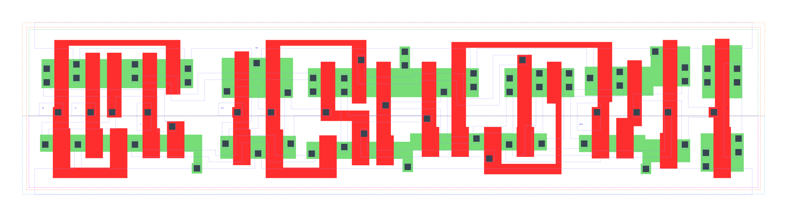

====================================
gf180mcu_fd_sc_mcu9t5v0__sdffsnq_x1
====================================

**gf180mcu_fd_sc_mcu9t5v0__sdffsnq_x1 symbol**

.. image:: sc9_sym/SDFFSNQ_X1_sym.png
    :height: 200px
    :width: 400 px
    :align: center
    :alt: gf180mcu_fd_sc_mcu9t5v0__sdffsnq_x1 symbol

**gf180mcu_fd_sc_mcu9t5v0__sdffsnq_x1 schematic**

.. image:: sc9_sch/SDFFSNQ_X1_sch.png
    :height: 250px
    :width: 450 px
    :align: center
    :alt: gf180mcu_fd_sc_mcu9t5v0__sdffsnq_x1 schematic

**gf180mcu_fd_sc_mcu9t5v0__sdffsnq_x1 layout**

.. include:: images.rst
| SDFFSNQ_X1 is a positive edge triggered scan D-type flip flop with active low set and 1X drive strength

|
| Attributes

============= =======================
**Attribute** **Value**
area          124.185600 µm\ :sup:`2`
============= =======================

|

TRUTH TABLE

===== == == = === ======
Input             Output
SETN  SE SI D CLK Q
H     L  X  L ↑   L
H     L  X  H ↑   H
H     H  L  X ↑   L
H     H  H  X ↑   H
L     X  X  X X   H
===== == == = === ======

|
| FUNCTIONAL SCHEMATIC
| |image644|
| CONSTRAINTS

================== =============== ============= ============
**Constraint Pin** **Related Pin** **setup(ns)** **hold(ns)**
SE(LH)             CLK(LH)         0.4690        -0.1830
SE(LH)             CLK(LH)         0.6760        -0.1550
SE(HL)             CLK(LH)         0.5610        -0.1140
SE(HL)             CLK(LH)         0.5500        -0.2810
SI(HL)             CLK(LH)         0.6410        -0.1550
SI(HL)             CLK(LH)         0.6470        -0.1260
SI(LH)             CLK(LH)         0.5150        -0.2290
SI(LH)             CLK(LH)         0.5040        -0.2290
D(HL)              CLK(LH)         0.5440        -0.0970
D(HL)              CLK(LH)         0.5440        -0.0970
D(LH)              CLK(LH)         0.4410        -0.1770
D(LH)              CLK(LH)         0.4410        -0.1770
================== =============== ============= ============

|

================== =============== ================ ===============
**Constraint Pin** **Related Pin** **recovery(ns)** **removal(ns)**
SETN(LH)           CLK(LH)         0.0230           0.1600
SETN(LH)           CLK(LH)         0.0230           0.1600
SETN(LH)           CLK(LH)         0.0230           0.1600
SETN(LH)           CLK(LH)         0.0230           0.1600
================== =============== ================ ===============

|

================== =============== ===========================
**Constraint Pin** **Related Pin** **Minimum Pulse Width(ns)**
CLK(HLH)           CLK(HL)         0.6560
CLK(HLH)           CLK(HL)         0.6750
CLK(HLH)           CLK(HL)         0.6560
CLK(HLH)           CLK(HL)         0.5950
CLK(HLH)           CLK(HL)         0.5220
CLK(HLH)           CLK(HL)         0.7420
CLK(HLH)           CLK(HL)         0.5220
CLK(HLH)           CLK(HL)         0.5590
CLK(LHL)           CLK(LH)         0.3680
CLK(LHL)           CLK(LH)         0.3680
CLK(LHL)           CLK(LH)         0.3680
CLK(LHL)           CLK(LH)         0.3390
CLK(LHL)           CLK(LH)         0.3390
CLK(LHL)           CLK(LH)         0.3680
CLK(LHL)           CLK(LH)         0.3390
CLK(LHL)           CLK(LH)         0.3390
SETN(HLH)          SETN(HL)        0.3190
SETN(HLH)          SETN(HL)        0.3190
SETN(HLH)          SETN(HL)        0.3190
SETN(HLH)          SETN(HL)        0.3190
SETN(HLH)          SETN(HL)        0.3390
SETN(HLH)          SETN(HL)        0.3390
SETN(HLH)          SETN(HL)        0.3390
SETN(HLH)          SETN(HL)        0.3390
SETN(HLH)          SETN(HL)        0.3190
SETN(HLH)          SETN(HL)        0.3190
SETN(HLH)          SETN(HL)        0.3190
SETN(HLH)          SETN(HL)        0.3390
SETN(HLH)          SETN(HL)        0.3390
SETN(HLH)          SETN(HL)        0.3390
SETN(HLH)          SETN(HL)        0.3390
SETN(HLH)          SETN(HL)        0.3190
================== =============== ===========================

|
| PIN CAPACITANCE (pf)

======= ======== ====================
**Pin** **Type** **Capacitance (pf)**
SE      input    0.0085
SI      input    0.0039
D       input    0.0039
CLK     input    0.0050
SETN    input    0.0087
======= ======== ====================

|
| DELAY AND OUTPUT TRANSITION TIME corresponding to min slew and load

+---------------+------------+--------------------+--------------+-------------------+----------------+---------------+
| **Input Pin** | **Output** | **When Condition** | **Tin (ns)** | **Out Load (pf)** | **Delay (ns)** | **Tout (ns)** |
+---------------+------------+--------------------+--------------+-------------------+----------------+---------------+
| CLK(LH)       | Q(HL)      | !D&!SE&SETN&!SI    | 0.0100       | 0.0010            | 0.5713         | 0.0362        |
+---------------+------------+--------------------+--------------+-------------------+----------------+---------------+
| CLK(LH)       | Q(HL)      | !D&!SE&SETN&SI     | 0.0100       | 0.0010            | 0.5713         | 0.0362        |
+---------------+------------+--------------------+--------------+-------------------+----------------+---------------+
| CLK(LH)       | Q(HL)      | !D&SE&SETN&!SI     | 0.0100       | 0.0010            | 0.5713         | 0.0362        |
+---------------+------------+--------------------+--------------+-------------------+----------------+---------------+
| CLK(LH)       | Q(HL)      | D&SE&SETN&!SI      | 0.0100       | 0.0010            | 0.5713         | 0.0362        |
+---------------+------------+--------------------+--------------+-------------------+----------------+---------------+
| CLK(LH)       | Q(LH)      | !D&SE&SETN&SI      | 0.0100       | 0.0010            | 0.5214         | 0.0383        |
+---------------+------------+--------------------+--------------+-------------------+----------------+---------------+
| CLK(LH)       | Q(LH)      | D&!SE&SETN&!SI     | 0.0100       | 0.0010            | 0.5214         | 0.0383        |
+---------------+------------+--------------------+--------------+-------------------+----------------+---------------+
| CLK(LH)       | Q(LH)      | D&!SE&SETN&SI      | 0.0100       | 0.0010            | 0.5214         | 0.0383        |
+---------------+------------+--------------------+--------------+-------------------+----------------+---------------+
| CLK(LH)       | Q(LH)      | D&SE&SETN&SI       | 0.0100       | 0.0010            | 0.5215         | 0.0383        |
+---------------+------------+--------------------+--------------+-------------------+----------------+---------------+
| SETN(HL)      | Q(LH)      | !CLK&!D&!SE&!SI    | 0.0100       | 0.0010            | 0.4413         | 0.0380        |
+---------------+------------+--------------------+--------------+-------------------+----------------+---------------+
| SETN(HL)      | Q(LH)      | !CLK&D&SE&!SI      | 0.0100       | 0.0010            | 0.4413         | 0.0380        |
+---------------+------------+--------------------+--------------+-------------------+----------------+---------------+
| SETN(HL)      | Q(LH)      | !CLK&D&!SE&SI      | 0.0100       | 0.0010            | 0.4417         | 0.0380        |
+---------------+------------+--------------------+--------------+-------------------+----------------+---------------+
| SETN(HL)      | Q(LH)      | !CLK&D&SE&SI       | 0.0100       | 0.0010            | 0.4417         | 0.0380        |
+---------------+------------+--------------------+--------------+-------------------+----------------+---------------+
| SETN(HL)      | Q(LH)      | CLK&D&!SE&!SI      | 0.0100       | 0.0010            | 0.4838         | 0.0382        |
+---------------+------------+--------------------+--------------+-------------------+----------------+---------------+
| SETN(HL)      | Q(LH)      | CLK&D&SE&!SI       | 0.0100       | 0.0010            | 0.4838         | 0.0382        |
+---------------+------------+--------------------+--------------+-------------------+----------------+---------------+
| SETN(HL)      | Q(LH)      | CLK&D&!SE&SI       | 0.0100       | 0.0010            | 0.4838         | 0.0382        |
+---------------+------------+--------------------+--------------+-------------------+----------------+---------------+
| SETN(HL)      | Q(LH)      | CLK&D&SE&SI        | 0.0100       | 0.0010            | 0.4838         | 0.0382        |
+---------------+------------+--------------------+--------------+-------------------+----------------+---------------+
| SETN(HL)      | Q(LH)      | !CLK&!D&SE&!SI     | 0.0100       | 0.0010            | 0.4413         | 0.0380        |
+---------------+------------+--------------------+--------------+-------------------+----------------+---------------+
| SETN(HL)      | Q(LH)      | !CLK&!D&!SE&SI     | 0.0100       | 0.0010            | 0.4413         | 0.0380        |
+---------------+------------+--------------------+--------------+-------------------+----------------+---------------+
| SETN(HL)      | Q(LH)      | !CLK&!D&SE&SI      | 0.0100       | 0.0010            | 0.4417         | 0.0380        |
+---------------+------------+--------------------+--------------+-------------------+----------------+---------------+
| SETN(HL)      | Q(LH)      | CLK&!D&!SE&!SI     | 0.0100       | 0.0010            | 0.4838         | 0.0382        |
+---------------+------------+--------------------+--------------+-------------------+----------------+---------------+
| SETN(HL)      | Q(LH)      | CLK&!D&SE&!SI      | 0.0100       | 0.0010            | 0.4838         | 0.0382        |
+---------------+------------+--------------------+--------------+-------------------+----------------+---------------+
| SETN(HL)      | Q(LH)      | CLK&!D&!SE&SI      | 0.0100       | 0.0010            | 0.4836         | 0.0381        |
+---------------+------------+--------------------+--------------+-------------------+----------------+---------------+
| SETN(HL)      | Q(LH)      | CLK&!D&SE&SI       | 0.0100       | 0.0010            | 0.4838         | 0.0382        |
+---------------+------------+--------------------+--------------+-------------------+----------------+---------------+
| SETN(HL)      | Q(LH)      | !CLK&D&!SE&!SI     | 0.0100       | 0.0010            | 0.4417         | 0.0380        |
+---------------+------------+--------------------+--------------+-------------------+----------------+---------------+

|
| DYNAMIC ENERGY

+---------------+--------------------+--------------+------------+-------------------+---------------------+
| **Input Pin** | **When Condition** | **Tin (ns)** | **Output** | **Out Load (pf)** | **Energy (uW/MHz)** |
+---------------+--------------------+--------------+------------+-------------------+---------------------+
| CLK           | !D&!SE&SETN&!SI    | 0.0100       | Q(HL)      | 0.0010            | 0.7987              |
+---------------+--------------------+--------------+------------+-------------------+---------------------+
| CLK           | !D&!SE&SETN&SI     | 0.0100       | Q(HL)      | 0.0010            | 0.7990              |
+---------------+--------------------+--------------+------------+-------------------+---------------------+
| CLK           | !D&SE&SETN&!SI     | 0.0100       | Q(HL)      | 0.0010            | 0.7989              |
+---------------+--------------------+--------------+------------+-------------------+---------------------+
| CLK           | D&SE&SETN&!SI      | 0.0100       | Q(HL)      | 0.0010            | 0.7989              |
+---------------+--------------------+--------------+------------+-------------------+---------------------+
| CLK           | !D&SE&SETN&SI      | 0.0100       | Q(LH)      | 0.0010            | 0.8395              |
+---------------+--------------------+--------------+------------+-------------------+---------------------+
| CLK           | D&!SE&SETN&!SI     | 0.0100       | Q(LH)      | 0.0010            | 0.8395              |
+---------------+--------------------+--------------+------------+-------------------+---------------------+
| CLK           | D&!SE&SETN&SI      | 0.0100       | Q(LH)      | 0.0010            | 0.8395              |
+---------------+--------------------+--------------+------------+-------------------+---------------------+
| CLK           | D&SE&SETN&SI       | 0.0100       | Q(LH)      | 0.0010            | 0.8395              |
+---------------+--------------------+--------------+------------+-------------------+---------------------+
| SETN          | !CLK&!D&!SE&!SI    | 0.0100       | Q(LH)      | 0.0010            | 0.7282              |
+---------------+--------------------+--------------+------------+-------------------+---------------------+
| SETN          | !CLK&D&SE&!SI      | 0.0100       | Q(LH)      | 0.0010            | 0.7284              |
+---------------+--------------------+--------------+------------+-------------------+---------------------+
| SETN          | !CLK&D&!SE&SI      | 0.0100       | Q(LH)      | 0.0010            | 0.6002              |
+---------------+--------------------+--------------+------------+-------------------+---------------------+
| SETN          | !CLK&D&SE&SI       | 0.0100       | Q(LH)      | 0.0010            | 0.6002              |
+---------------+--------------------+--------------+------------+-------------------+---------------------+
| SETN          | CLK&D&!SE&!SI      | 0.0100       | Q(LH)      | 0.0010            | 0.8590              |
+---------------+--------------------+--------------+------------+-------------------+---------------------+
| SETN          | CLK&D&SE&!SI       | 0.0100       | Q(LH)      | 0.0010            | 0.8590              |
+---------------+--------------------+--------------+------------+-------------------+---------------------+
| SETN          | CLK&D&!SE&SI       | 0.0100       | Q(LH)      | 0.0010            | 0.8591              |
+---------------+--------------------+--------------+------------+-------------------+---------------------+
| SETN          | CLK&D&SE&SI        | 0.0100       | Q(LH)      | 0.0010            | 0.8590              |
+---------------+--------------------+--------------+------------+-------------------+---------------------+
| SETN          | !CLK&!D&SE&!SI     | 0.0100       | Q(LH)      | 0.0010            | 0.7284              |
+---------------+--------------------+--------------+------------+-------------------+---------------------+
| SETN          | !CLK&!D&!SE&SI     | 0.0100       | Q(LH)      | 0.0010            | 0.7282              |
+---------------+--------------------+--------------+------------+-------------------+---------------------+
| SETN          | !CLK&!D&SE&SI      | 0.0100       | Q(LH)      | 0.0010            | 0.6002              |
+---------------+--------------------+--------------+------------+-------------------+---------------------+
| SETN          | CLK&!D&!SE&!SI     | 0.0100       | Q(LH)      | 0.0010            | 0.8590              |
+---------------+--------------------+--------------+------------+-------------------+---------------------+
| SETN          | CLK&!D&SE&!SI      | 0.0100       | Q(LH)      | 0.0010            | 0.8590              |
+---------------+--------------------+--------------+------------+-------------------+---------------------+
| SETN          | CLK&!D&!SE&SI      | 0.0100       | Q(LH)      | 0.0010            | 0.8588              |
+---------------+--------------------+--------------+------------+-------------------+---------------------+
| SETN          | CLK&!D&SE&SI       | 0.0100       | Q(LH)      | 0.0010            | 0.8590              |
+---------------+--------------------+--------------+------------+-------------------+---------------------+
| SETN          | !CLK&D&!SE&!SI     | 0.0100       | Q(LH)      | 0.0010            | 0.6002              |
+---------------+--------------------+--------------+------------+-------------------+---------------------+
| SETN(HL)      | !CLK&!D&!SE&!SI    | 0.0100       | n/a        | n/a               | 0.1971              |
+---------------+--------------------+--------------+------------+-------------------+---------------------+
| SETN(HL)      | !CLK&D&SE&!SI      | 0.0100       | n/a        | n/a               | 0.1971              |
+---------------+--------------------+--------------+------------+-------------------+---------------------+
| SETN(HL)      | !CLK&D&!SE&SI      | 0.0100       | n/a        | n/a               | 0.0708              |
+---------------+--------------------+--------------+------------+-------------------+---------------------+
| SETN(HL)      | !CLK&D&SE&SI       | 0.0100       | n/a        | n/a               | 0.0708              |
+---------------+--------------------+--------------+------------+-------------------+---------------------+
| SETN(HL)      | CLK&D&!SE&!SI      | 0.0100       | n/a        | n/a               | 0.0708              |
+---------------+--------------------+--------------+------------+-------------------+---------------------+
| SETN(HL)      | CLK&D&SE&!SI       | 0.0100       | n/a        | n/a               | 0.0708              |
+---------------+--------------------+--------------+------------+-------------------+---------------------+
| SETN(HL)      | CLK&D&!SE&SI       | 0.0100       | n/a        | n/a               | 0.0708              |
+---------------+--------------------+--------------+------------+-------------------+---------------------+
| SETN(HL)      | CLK&D&SE&SI        | 0.0100       | n/a        | n/a               | 0.0708              |
+---------------+--------------------+--------------+------------+-------------------+---------------------+
| SETN(HL)      | !CLK&!D&SE&!SI     | 0.0100       | n/a        | n/a               | 0.1971              |
+---------------+--------------------+--------------+------------+-------------------+---------------------+
| SETN(HL)      | !CLK&!D&!SE&SI     | 0.0100       | n/a        | n/a               | 0.1971              |
+---------------+--------------------+--------------+------------+-------------------+---------------------+
| SETN(HL)      | !CLK&!D&SE&SI      | 0.0100       | n/a        | n/a               | 0.0708              |
+---------------+--------------------+--------------+------------+-------------------+---------------------+
| SETN(HL)      | CLK&!D&!SE&!SI     | 0.0100       | n/a        | n/a               | 0.0708              |
+---------------+--------------------+--------------+------------+-------------------+---------------------+
| SETN(HL)      | CLK&!D&SE&!SI      | 0.0100       | n/a        | n/a               | 0.0708              |
+---------------+--------------------+--------------+------------+-------------------+---------------------+
| SETN(HL)      | CLK&!D&!SE&SI      | 0.0100       | n/a        | n/a               | 0.0708              |
+---------------+--------------------+--------------+------------+-------------------+---------------------+
| SETN(HL)      | CLK&!D&SE&SI       | 0.0100       | n/a        | n/a               | 0.0708              |
+---------------+--------------------+--------------+------------+-------------------+---------------------+
| SETN(HL)      | !CLK&D&!SE&!SI     | 0.0100       | n/a        | n/a               | 0.0708              |
+---------------+--------------------+--------------+------------+-------------------+---------------------+
| D(HL)         | !CLK&!SE&!SETN&!SI | 0.0100       | n/a        | n/a               | 0.2593              |
+---------------+--------------------+--------------+------------+-------------------+---------------------+
| D(HL)         | !CLK&!SE&!SETN&SI  | 0.0100       | n/a        | n/a               | 0.2593              |
+---------------+--------------------+--------------+------------+-------------------+---------------------+
| D(HL)         | !CLK&SE&!SETN&!SI  | 0.0100       | n/a        | n/a               | 0.0328              |
+---------------+--------------------+--------------+------------+-------------------+---------------------+
| D(HL)         | !CLK&SE&!SETN&SI   | 0.0100       | n/a        | n/a               | 0.0161              |
+---------------+--------------------+--------------+------------+-------------------+---------------------+
| D(HL)         | CLK&!SE&!SETN&!SI  | 0.0100       | n/a        | n/a               | 0.0321              |
+---------------+--------------------+--------------+------------+-------------------+---------------------+
| D(HL)         | CLK&!SE&!SETN&SI   | 0.0100       | n/a        | n/a               | 0.0321              |
+---------------+--------------------+--------------+------------+-------------------+---------------------+
| D(HL)         | CLK&SE&!SETN&!SI   | 0.0100       | n/a        | n/a               | 0.0321              |
+---------------+--------------------+--------------+------------+-------------------+---------------------+
| D(HL)         | CLK&SE&!SETN&SI    | 0.0100       | n/a        | n/a               | 0.0167              |
+---------------+--------------------+--------------+------------+-------------------+---------------------+
| D(HL)         | CLK&!SE&SETN&!SI   | 0.0100       | n/a        | n/a               | 0.0659              |
+---------------+--------------------+--------------+------------+-------------------+---------------------+
| D(HL)         | CLK&SE&SETN&!SI    | 0.0100       | n/a        | n/a               | 0.0321              |
+---------------+--------------------+--------------+------------+-------------------+---------------------+
| D(HL)         | CLK&!SE&SETN&SI    | 0.0100       | n/a        | n/a               | 0.0659              |
+---------------+--------------------+--------------+------------+-------------------+---------------------+
| D(HL)         | CLK&SE&SETN&SI     | 0.0100       | n/a        | n/a               | 0.0142              |
+---------------+--------------------+--------------+------------+-------------------+---------------------+
| D(HL)         | !CLK&!SE&SETN&!SI  | 0.0100       | n/a        | n/a               | 0.3938              |
+---------------+--------------------+--------------+------------+-------------------+---------------------+
| D(HL)         | !CLK&SE&SETN&!SI   | 0.0100       | n/a        | n/a               | 0.0329              |
+---------------+--------------------+--------------+------------+-------------------+---------------------+
| D(HL)         | !CLK&!SE&SETN&SI   | 0.0100       | n/a        | n/a               | 0.3938              |
+---------------+--------------------+--------------+------------+-------------------+---------------------+
| D(HL)         | !CLK&SE&SETN&SI    | 0.0100       | n/a        | n/a               | 0.0161              |
+---------------+--------------------+--------------+------------+-------------------+---------------------+
| SE(LH)        | !CLK&!D&!SETN&!SI  | 0.0100       | n/a        | n/a               | 0.0029              |
+---------------+--------------------+--------------+------------+-------------------+---------------------+
| SE(LH)        | !CLK&!D&!SETN&SI   | 0.0100       | n/a        | n/a               | 0.1281              |
+---------------+--------------------+--------------+------------+-------------------+---------------------+
| SE(LH)        | !CLK&D&!SETN&!SI   | 0.0100       | n/a        | n/a               | 0.2718              |
+---------------+--------------------+--------------+------------+-------------------+---------------------+
| SE(LH)        | !CLK&D&!SETN&SI    | 0.0100       | n/a        | n/a               | -0.0119             |
+---------------+--------------------+--------------+------------+-------------------+---------------------+
| SE(LH)        | CLK&!D&!SETN&!SI   | 0.0100       | n/a        | n/a               | -0.0000             |
+---------------+--------------------+--------------+------------+-------------------+---------------------+
| SE(LH)        | CLK&!D&!SETN&SI    | 0.0100       | n/a        | n/a               | -0.0088             |
+---------------+--------------------+--------------+------------+-------------------+---------------------+
| SE(LH)        | CLK&D&!SETN&!SI    | 0.0100       | n/a        | n/a               | 0.0007              |
+---------------+--------------------+--------------+------------+-------------------+---------------------+
| SE(LH)        | CLK&D&!SETN&SI     | 0.0100       | n/a        | n/a               | -0.0129             |
+---------------+--------------------+--------------+------------+-------------------+---------------------+
| SE(LH)        | !CLK&D&SETN&!SI    | 0.0100       | n/a        | n/a               | 0.4212              |
+---------------+--------------------+--------------+------------+-------------------+---------------------+
| SE(LH)        | !CLK&D&SETN&SI     | 0.0100       | n/a        | n/a               | -0.0119             |
+---------------+--------------------+--------------+------------+-------------------+---------------------+
| SE(LH)        | CLK&D&SETN&!SI     | 0.0100       | n/a        | n/a               | 0.0373              |
+---------------+--------------------+--------------+------------+-------------------+---------------------+
| SE(LH)        | CLK&D&SETN&SI      | 0.0100       | n/a        | n/a               | -0.0153             |
+---------------+--------------------+--------------+------------+-------------------+---------------------+
| SE(LH)        | !CLK&!D&SETN&!SI   | 0.0100       | n/a        | n/a               | 0.0029              |
+---------------+--------------------+--------------+------------+-------------------+---------------------+
| SE(LH)        | !CLK&!D&SETN&SI    | 0.0100       | n/a        | n/a               | 0.3124              |
+---------------+--------------------+--------------+------------+-------------------+---------------------+
| SE(LH)        | CLK&!D&SETN&!SI    | 0.0100       | n/a        | n/a               | 0.0000              |
+---------------+--------------------+--------------+------------+-------------------+---------------------+
| SE(LH)        | CLK&!D&SETN&SI     | 0.0100       | n/a        | n/a               | -0.0087             |
+---------------+--------------------+--------------+------------+-------------------+---------------------+
| CLK(LH)       | !D&!SE&!SETN&!SI   | 0.0100       | n/a        | n/a               | 0.3794              |
+---------------+--------------------+--------------+------------+-------------------+---------------------+
| CLK(LH)       | !D&!SE&!SETN&SI    | 0.0100       | n/a        | n/a               | 0.3794              |
+---------------+--------------------+--------------+------------+-------------------+---------------------+
| CLK(LH)       | !D&SE&!SETN&!SI    | 0.0100       | n/a        | n/a               | 0.3797              |
+---------------+--------------------+--------------+------------+-------------------+---------------------+
| CLK(LH)       | !D&SE&!SETN&SI     | 0.0100       | n/a        | n/a               | 0.2894              |
+---------------+--------------------+--------------+------------+-------------------+---------------------+
| CLK(LH)       | D&!SE&!SETN&!SI    | 0.0100       | n/a        | n/a               | 0.2895              |
+---------------+--------------------+--------------+------------+-------------------+---------------------+
| CLK(LH)       | D&!SE&!SETN&SI     | 0.0100       | n/a        | n/a               | 0.2893              |
+---------------+--------------------+--------------+------------+-------------------+---------------------+
| CLK(LH)       | D&SE&!SETN&!SI     | 0.0100       | n/a        | n/a               | 0.3794              |
+---------------+--------------------+--------------+------------+-------------------+---------------------+
| CLK(LH)       | D&SE&!SETN&SI      | 0.0100       | n/a        | n/a               | 0.2894              |
+---------------+--------------------+--------------+------------+-------------------+---------------------+
| CLK(LH)       | D&!SE&SETN&!SI     | 0.0100       | n/a        | n/a               | 0.2891              |
+---------------+--------------------+--------------+------------+-------------------+---------------------+
| CLK(LH)       | D&SE&SETN&!SI      | 0.0100       | n/a        | n/a               | 0.2748              |
+---------------+--------------------+--------------+------------+-------------------+---------------------+
| CLK(LH)       | D&!SE&SETN&SI      | 0.0100       | n/a        | n/a               | 0.2892              |
+---------------+--------------------+--------------+------------+-------------------+---------------------+
| CLK(LH)       | D&SE&SETN&SI       | 0.0100       | n/a        | n/a               | 0.2893              |
+---------------+--------------------+--------------+------------+-------------------+---------------------+
| CLK(LH)       | !D&!SE&SETN&!SI    | 0.0100       | n/a        | n/a               | 0.2748              |
+---------------+--------------------+--------------+------------+-------------------+---------------------+
| CLK(LH)       | !D&SE&SETN&!SI     | 0.0100       | n/a        | n/a               | 0.2748              |
+---------------+--------------------+--------------+------------+-------------------+---------------------+
| CLK(LH)       | !D&!SE&SETN&SI     | 0.0100       | n/a        | n/a               | 0.2748              |
+---------------+--------------------+--------------+------------+-------------------+---------------------+
| CLK(LH)       | !D&SE&SETN&SI      | 0.0100       | n/a        | n/a               | 0.2892              |
+---------------+--------------------+--------------+------------+-------------------+---------------------+
| SI(LH)        | !CLK&!D&!SE&!SETN  | 0.0100       | n/a        | n/a               | -0.0315             |
+---------------+--------------------+--------------+------------+-------------------+---------------------+
| SI(LH)        | !CLK&!D&SE&!SETN   | 0.0100       | n/a        | n/a               | 0.1268              |
+---------------+--------------------+--------------+------------+-------------------+---------------------+
| SI(LH)        | !CLK&D&!SE&!SETN   | 0.0100       | n/a        | n/a               | -0.0293             |
+---------------+--------------------+--------------+------------+-------------------+---------------------+
| SI(LH)        | !CLK&D&SE&!SETN    | 0.0100       | n/a        | n/a               | 0.1100              |
+---------------+--------------------+--------------+------------+-------------------+---------------------+
| SI(LH)        | CLK&!D&!SE&!SETN   | 0.0100       | n/a        | n/a               | -0.0315             |
+---------------+--------------------+--------------+------------+-------------------+---------------------+
| SI(LH)        | CLK&!D&SE&!SETN    | 0.0100       | n/a        | n/a               | -0.0259             |
+---------------+--------------------+--------------+------------+-------------------+---------------------+
| SI(LH)        | CLK&D&!SE&!SETN    | 0.0100       | n/a        | n/a               | -0.0303             |
+---------------+--------------------+--------------+------------+-------------------+---------------------+
| SI(LH)        | CLK&D&SE&!SETN     | 0.0100       | n/a        | n/a               | -0.0260             |
+---------------+--------------------+--------------+------------+-------------------+---------------------+
| SI(LH)        | !CLK&D&!SE&SETN    | 0.0100       | n/a        | n/a               | -0.0293             |
+---------------+--------------------+--------------+------------+-------------------+---------------------+
| SI(LH)        | !CLK&D&SE&SETN     | 0.0100       | n/a        | n/a               | 0.2930              |
+---------------+--------------------+--------------+------------+-------------------+---------------------+
| SI(LH)        | CLK&D&!SE&SETN     | 0.0100       | n/a        | n/a               | -0.0297             |
+---------------+--------------------+--------------+------------+-------------------+---------------------+
| SI(LH)        | CLK&D&SE&SETN      | 0.0100       | n/a        | n/a               | -0.0260             |
+---------------+--------------------+--------------+------------+-------------------+---------------------+
| SI(LH)        | !CLK&!D&!SE&SETN   | 0.0100       | n/a        | n/a               | -0.0316             |
+---------------+--------------------+--------------+------------+-------------------+---------------------+
| SI(LH)        | !CLK&!D&SE&SETN    | 0.0100       | n/a        | n/a               | 0.3133              |
+---------------+--------------------+--------------+------------+-------------------+---------------------+
| SI(LH)        | CLK&!D&!SE&SETN    | 0.0100       | n/a        | n/a               | -0.0315             |
+---------------+--------------------+--------------+------------+-------------------+---------------------+
| SI(LH)        | CLK&!D&SE&SETN     | 0.0100       | n/a        | n/a               | -0.0259             |
+---------------+--------------------+--------------+------------+-------------------+---------------------+
| SE(HL)        | !CLK&!D&!SETN&!SI  | 0.0100       | n/a        | n/a               | 0.1907              |
+---------------+--------------------+--------------+------------+-------------------+---------------------+
| SE(HL)        | !CLK&!D&!SETN&SI   | 0.0100       | n/a        | n/a               | 0.4413              |
+---------------+--------------------+--------------+------------+-------------------+---------------------+
| SE(HL)        | !CLK&D&!SETN&!SI   | 0.0100       | n/a        | n/a               | 0.3230              |
+---------------+--------------------+--------------+------------+-------------------+---------------------+
| SE(HL)        | !CLK&D&!SETN&SI    | 0.0100       | n/a        | n/a               | 0.1934              |
+---------------+--------------------+--------------+------------+-------------------+---------------------+
| SE(HL)        | CLK&!D&!SETN&!SI   | 0.0100       | n/a        | n/a               | 0.1899              |
+---------------+--------------------+--------------+------------+-------------------+---------------------+
| SE(HL)        | CLK&!D&!SETN&SI    | 0.0100       | n/a        | n/a               | 0.1904              |
+---------------+--------------------+--------------+------------+-------------------+---------------------+
| SE(HL)        | CLK&D&!SETN&!SI    | 0.0100       | n/a        | n/a               | 0.1944              |
+---------------+--------------------+--------------+------------+-------------------+---------------------+
| SE(HL)        | CLK&D&!SETN&SI     | 0.0100       | n/a        | n/a               | 0.2017              |
+---------------+--------------------+--------------+------------+-------------------+---------------------+
| SE(HL)        | !CLK&D&SETN&!SI    | 0.0100       | n/a        | n/a               | 0.5009              |
+---------------+--------------------+--------------+------------+-------------------+---------------------+
| SE(HL)        | !CLK&D&SETN&SI     | 0.0100       | n/a        | n/a               | 0.1934              |
+---------------+--------------------+--------------+------------+-------------------+---------------------+
| SE(HL)        | CLK&D&SETN&!SI     | 0.0100       | n/a        | n/a               | 0.1967              |
+---------------+--------------------+--------------+------------+-------------------+---------------------+
| SE(HL)        | CLK&D&SETN&SI      | 0.0100       | n/a        | n/a               | 0.1930              |
+---------------+--------------------+--------------+------------+-------------------+---------------------+
| SE(HL)        | !CLK&!D&SETN&!SI   | 0.0100       | n/a        | n/a               | 0.1907              |
+---------------+--------------------+--------------+------------+-------------------+---------------------+
| SE(HL)        | !CLK&!D&SETN&SI    | 0.0100       | n/a        | n/a               | 0.5756              |
+---------------+--------------------+--------------+------------+-------------------+---------------------+
| SE(HL)        | CLK&!D&SETN&!SI    | 0.0100       | n/a        | n/a               | 0.1900              |
+---------------+--------------------+--------------+------------+-------------------+---------------------+
| SE(HL)        | CLK&!D&SETN&SI     | 0.0100       | n/a        | n/a               | 0.2484              |
+---------------+--------------------+--------------+------------+-------------------+---------------------+
| CLK(HL)       | !D&!SE&!SETN&!SI   | 0.0100       | n/a        | n/a               | 0.5866              |
+---------------+--------------------+--------------+------------+-------------------+---------------------+
| CLK(HL)       | !D&!SE&!SETN&SI    | 0.0100       | n/a        | n/a               | 0.5865              |
+---------------+--------------------+--------------+------------+-------------------+---------------------+
| CLK(HL)       | !D&SE&!SETN&!SI    | 0.0100       | n/a        | n/a               | 0.6143              |
+---------------+--------------------+--------------+------------+-------------------+---------------------+
| CLK(HL)       | !D&SE&!SETN&SI     | 0.0100       | n/a        | n/a               | 0.4642              |
+---------------+--------------------+--------------+------------+-------------------+---------------------+
| CLK(HL)       | D&!SE&!SETN&!SI    | 0.0100       | n/a        | n/a               | 0.4342              |
+---------------+--------------------+--------------+------------+-------------------+---------------------+
| CLK(HL)       | D&!SE&!SETN&SI     | 0.0100       | n/a        | n/a               | 0.4342              |
+---------------+--------------------+--------------+------------+-------------------+---------------------+
| CLK(HL)       | D&SE&!SETN&!SI     | 0.0100       | n/a        | n/a               | 0.6415              |
+---------------+--------------------+--------------+------------+-------------------+---------------------+
| CLK(HL)       | D&SE&!SETN&SI      | 0.0100       | n/a        | n/a               | 0.4474              |
+---------------+--------------------+--------------+------------+-------------------+---------------------+
| CLK(HL)       | D&!SE&SETN&!SI     | 0.0100       | n/a        | n/a               | 0.4017              |
+---------------+--------------------+--------------+------------+-------------------+---------------------+
| CLK(HL)       | D&SE&SETN&!SI      | 0.0100       | n/a        | n/a               | 0.4039              |
+---------------+--------------------+--------------+------------+-------------------+---------------------+
| CLK(HL)       | D&!SE&SETN&SI      | 0.0100       | n/a        | n/a               | 0.4017              |
+---------------+--------------------+--------------+------------+-------------------+---------------------+
| CLK(HL)       | D&SE&SETN&SI       | 0.0100       | n/a        | n/a               | 0.4015              |
+---------------+--------------------+--------------+------------+-------------------+---------------------+
| CLK(HL)       | !D&!SE&SETN&!SI    | 0.0100       | n/a        | n/a               | 0.4039              |
+---------------+--------------------+--------------+------------+-------------------+---------------------+
| CLK(HL)       | !D&SE&SETN&!SI     | 0.0100       | n/a        | n/a               | 0.4037              |
+---------------+--------------------+--------------+------------+-------------------+---------------------+
| CLK(HL)       | !D&!SE&SETN&SI     | 0.0100       | n/a        | n/a               | 0.4039              |
+---------------+--------------------+--------------+------------+-------------------+---------------------+
| CLK(HL)       | !D&SE&SETN&SI      | 0.0100       | n/a        | n/a               | 0.4015              |
+---------------+--------------------+--------------+------------+-------------------+---------------------+
| SI(HL)        | !CLK&!D&!SE&!SETN  | 0.0100       | n/a        | n/a               | 0.0324              |
+---------------+--------------------+--------------+------------+-------------------+---------------------+
| SI(HL)        | !CLK&!D&SE&!SETN   | 0.0100       | n/a        | n/a               | 0.3323              |
+---------------+--------------------+--------------+------------+-------------------+---------------------+
| SI(HL)        | !CLK&D&!SE&!SETN   | 0.0100       | n/a        | n/a               | 0.0320              |
+---------------+--------------------+--------------+------------+-------------------+---------------------+
| SI(HL)        | !CLK&D&SE&!SETN    | 0.0100       | n/a        | n/a               | 0.3373              |
+---------------+--------------------+--------------+------------+-------------------+---------------------+
| SI(HL)        | CLK&!D&!SE&!SETN   | 0.0100       | n/a        | n/a               | 0.0320              |
+---------------+--------------------+--------------+------------+-------------------+---------------------+
| SI(HL)        | CLK&!D&SE&!SETN    | 0.0100       | n/a        | n/a               | 0.0320              |
+---------------+--------------------+--------------+------------+-------------------+---------------------+
| SI(HL)        | CLK&D&!SE&!SETN    | 0.0100       | n/a        | n/a               | 0.0320              |
+---------------+--------------------+--------------+------------+-------------------+---------------------+
| SI(HL)        | CLK&D&SE&!SETN     | 0.0100       | n/a        | n/a               | 0.0320              |
+---------------+--------------------+--------------+------------+-------------------+---------------------+
| SI(HL)        | !CLK&D&!SE&SETN    | 0.0100       | n/a        | n/a               | 0.0321              |
+---------------+--------------------+--------------+------------+-------------------+---------------------+
| SI(HL)        | !CLK&D&SE&SETN     | 0.0100       | n/a        | n/a               | 0.4866              |
+---------------+--------------------+--------------+------------+-------------------+---------------------+
| SI(HL)        | CLK&D&!SE&SETN     | 0.0100       | n/a        | n/a               | 0.0321              |
+---------------+--------------------+--------------+------------+-------------------+---------------------+
| SI(HL)        | CLK&D&SE&SETN      | 0.0100       | n/a        | n/a               | 0.0918              |
+---------------+--------------------+--------------+------------+-------------------+---------------------+
| SI(HL)        | !CLK&!D&!SE&SETN   | 0.0100       | n/a        | n/a               | 0.0325              |
+---------------+--------------------+--------------+------------+-------------------+---------------------+
| SI(HL)        | !CLK&!D&SE&SETN    | 0.0100       | n/a        | n/a               | 0.4768              |
+---------------+--------------------+--------------+------------+-------------------+---------------------+
| SI(HL)        | CLK&!D&!SE&SETN    | 0.0100       | n/a        | n/a               | 0.0320              |
+---------------+--------------------+--------------+------------+-------------------+---------------------+
| SI(HL)        | CLK&!D&SE&SETN     | 0.0100       | n/a        | n/a               | 0.1153              |
+---------------+--------------------+--------------+------------+-------------------+---------------------+
| D(LH)         | !CLK&!SE&!SETN&!SI | 0.0100       | n/a        | n/a               | 0.0999              |
+---------------+--------------------+--------------+------------+-------------------+---------------------+
| D(LH)         | !CLK&!SE&!SETN&SI  | 0.0100       | n/a        | n/a               | 0.0999              |
+---------------+--------------------+--------------+------------+-------------------+---------------------+
| D(LH)         | !CLK&SE&!SETN&!SI  | 0.0100       | n/a        | n/a               | -0.0288             |
+---------------+--------------------+--------------+------------+-------------------+---------------------+
| D(LH)         | !CLK&SE&!SETN&SI   | 0.0100       | n/a        | n/a               | -0.0103             |
+---------------+--------------------+--------------+------------+-------------------+---------------------+
| D(LH)         | CLK&!SE&!SETN&!SI  | 0.0100       | n/a        | n/a               | -0.0251             |
+---------------+--------------------+--------------+------------+-------------------+---------------------+
| D(LH)         | CLK&!SE&!SETN&SI   | 0.0100       | n/a        | n/a               | -0.0249             |
+---------------+--------------------+--------------+------------+-------------------+---------------------+
| D(LH)         | CLK&SE&!SETN&!SI   | 0.0100       | n/a        | n/a               | -0.0313             |
+---------------+--------------------+--------------+------------+-------------------+---------------------+
| D(LH)         | CLK&SE&!SETN&SI    | 0.0100       | n/a        | n/a               | -0.0216             |
+---------------+--------------------+--------------+------------+-------------------+---------------------+
| D(LH)         | CLK&!SE&SETN&!SI   | 0.0100       | n/a        | n/a               | -0.0274             |
+---------------+--------------------+--------------+------------+-------------------+---------------------+
| D(LH)         | CLK&SE&SETN&!SI    | 0.0100       | n/a        | n/a               | -0.0312             |
+---------------+--------------------+--------------+------------+-------------------+---------------------+
| D(LH)         | CLK&!SE&SETN&SI    | 0.0100       | n/a        | n/a               | -0.0272             |
+---------------+--------------------+--------------+------------+-------------------+---------------------+
| D(LH)         | CLK&SE&SETN&SI     | 0.0100       | n/a        | n/a               | -0.0108             |
+---------------+--------------------+--------------+------------+-------------------+---------------------+
| D(LH)         | !CLK&!SE&SETN&!SI  | 0.0100       | n/a        | n/a               | 0.2777              |
+---------------+--------------------+--------------+------------+-------------------+---------------------+
| D(LH)         | !CLK&SE&SETN&!SI   | 0.0100       | n/a        | n/a               | -0.0288             |
+---------------+--------------------+--------------+------------+-------------------+---------------------+
| D(LH)         | !CLK&!SE&SETN&SI   | 0.0100       | n/a        | n/a               | 0.2777              |
+---------------+--------------------+--------------+------------+-------------------+---------------------+
| D(LH)         | !CLK&SE&SETN&SI    | 0.0100       | n/a        | n/a               | -0.0103             |
+---------------+--------------------+--------------+------------+-------------------+---------------------+
| SETN(LH)      | !CLK&!D&!SE&!SI    | 0.0100       | n/a        | n/a               | 0.0358              |
+---------------+--------------------+--------------+------------+-------------------+---------------------+
| SETN(LH)      | !CLK&!D&!SE&SI     | 0.0100       | n/a        | n/a               | 0.0358              |
+---------------+--------------------+--------------+------------+-------------------+---------------------+
| SETN(LH)      | !CLK&!D&SE&!SI     | 0.0100       | n/a        | n/a               | 0.0358              |
+---------------+--------------------+--------------+------------+-------------------+---------------------+
| SETN(LH)      | !CLK&!D&SE&SI      | 0.0100       | n/a        | n/a               | -0.0481             |
+---------------+--------------------+--------------+------------+-------------------+---------------------+
| SETN(LH)      | !CLK&D&!SE&!SI     | 0.0100       | n/a        | n/a               | -0.0481             |
+---------------+--------------------+--------------+------------+-------------------+---------------------+
| SETN(LH)      | !CLK&D&!SE&SI      | 0.0100       | n/a        | n/a               | -0.0481             |
+---------------+--------------------+--------------+------------+-------------------+---------------------+
| SETN(LH)      | !CLK&D&SE&!SI      | 0.0100       | n/a        | n/a               | 0.0358              |
+---------------+--------------------+--------------+------------+-------------------+---------------------+
| SETN(LH)      | !CLK&D&SE&SI       | 0.0100       | n/a        | n/a               | -0.0481             |
+---------------+--------------------+--------------+------------+-------------------+---------------------+
| SETN(LH)      | CLK&!D&!SE&!SI     | 0.0100       | n/a        | n/a               | -0.0481             |
+---------------+--------------------+--------------+------------+-------------------+---------------------+
| SETN(LH)      | CLK&!D&!SE&SI      | 0.0100       | n/a        | n/a               | -0.0481             |
+---------------+--------------------+--------------+------------+-------------------+---------------------+
| SETN(LH)      | CLK&!D&SE&!SI      | 0.0100       | n/a        | n/a               | -0.0481             |
+---------------+--------------------+--------------+------------+-------------------+---------------------+
| SETN(LH)      | CLK&!D&SE&SI       | 0.0100       | n/a        | n/a               | -0.0481             |
+---------------+--------------------+--------------+------------+-------------------+---------------------+
| SETN(LH)      | CLK&D&!SE&!SI      | 0.0100       | n/a        | n/a               | -0.0481             |
+---------------+--------------------+--------------+------------+-------------------+---------------------+
| SETN(LH)      | CLK&D&!SE&SI       | 0.0100       | n/a        | n/a               | -0.0481             |
+---------------+--------------------+--------------+------------+-------------------+---------------------+
| SETN(LH)      | CLK&D&SE&!SI       | 0.0100       | n/a        | n/a               | -0.0481             |
+---------------+--------------------+--------------+------------+-------------------+---------------------+
| SETN(LH)      | CLK&D&SE&SI        | 0.0100       | n/a        | n/a               | -0.0481             |
+---------------+--------------------+--------------+------------+-------------------+---------------------+

|
| LEAKAGE POWER

===================== ==============
**When Condition**    **Power (nW)**
!CLK&!D&!SE&!SETN&!SI 0.4423
!CLK&!D&!SE&!SETN&SI  0.4425
!CLK&!D&SE&!SETN&!SI  0.4824
!CLK&!D&SE&!SETN&SI   0.5091
!CLK&D&!SE&!SETN&!SI  0.4375
!CLK&D&!SE&!SETN&SI   0.4375
!CLK&D&SE&!SETN&!SI   0.5219
!CLK&D&SE&!SETN&SI    0.4737
CLK&!D&!SE&!SETN&!SI  0.4186
CLK&!D&!SE&!SETN&SI   0.4186
CLK&!D&SE&!SETN&!SI   0.4195
CLK&!D&SE&!SETN&SI    0.4194
CLK&D&!SE&!SETN&!SI   0.4185
CLK&D&!SE&!SETN&SI    0.4185
CLK&D&SE&!SETN&!SI    0.4195
CLK&D&SE&!SETN&SI     0.4194
CLK&!D&!SE&SETN&!SI   0.5193
CLK&!D&!SE&SETN&SI    0.5193
CLK&!D&SE&SETN&!SI    0.5202
CLK&D&SE&SETN&!SI     0.5202
CLK&!D&SE&SETN&SI     0.6845
CLK&D&!SE&SETN&!SI    0.6486
CLK&D&!SE&SETN&SI     0.6486
CLK&D&SE&SETN&SI      0.6686
!CLK&!D&!SE&SETN&!SI  0.6714
!CLK&!D&!SE&SETN&SI   0.6716
!CLK&!D&SE&SETN&!SI   0.7115
!CLK&!D&SE&SETN&SI    0.7171
!CLK&D&!SE&SETN&!SI   0.6455
!CLK&D&!SE&SETN&SI    0.6455
!CLK&D&SE&SETN&!SI    0.7510
!CLK&D&SE&SETN&SI     0.6818
===================== ==============

