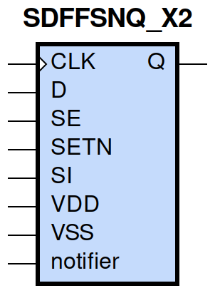
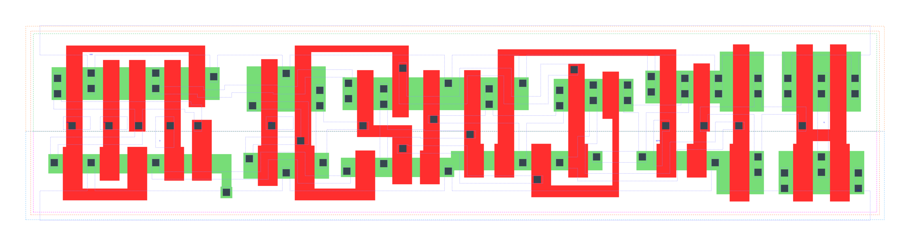

====================================
gf180mcu_fd_sc_mcu9t5v0__sdffsnq_x2
====================================

**gf180mcu_fd_sc_mcu9t5v0__sdffsnq_x2 symbol**

**gf180mcu_fd_sc_mcu9t5v0__sdffsnq_x2 schematic**

.. image:: sc9_sch/SDFFSNQ_X2_sch.png
    :height: 250px
    :width: 450 px
    :align: center
    :alt: gf180mcu_fd_sc_mcu9t5v0__sdffsnq_x2 schematic

**gf180mcu_fd_sc_mcu9t5v0__sdffsnq_x2 layout**

.. include:: images.rst
| SDFFSNQ_X2 is a positive edge triggered scan D-type flip flop with active low set and 2X drive strength

|
| Attributes

============= =======================
**Attribute** **Value**
area          127.008000 µm\ :sup:`2`
============= =======================

|

TRUTH TABLE

===== == == = === ======
Input             Output
SETN  SE SI D CLK Q
H     L  X  L ↑   L
H     L  X  H ↑   H
H     H  L  X ↑   L
H     H  H  X ↑   H
L     X  X  X X   H
===== == == = === ======

|
| FUNCTIONAL SCHEMATIC
| |image647|
| CONSTRAINTS

================== =============== ============= ============
**Constraint Pin** **Related Pin** **setup(ns)** **hold(ns)**
SE(LH)             CLK(LH)         0.4640        -0.1770
SE(LH)             CLK(LH)         0.6700        -0.1370
SE(HL)             CLK(LH)         0.5500        -0.0970
SE(HL)             CLK(LH)         0.5500        -0.2750
SI(HL)             CLK(LH)         0.6410        -0.1320
SI(HL)             CLK(LH)         0.6410        -0.1030
SI(LH)             CLK(LH)         0.5100        -0.2230
SI(LH)             CLK(LH)         0.5040        -0.2180
D(HL)              CLK(LH)         0.5440        -0.0800
D(HL)              CLK(LH)         0.5440        -0.0800
D(LH)              CLK(LH)         0.4410        -0.1720
D(LH)              CLK(LH)         0.4410        -0.1720
================== =============== ============= ============

|

================== =============== ================ ===============
**Constraint Pin** **Related Pin** **recovery(ns)** **removal(ns)**
SETN(LH)           CLK(LH)         0.0170           0.1600
SETN(LH)           CLK(LH)         0.0170           0.1600
SETN(LH)           CLK(LH)         0.0170           0.1600
SETN(LH)           CLK(LH)         0.0170           0.1600
================== =============== ================ ===============

|

================== =============== ===========================
**Constraint Pin** **Related Pin** **Minimum Pulse Width(ns)**
CLK(HLH)           CLK(HL)         0.6560
CLK(HLH)           CLK(HL)         0.6750
CLK(HLH)           CLK(HL)         0.6560
CLK(HLH)           CLK(HL)         0.6010
CLK(HLH)           CLK(HL)         0.5220
CLK(HLH)           CLK(HL)         0.7360
CLK(HLH)           CLK(HL)         0.5220
CLK(HLH)           CLK(HL)         0.5590
CLK(LHL)           CLK(LH)         0.4070
CLK(LHL)           CLK(LH)         0.4070
CLK(LHL)           CLK(LH)         0.4070
CLK(LHL)           CLK(LH)         0.3580
CLK(LHL)           CLK(LH)         0.3580
CLK(LHL)           CLK(LH)         0.4070
CLK(LHL)           CLK(LH)         0.3580
CLK(LHL)           CLK(LH)         0.3580
SETN(HLH)          SETN(HL)        0.3390
SETN(HLH)          SETN(HL)        0.3390
SETN(HLH)          SETN(HL)        0.3390
SETN(HLH)          SETN(HL)        0.3390
SETN(HLH)          SETN(HL)        0.3490
SETN(HLH)          SETN(HL)        0.3490
SETN(HLH)          SETN(HL)        0.3490
SETN(HLH)          SETN(HL)        0.3490
SETN(HLH)          SETN(HL)        0.3390
SETN(HLH)          SETN(HL)        0.3390
SETN(HLH)          SETN(HL)        0.3390
SETN(HLH)          SETN(HL)        0.3490
SETN(HLH)          SETN(HL)        0.3490
SETN(HLH)          SETN(HL)        0.3490
SETN(HLH)          SETN(HL)        0.3490
SETN(HLH)          SETN(HL)        0.3390
================== =============== ===========================

|
| PIN CAPACITANCE (pf)

======= ======== ====================
**Pin** **Type** **Capacitance (pf)**
SE      input    0.0084
SI      input    0.0039
D       input    0.0039
CLK     input    0.0050
SETN    input    0.0086
======= ======== ====================

|
| DELAY AND OUTPUT TRANSITION TIME corresponding to min slew and load

+---------------+------------+--------------------+--------------+-------------------+----------------+---------------+
| **Input Pin** | **Output** | **When Condition** | **Tin (ns)** | **Out Load (pf)** | **Delay (ns)** | **Tout (ns)** |
+---------------+------------+--------------------+--------------+-------------------+----------------+---------------+
| CLK(LH)       | Q(HL)      | !D&!SE&SETN&!SI    | 0.0100       | 0.0010            | 0.6098         | 0.0326        |
+---------------+------------+--------------------+--------------+-------------------+----------------+---------------+
| CLK(LH)       | Q(HL)      | !D&!SE&SETN&SI     | 0.0100       | 0.0010            | 0.6098         | 0.0326        |
+---------------+------------+--------------------+--------------+-------------------+----------------+---------------+
| CLK(LH)       | Q(HL)      | !D&SE&SETN&!SI     | 0.0100       | 0.0010            | 0.6098         | 0.0326        |
+---------------+------------+--------------------+--------------+-------------------+----------------+---------------+
| CLK(LH)       | Q(HL)      | D&SE&SETN&!SI      | 0.0100       | 0.0010            | 0.6098         | 0.0326        |
+---------------+------------+--------------------+--------------+-------------------+----------------+---------------+
| CLK(LH)       | Q(LH)      | !D&SE&SETN&SI      | 0.0100       | 0.0010            | 0.5240         | 0.0297        |
+---------------+------------+--------------------+--------------+-------------------+----------------+---------------+
| CLK(LH)       | Q(LH)      | D&!SE&SETN&!SI     | 0.0100       | 0.0010            | 0.5240         | 0.0297        |
+---------------+------------+--------------------+--------------+-------------------+----------------+---------------+
| CLK(LH)       | Q(LH)      | D&!SE&SETN&SI      | 0.0100       | 0.0010            | 0.5240         | 0.0297        |
+---------------+------------+--------------------+--------------+-------------------+----------------+---------------+
| CLK(LH)       | Q(LH)      | D&SE&SETN&SI       | 0.0100       | 0.0010            | 0.5241         | 0.0297        |
+---------------+------------+--------------------+--------------+-------------------+----------------+---------------+
| SETN(HL)      | Q(LH)      | !CLK&!D&!SE&!SI    | 0.0100       | 0.0010            | 0.4376         | 0.0297        |
+---------------+------------+--------------------+--------------+-------------------+----------------+---------------+
| SETN(HL)      | Q(LH)      | !CLK&D&SE&!SI      | 0.0100       | 0.0010            | 0.4376         | 0.0297        |
+---------------+------------+--------------------+--------------+-------------------+----------------+---------------+
| SETN(HL)      | Q(LH)      | !CLK&D&!SE&SI      | 0.0100       | 0.0010            | 0.4378         | 0.0297        |
+---------------+------------+--------------------+--------------+-------------------+----------------+---------------+
| SETN(HL)      | Q(LH)      | !CLK&D&SE&SI       | 0.0100       | 0.0010            | 0.4376         | 0.0297        |
+---------------+------------+--------------------+--------------+-------------------+----------------+---------------+
| SETN(HL)      | Q(LH)      | CLK&D&!SE&!SI      | 0.0100       | 0.0010            | 0.4754         | 0.0299        |
+---------------+------------+--------------------+--------------+-------------------+----------------+---------------+
| SETN(HL)      | Q(LH)      | CLK&D&SE&!SI       | 0.0100       | 0.0010            | 0.4754         | 0.0298        |
+---------------+------------+--------------------+--------------+-------------------+----------------+---------------+
| SETN(HL)      | Q(LH)      | CLK&D&!SE&SI       | 0.0100       | 0.0010            | 0.4754         | 0.0299        |
+---------------+------------+--------------------+--------------+-------------------+----------------+---------------+
| SETN(HL)      | Q(LH)      | CLK&D&SE&SI        | 0.0100       | 0.0010            | 0.4754         | 0.0299        |
+---------------+------------+--------------------+--------------+-------------------+----------------+---------------+
| SETN(HL)      | Q(LH)      | !CLK&!D&SE&!SI     | 0.0100       | 0.0010            | 0.4376         | 0.0297        |
+---------------+------------+--------------------+--------------+-------------------+----------------+---------------+
| SETN(HL)      | Q(LH)      | !CLK&!D&!SE&SI     | 0.0100       | 0.0010            | 0.4376         | 0.0297        |
+---------------+------------+--------------------+--------------+-------------------+----------------+---------------+
| SETN(HL)      | Q(LH)      | !CLK&!D&SE&SI      | 0.0100       | 0.0010            | 0.4376         | 0.0297        |
+---------------+------------+--------------------+--------------+-------------------+----------------+---------------+
| SETN(HL)      | Q(LH)      | CLK&!D&!SE&!SI     | 0.0100       | 0.0010            | 0.4754         | 0.0298        |
+---------------+------------+--------------------+--------------+-------------------+----------------+---------------+
| SETN(HL)      | Q(LH)      | CLK&!D&SE&!SI      | 0.0100       | 0.0010            | 0.4754         | 0.0298        |
+---------------+------------+--------------------+--------------+-------------------+----------------+---------------+
| SETN(HL)      | Q(LH)      | CLK&!D&!SE&SI      | 0.0100       | 0.0010            | 0.4754         | 0.0298        |
+---------------+------------+--------------------+--------------+-------------------+----------------+---------------+
| SETN(HL)      | Q(LH)      | CLK&!D&SE&SI       | 0.0100       | 0.0010            | 0.4754         | 0.0299        |
+---------------+------------+--------------------+--------------+-------------------+----------------+---------------+
| SETN(HL)      | Q(LH)      | !CLK&D&!SE&!SI     | 0.0100       | 0.0010            | 0.4378         | 0.0297        |
+---------------+------------+--------------------+--------------+-------------------+----------------+---------------+

|
| DYNAMIC ENERGY

+---------------+--------------------+--------------+------------+-------------------+---------------------+
| **Input Pin** | **When Condition** | **Tin (ns)** | **Output** | **Out Load (pf)** | **Energy (uW/MHz)** |
+---------------+--------------------+--------------+------------+-------------------+---------------------+
| CLK           | !D&!SE&SETN&!SI    | 0.0100       | Q(HL)      | 0.0010            | 1.0579              |
+---------------+--------------------+--------------+------------+-------------------+---------------------+
| CLK           | !D&!SE&SETN&SI     | 0.0100       | Q(HL)      | 0.0010            | 1.0579              |
+---------------+--------------------+--------------+------------+-------------------+---------------------+
| CLK           | !D&SE&SETN&!SI     | 0.0100       | Q(HL)      | 0.0010            | 1.0583              |
+---------------+--------------------+--------------+------------+-------------------+---------------------+
| CLK           | D&SE&SETN&!SI      | 0.0100       | Q(HL)      | 0.0010            | 1.0579              |
+---------------+--------------------+--------------+------------+-------------------+---------------------+
| CLK           | !D&SE&SETN&SI      | 0.0100       | Q(LH)      | 0.0010            | 1.0405              |
+---------------+--------------------+--------------+------------+-------------------+---------------------+
| CLK           | D&!SE&SETN&!SI     | 0.0100       | Q(LH)      | 0.0010            | 1.0405              |
+---------------+--------------------+--------------+------------+-------------------+---------------------+
| CLK           | D&!SE&SETN&SI      | 0.0100       | Q(LH)      | 0.0010            | 1.0405              |
+---------------+--------------------+--------------+------------+-------------------+---------------------+
| CLK           | D&SE&SETN&SI       | 0.0100       | Q(LH)      | 0.0010            | 1.0406              |
+---------------+--------------------+--------------+------------+-------------------+---------------------+
| SETN          | !CLK&!D&!SE&!SI    | 0.0100       | Q(LH)      | 0.0010            | 0.9161              |
+---------------+--------------------+--------------+------------+-------------------+---------------------+
| SETN          | !CLK&D&SE&!SI      | 0.0100       | Q(LH)      | 0.0010            | 0.9160              |
+---------------+--------------------+--------------+------------+-------------------+---------------------+
| SETN          | !CLK&D&!SE&SI      | 0.0100       | Q(LH)      | 0.0010            | 0.7949              |
+---------------+--------------------+--------------+------------+-------------------+---------------------+
| SETN          | !CLK&D&SE&SI       | 0.0100       | Q(LH)      | 0.0010            | 0.7945              |
+---------------+--------------------+--------------+------------+-------------------+---------------------+
| SETN          | CLK&D&!SE&!SI      | 0.0100       | Q(LH)      | 0.0010            | 1.0530              |
+---------------+--------------------+--------------+------------+-------------------+---------------------+
| SETN          | CLK&D&SE&!SI       | 0.0100       | Q(LH)      | 0.0010            | 1.0531              |
+---------------+--------------------+--------------+------------+-------------------+---------------------+
| SETN          | CLK&D&!SE&SI       | 0.0100       | Q(LH)      | 0.0010            | 1.0530              |
+---------------+--------------------+--------------+------------+-------------------+---------------------+
| SETN          | CLK&D&SE&SI        | 0.0100       | Q(LH)      | 0.0010            | 1.0529              |
+---------------+--------------------+--------------+------------+-------------------+---------------------+
| SETN          | !CLK&!D&SE&!SI     | 0.0100       | Q(LH)      | 0.0010            | 0.9160              |
+---------------+--------------------+--------------+------------+-------------------+---------------------+
| SETN          | !CLK&!D&!SE&SI     | 0.0100       | Q(LH)      | 0.0010            | 0.9161              |
+---------------+--------------------+--------------+------------+-------------------+---------------------+
| SETN          | !CLK&!D&SE&SI      | 0.0100       | Q(LH)      | 0.0010            | 0.7945              |
+---------------+--------------------+--------------+------------+-------------------+---------------------+
| SETN          | CLK&!D&!SE&!SI     | 0.0100       | Q(LH)      | 0.0010            | 1.0531              |
+---------------+--------------------+--------------+------------+-------------------+---------------------+
| SETN          | CLK&!D&SE&!SI      | 0.0100       | Q(LH)      | 0.0010            | 1.0531              |
+---------------+--------------------+--------------+------------+-------------------+---------------------+
| SETN          | CLK&!D&!SE&SI      | 0.0100       | Q(LH)      | 0.0010            | 1.0531              |
+---------------+--------------------+--------------+------------+-------------------+---------------------+
| SETN          | CLK&!D&SE&SI       | 0.0100       | Q(LH)      | 0.0010            | 1.0529              |
+---------------+--------------------+--------------+------------+-------------------+---------------------+
| SETN          | !CLK&D&!SE&!SI     | 0.0100       | Q(LH)      | 0.0010            | 0.7949              |
+---------------+--------------------+--------------+------------+-------------------+---------------------+
| SETN(HL)      | !CLK&!D&!SE&!SI    | 0.0100       | n/a        | n/a               | 0.1900              |
+---------------+--------------------+--------------+------------+-------------------+---------------------+
| SETN(HL)      | !CLK&D&SE&!SI      | 0.0100       | n/a        | n/a               | 0.1900              |
+---------------+--------------------+--------------+------------+-------------------+---------------------+
| SETN(HL)      | !CLK&D&!SE&SI      | 0.0100       | n/a        | n/a               | 0.0708              |
+---------------+--------------------+--------------+------------+-------------------+---------------------+
| SETN(HL)      | !CLK&D&SE&SI       | 0.0100       | n/a        | n/a               | 0.0708              |
+---------------+--------------------+--------------+------------+-------------------+---------------------+
| SETN(HL)      | CLK&D&!SE&!SI      | 0.0100       | n/a        | n/a               | 0.0708              |
+---------------+--------------------+--------------+------------+-------------------+---------------------+
| SETN(HL)      | CLK&D&SE&!SI       | 0.0100       | n/a        | n/a               | 0.0708              |
+---------------+--------------------+--------------+------------+-------------------+---------------------+
| SETN(HL)      | CLK&D&!SE&SI       | 0.0100       | n/a        | n/a               | 0.0708              |
+---------------+--------------------+--------------+------------+-------------------+---------------------+
| SETN(HL)      | CLK&D&SE&SI        | 0.0100       | n/a        | n/a               | 0.0708              |
+---------------+--------------------+--------------+------------+-------------------+---------------------+
| SETN(HL)      | !CLK&!D&SE&!SI     | 0.0100       | n/a        | n/a               | 0.1900              |
+---------------+--------------------+--------------+------------+-------------------+---------------------+
| SETN(HL)      | !CLK&!D&!SE&SI     | 0.0100       | n/a        | n/a               | 0.1900              |
+---------------+--------------------+--------------+------------+-------------------+---------------------+
| SETN(HL)      | !CLK&!D&SE&SI      | 0.0100       | n/a        | n/a               | 0.0708              |
+---------------+--------------------+--------------+------------+-------------------+---------------------+
| SETN(HL)      | CLK&!D&!SE&!SI     | 0.0100       | n/a        | n/a               | 0.0708              |
+---------------+--------------------+--------------+------------+-------------------+---------------------+
| SETN(HL)      | CLK&!D&SE&!SI      | 0.0100       | n/a        | n/a               | 0.0708              |
+---------------+--------------------+--------------+------------+-------------------+---------------------+
| SETN(HL)      | CLK&!D&!SE&SI      | 0.0100       | n/a        | n/a               | 0.0708              |
+---------------+--------------------+--------------+------------+-------------------+---------------------+
| SETN(HL)      | CLK&!D&SE&SI       | 0.0100       | n/a        | n/a               | 0.0709              |
+---------------+--------------------+--------------+------------+-------------------+---------------------+
| SETN(HL)      | !CLK&D&!SE&!SI     | 0.0100       | n/a        | n/a               | 0.0708              |
+---------------+--------------------+--------------+------------+-------------------+---------------------+
| D(HL)         | !CLK&!SE&!SETN&!SI | 0.0100       | n/a        | n/a               | 0.2606              |
+---------------+--------------------+--------------+------------+-------------------+---------------------+
| D(HL)         | !CLK&!SE&!SETN&SI  | 0.0100       | n/a        | n/a               | 0.2606              |
+---------------+--------------------+--------------+------------+-------------------+---------------------+
| D(HL)         | !CLK&SE&!SETN&!SI  | 0.0100       | n/a        | n/a               | 0.0329              |
+---------------+--------------------+--------------+------------+-------------------+---------------------+
| D(HL)         | !CLK&SE&!SETN&SI   | 0.0100       | n/a        | n/a               | 0.0154              |
+---------------+--------------------+--------------+------------+-------------------+---------------------+
| D(HL)         | CLK&!SE&!SETN&!SI  | 0.0100       | n/a        | n/a               | 0.0337              |
+---------------+--------------------+--------------+------------+-------------------+---------------------+
| D(HL)         | CLK&!SE&!SETN&SI   | 0.0100       | n/a        | n/a               | 0.0337              |
+---------------+--------------------+--------------+------------+-------------------+---------------------+
| D(HL)         | CLK&SE&!SETN&!SI   | 0.0100       | n/a        | n/a               | 0.0321              |
+---------------+--------------------+--------------+------------+-------------------+---------------------+
| D(HL)         | CLK&SE&!SETN&SI    | 0.0100       | n/a        | n/a               | 0.0162              |
+---------------+--------------------+--------------+------------+-------------------+---------------------+
| D(HL)         | CLK&!SE&SETN&!SI   | 0.0100       | n/a        | n/a               | 0.0658              |
+---------------+--------------------+--------------+------------+-------------------+---------------------+
| D(HL)         | CLK&SE&SETN&!SI    | 0.0100       | n/a        | n/a               | 0.0321              |
+---------------+--------------------+--------------+------------+-------------------+---------------------+
| D(HL)         | CLK&!SE&SETN&SI    | 0.0100       | n/a        | n/a               | 0.0658              |
+---------------+--------------------+--------------+------------+-------------------+---------------------+
| D(HL)         | CLK&SE&SETN&SI     | 0.0100       | n/a        | n/a               | 0.0138              |
+---------------+--------------------+--------------+------------+-------------------+---------------------+
| D(HL)         | !CLK&!SE&SETN&!SI  | 0.0100       | n/a        | n/a               | 0.3961              |
+---------------+--------------------+--------------+------------+-------------------+---------------------+
| D(HL)         | !CLK&SE&SETN&!SI   | 0.0100       | n/a        | n/a               | 0.0329              |
+---------------+--------------------+--------------+------------+-------------------+---------------------+
| D(HL)         | !CLK&!SE&SETN&SI   | 0.0100       | n/a        | n/a               | 0.3961              |
+---------------+--------------------+--------------+------------+-------------------+---------------------+
| D(HL)         | !CLK&SE&SETN&SI    | 0.0100       | n/a        | n/a               | 0.0154              |
+---------------+--------------------+--------------+------------+-------------------+---------------------+
| SE(LH)        | !CLK&!D&!SETN&!SI  | 0.0100       | n/a        | n/a               | 0.0030              |
+---------------+--------------------+--------------+------------+-------------------+---------------------+
| SE(LH)        | !CLK&!D&!SETN&SI   | 0.0100       | n/a        | n/a               | 0.1256              |
+---------------+--------------------+--------------+------------+-------------------+---------------------+
| SE(LH)        | !CLK&D&!SETN&!SI   | 0.0100       | n/a        | n/a               | 0.2732              |
+---------------+--------------------+--------------+------------+-------------------+---------------------+
| SE(LH)        | !CLK&D&!SETN&SI    | 0.0100       | n/a        | n/a               | -0.0111             |
+---------------+--------------------+--------------+------------+-------------------+---------------------+
| SE(LH)        | CLK&!D&!SETN&!SI   | 0.0100       | n/a        | n/a               | -0.0000             |
+---------------+--------------------+--------------+------------+-------------------+---------------------+
| SE(LH)        | CLK&!D&!SETN&SI    | 0.0100       | n/a        | n/a               | -0.0089             |
+---------------+--------------------+--------------+------------+-------------------+---------------------+
| SE(LH)        | CLK&D&!SETN&!SI    | 0.0100       | n/a        | n/a               | 0.0025              |
+---------------+--------------------+--------------+------------+-------------------+---------------------+
| SE(LH)        | CLK&D&!SETN&SI     | 0.0100       | n/a        | n/a               | -0.0133             |
+---------------+--------------------+--------------+------------+-------------------+---------------------+
| SE(LH)        | !CLK&D&SETN&!SI    | 0.0100       | n/a        | n/a               | 0.4237              |
+---------------+--------------------+--------------+------------+-------------------+---------------------+
| SE(LH)        | !CLK&D&SETN&SI     | 0.0100       | n/a        | n/a               | -0.0111             |
+---------------+--------------------+--------------+------------+-------------------+---------------------+
| SE(LH)        | CLK&D&SETN&!SI     | 0.0100       | n/a        | n/a               | 0.0371              |
+---------------+--------------------+--------------+------------+-------------------+---------------------+
| SE(LH)        | CLK&D&SETN&SI      | 0.0100       | n/a        | n/a               | -0.0148             |
+---------------+--------------------+--------------+------------+-------------------+---------------------+
| SE(LH)        | !CLK&!D&SETN&!SI   | 0.0100       | n/a        | n/a               | 0.0030              |
+---------------+--------------------+--------------+------------+-------------------+---------------------+
| SE(LH)        | !CLK&!D&SETN&SI    | 0.0100       | n/a        | n/a               | 0.3017              |
+---------------+--------------------+--------------+------------+-------------------+---------------------+
| SE(LH)        | CLK&!D&SETN&!SI    | 0.0100       | n/a        | n/a               | 0.0000              |
+---------------+--------------------+--------------+------------+-------------------+---------------------+
| SE(LH)        | CLK&!D&SETN&SI     | 0.0100       | n/a        | n/a               | -0.0089             |
+---------------+--------------------+--------------+------------+-------------------+---------------------+
| CLK(LH)       | !D&!SE&!SETN&!SI   | 0.0100       | n/a        | n/a               | 0.3857              |
+---------------+--------------------+--------------+------------+-------------------+---------------------+
| CLK(LH)       | !D&!SE&!SETN&SI    | 0.0100       | n/a        | n/a               | 0.3857              |
+---------------+--------------------+--------------+------------+-------------------+---------------------+
| CLK(LH)       | !D&SE&!SETN&!SI    | 0.0100       | n/a        | n/a               | 0.3860              |
+---------------+--------------------+--------------+------------+-------------------+---------------------+
| CLK(LH)       | !D&SE&!SETN&SI     | 0.0100       | n/a        | n/a               | 0.2958              |
+---------------+--------------------+--------------+------------+-------------------+---------------------+
| CLK(LH)       | D&!SE&!SETN&!SI    | 0.0100       | n/a        | n/a               | 0.2957              |
+---------------+--------------------+--------------+------------+-------------------+---------------------+
| CLK(LH)       | D&!SE&!SETN&SI     | 0.0100       | n/a        | n/a               | 0.2957              |
+---------------+--------------------+--------------+------------+-------------------+---------------------+
| CLK(LH)       | D&SE&!SETN&!SI     | 0.0100       | n/a        | n/a               | 0.3857              |
+---------------+--------------------+--------------+------------+-------------------+---------------------+
| CLK(LH)       | D&SE&!SETN&SI      | 0.0100       | n/a        | n/a               | 0.2958              |
+---------------+--------------------+--------------+------------+-------------------+---------------------+
| CLK(LH)       | D&!SE&SETN&!SI     | 0.0100       | n/a        | n/a               | 0.2956              |
+---------------+--------------------+--------------+------------+-------------------+---------------------+
| CLK(LH)       | D&SE&SETN&!SI      | 0.0100       | n/a        | n/a               | 0.2796              |
+---------------+--------------------+--------------+------------+-------------------+---------------------+
| CLK(LH)       | D&!SE&SETN&SI      | 0.0100       | n/a        | n/a               | 0.2956              |
+---------------+--------------------+--------------+------------+-------------------+---------------------+
| CLK(LH)       | D&SE&SETN&SI       | 0.0100       | n/a        | n/a               | 0.2958              |
+---------------+--------------------+--------------+------------+-------------------+---------------------+
| CLK(LH)       | !D&!SE&SETN&!SI    | 0.0100       | n/a        | n/a               | 0.2796              |
+---------------+--------------------+--------------+------------+-------------------+---------------------+
| CLK(LH)       | !D&SE&SETN&!SI     | 0.0100       | n/a        | n/a               | 0.2796              |
+---------------+--------------------+--------------+------------+-------------------+---------------------+
| CLK(LH)       | !D&!SE&SETN&SI     | 0.0100       | n/a        | n/a               | 0.2796              |
+---------------+--------------------+--------------+------------+-------------------+---------------------+
| CLK(LH)       | !D&SE&SETN&SI      | 0.0100       | n/a        | n/a               | 0.2957              |
+---------------+--------------------+--------------+------------+-------------------+---------------------+
| SI(LH)        | !CLK&!D&!SE&!SETN  | 0.0100       | n/a        | n/a               | -0.0315             |
+---------------+--------------------+--------------+------------+-------------------+---------------------+
| SI(LH)        | !CLK&!D&SE&!SETN   | 0.0100       | n/a        | n/a               | 0.1244              |
+---------------+--------------------+--------------+------------+-------------------+---------------------+
| SI(LH)        | !CLK&D&!SE&!SETN   | 0.0100       | n/a        | n/a               | -0.0292             |
+---------------+--------------------+--------------+------------+-------------------+---------------------+
| SI(LH)        | !CLK&D&SE&!SETN    | 0.0100       | n/a        | n/a               | 0.1084              |
+---------------+--------------------+--------------+------------+-------------------+---------------------+
| SI(LH)        | CLK&!D&!SE&!SETN   | 0.0100       | n/a        | n/a               | -0.0315             |
+---------------+--------------------+--------------+------------+-------------------+---------------------+
| SI(LH)        | CLK&!D&SE&!SETN    | 0.0100       | n/a        | n/a               | -0.0257             |
+---------------+--------------------+--------------+------------+-------------------+---------------------+
| SI(LH)        | CLK&D&!SE&!SETN    | 0.0100       | n/a        | n/a               | -0.0302             |
+---------------+--------------------+--------------+------------+-------------------+---------------------+
| SI(LH)        | CLK&D&SE&!SETN     | 0.0100       | n/a        | n/a               | -0.0259             |
+---------------+--------------------+--------------+------------+-------------------+---------------------+
| SI(LH)        | !CLK&D&!SE&SETN    | 0.0100       | n/a        | n/a               | -0.0292             |
+---------------+--------------------+--------------+------------+-------------------+---------------------+
| SI(LH)        | !CLK&D&SE&SETN     | 0.0100       | n/a        | n/a               | 0.2835              |
+---------------+--------------------+--------------+------------+-------------------+---------------------+
| SI(LH)        | CLK&D&!SE&SETN     | 0.0100       | n/a        | n/a               | -0.0296             |
+---------------+--------------------+--------------+------------+-------------------+---------------------+
| SI(LH)        | CLK&D&SE&SETN      | 0.0100       | n/a        | n/a               | -0.0259             |
+---------------+--------------------+--------------+------------+-------------------+---------------------+
| SI(LH)        | !CLK&!D&!SE&SETN   | 0.0100       | n/a        | n/a               | -0.0315             |
+---------------+--------------------+--------------+------------+-------------------+---------------------+
| SI(LH)        | !CLK&!D&SE&SETN    | 0.0100       | n/a        | n/a               | 0.3027              |
+---------------+--------------------+--------------+------------+-------------------+---------------------+
| SI(LH)        | CLK&!D&!SE&SETN    | 0.0100       | n/a        | n/a               | -0.0316             |
+---------------+--------------------+--------------+------------+-------------------+---------------------+
| SI(LH)        | CLK&!D&SE&SETN     | 0.0100       | n/a        | n/a               | -0.0258             |
+---------------+--------------------+--------------+------------+-------------------+---------------------+
| SE(HL)        | !CLK&!D&!SETN&!SI  | 0.0100       | n/a        | n/a               | 0.1918              |
+---------------+--------------------+--------------+------------+-------------------+---------------------+
| SE(HL)        | !CLK&!D&!SETN&SI   | 0.0100       | n/a        | n/a               | 0.4435              |
+---------------+--------------------+--------------+------------+-------------------+---------------------+
| SE(HL)        | !CLK&D&!SETN&!SI   | 0.0100       | n/a        | n/a               | 0.3216              |
+---------------+--------------------+--------------+------------+-------------------+---------------------+
| SE(HL)        | !CLK&D&!SETN&SI    | 0.0100       | n/a        | n/a               | 0.1946              |
+---------------+--------------------+--------------+------------+-------------------+---------------------+
| SE(HL)        | CLK&!D&!SETN&!SI   | 0.0100       | n/a        | n/a               | 0.1911              |
+---------------+--------------------+--------------+------------+-------------------+---------------------+
| SE(HL)        | CLK&!D&!SETN&SI    | 0.0100       | n/a        | n/a               | 0.1928              |
+---------------+--------------------+--------------+------------+-------------------+---------------------+
| SE(HL)        | CLK&D&!SETN&!SI    | 0.0100       | n/a        | n/a               | 0.1956              |
+---------------+--------------------+--------------+------------+-------------------+---------------------+
| SE(HL)        | CLK&D&!SETN&SI     | 0.0100       | n/a        | n/a               | 0.2026              |
+---------------+--------------------+--------------+------------+-------------------+---------------------+
| SE(HL)        | !CLK&D&SETN&!SI    | 0.0100       | n/a        | n/a               | 0.4913              |
+---------------+--------------------+--------------+------------+-------------------+---------------------+
| SE(HL)        | !CLK&D&SETN&SI     | 0.0100       | n/a        | n/a               | 0.1945              |
+---------------+--------------------+--------------+------------+-------------------+---------------------+
| SE(HL)        | CLK&D&SETN&!SI     | 0.0100       | n/a        | n/a               | 0.1976              |
+---------------+--------------------+--------------+------------+-------------------+---------------------+
| SE(HL)        | CLK&D&SETN&SI      | 0.0100       | n/a        | n/a               | 0.1941              |
+---------------+--------------------+--------------+------------+-------------------+---------------------+
| SE(HL)        | !CLK&!D&SETN&!SI   | 0.0100       | n/a        | n/a               | 0.1919              |
+---------------+--------------------+--------------+------------+-------------------+---------------------+
| SE(HL)        | !CLK&!D&SETN&SI    | 0.0100       | n/a        | n/a               | 0.5788              |
+---------------+--------------------+--------------+------------+-------------------+---------------------+
| SE(HL)        | CLK&!D&SETN&!SI    | 0.0100       | n/a        | n/a               | 0.1911              |
+---------------+--------------------+--------------+------------+-------------------+---------------------+
| SE(HL)        | CLK&!D&SETN&SI     | 0.0100       | n/a        | n/a               | 0.2493              |
+---------------+--------------------+--------------+------------+-------------------+---------------------+
| CLK(HL)       | !D&!SE&!SETN&!SI   | 0.0100       | n/a        | n/a               | 0.5933              |
+---------------+--------------------+--------------+------------+-------------------+---------------------+
| CLK(HL)       | !D&!SE&!SETN&SI    | 0.0100       | n/a        | n/a               | 0.5934              |
+---------------+--------------------+--------------+------------+-------------------+---------------------+
| CLK(HL)       | !D&SE&!SETN&!SI    | 0.0100       | n/a        | n/a               | 0.6212              |
+---------------+--------------------+--------------+------------+-------------------+---------------------+
| CLK(HL)       | !D&SE&!SETN&SI     | 0.0100       | n/a        | n/a               | 0.4652              |
+---------------+--------------------+--------------+------------+-------------------+---------------------+
| CLK(HL)       | D&!SE&!SETN&!SI    | 0.0100       | n/a        | n/a               | 0.4352              |
+---------------+--------------------+--------------+------------+-------------------+---------------------+
| CLK(HL)       | D&!SE&!SETN&SI     | 0.0100       | n/a        | n/a               | 0.4352              |
+---------------+--------------------+--------------+------------+-------------------+---------------------+
| CLK(HL)       | D&SE&!SETN&!SI     | 0.0100       | n/a        | n/a               | 0.6482              |
+---------------+--------------------+--------------+------------+-------------------+---------------------+
| CLK(HL)       | D&SE&!SETN&SI      | 0.0100       | n/a        | n/a               | 0.4494              |
+---------------+--------------------+--------------+------------+-------------------+---------------------+
| CLK(HL)       | D&!SE&SETN&!SI     | 0.0100       | n/a        | n/a               | 0.4070              |
+---------------+--------------------+--------------+------------+-------------------+---------------------+
| CLK(HL)       | D&SE&SETN&!SI      | 0.0100       | n/a        | n/a               | 0.4092              |
+---------------+--------------------+--------------+------------+-------------------+---------------------+
| CLK(HL)       | D&!SE&SETN&SI      | 0.0100       | n/a        | n/a               | 0.4069              |
+---------------+--------------------+--------------+------------+-------------------+---------------------+
| CLK(HL)       | D&SE&SETN&SI       | 0.0100       | n/a        | n/a               | 0.4068              |
+---------------+--------------------+--------------+------------+-------------------+---------------------+
| CLK(HL)       | !D&!SE&SETN&!SI    | 0.0100       | n/a        | n/a               | 0.4090              |
+---------------+--------------------+--------------+------------+-------------------+---------------------+
| CLK(HL)       | !D&SE&SETN&!SI     | 0.0100       | n/a        | n/a               | 0.4091              |
+---------------+--------------------+--------------+------------+-------------------+---------------------+
| CLK(HL)       | !D&!SE&SETN&SI     | 0.0100       | n/a        | n/a               | 0.4091              |
+---------------+--------------------+--------------+------------+-------------------+---------------------+
| CLK(HL)       | !D&SE&SETN&SI      | 0.0100       | n/a        | n/a               | 0.4067              |
+---------------+--------------------+--------------+------------+-------------------+---------------------+
| SI(HL)        | !CLK&!D&!SE&!SETN  | 0.0100       | n/a        | n/a               | 0.0324              |
+---------------+--------------------+--------------+------------+-------------------+---------------------+
| SI(HL)        | !CLK&!D&SE&!SETN   | 0.0100       | n/a        | n/a               | 0.3336              |
+---------------+--------------------+--------------+------------+-------------------+---------------------+
| SI(HL)        | !CLK&D&!SE&!SETN   | 0.0100       | n/a        | n/a               | 0.0320              |
+---------------+--------------------+--------------+------------+-------------------+---------------------+
| SI(HL)        | !CLK&D&SE&!SETN    | 0.0100       | n/a        | n/a               | 0.3386              |
+---------------+--------------------+--------------+------------+-------------------+---------------------+
| SI(HL)        | CLK&!D&!SE&!SETN   | 0.0100       | n/a        | n/a               | 0.0320              |
+---------------+--------------------+--------------+------------+-------------------+---------------------+
| SI(HL)        | CLK&!D&SE&!SETN    | 0.0100       | n/a        | n/a               | 0.0338              |
+---------------+--------------------+--------------+------------+-------------------+---------------------+
| SI(HL)        | CLK&D&!SE&!SETN    | 0.0100       | n/a        | n/a               | 0.0320              |
+---------------+--------------------+--------------+------------+-------------------+---------------------+
| SI(HL)        | CLK&D&SE&!SETN     | 0.0100       | n/a        | n/a               | 0.0338              |
+---------------+--------------------+--------------+------------+-------------------+---------------------+
| SI(HL)        | !CLK&D&!SE&SETN    | 0.0100       | n/a        | n/a               | 0.0320              |
+---------------+--------------------+--------------+------------+-------------------+---------------------+
| SI(HL)        | !CLK&D&SE&SETN     | 0.0100       | n/a        | n/a               | 0.4891              |
+---------------+--------------------+--------------+------------+-------------------+---------------------+
| SI(HL)        | CLK&D&!SE&SETN     | 0.0100       | n/a        | n/a               | 0.0321              |
+---------------+--------------------+--------------+------------+-------------------+---------------------+
| SI(HL)        | CLK&D&SE&SETN      | 0.0100       | n/a        | n/a               | 0.0918              |
+---------------+--------------------+--------------+------------+-------------------+---------------------+
| SI(HL)        | !CLK&!D&!SE&SETN   | 0.0100       | n/a        | n/a               | 0.0325              |
+---------------+--------------------+--------------+------------+-------------------+---------------------+
| SI(HL)        | !CLK&!D&SE&SETN    | 0.0100       | n/a        | n/a               | 0.4792              |
+---------------+--------------------+--------------+------------+-------------------+---------------------+
| SI(HL)        | CLK&!D&!SE&SETN    | 0.0100       | n/a        | n/a               | 0.0320              |
+---------------+--------------------+--------------+------------+-------------------+---------------------+
| SI(HL)        | CLK&!D&SE&SETN     | 0.0100       | n/a        | n/a               | 0.1151              |
+---------------+--------------------+--------------+------------+-------------------+---------------------+
| D(LH)         | !CLK&!SE&!SETN&!SI | 0.0100       | n/a        | n/a               | 0.0976              |
+---------------+--------------------+--------------+------------+-------------------+---------------------+
| D(LH)         | !CLK&!SE&!SETN&SI  | 0.0100       | n/a        | n/a               | 0.0976              |
+---------------+--------------------+--------------+------------+-------------------+---------------------+
| D(LH)         | !CLK&SE&!SETN&!SI  | 0.0100       | n/a        | n/a               | -0.0289             |
+---------------+--------------------+--------------+------------+-------------------+---------------------+
| D(LH)         | !CLK&SE&!SETN&SI   | 0.0100       | n/a        | n/a               | -0.0102             |
+---------------+--------------------+--------------+------------+-------------------+---------------------+
| D(LH)         | CLK&!SE&!SETN&!SI  | 0.0100       | n/a        | n/a               | -0.0249             |
+---------------+--------------------+--------------+------------+-------------------+---------------------+
| D(LH)         | CLK&!SE&!SETN&SI   | 0.0100       | n/a        | n/a               | -0.0247             |
+---------------+--------------------+--------------+------------+-------------------+---------------------+
| D(LH)         | CLK&SE&!SETN&!SI   | 0.0100       | n/a        | n/a               | -0.0313             |
+---------------+--------------------+--------------+------------+-------------------+---------------------+
| D(LH)         | CLK&SE&!SETN&SI    | 0.0100       | n/a        | n/a               | -0.0213             |
+---------------+--------------------+--------------+------------+-------------------+---------------------+
| D(LH)         | CLK&!SE&SETN&!SI   | 0.0100       | n/a        | n/a               | -0.0275             |
+---------------+--------------------+--------------+------------+-------------------+---------------------+
| D(LH)         | CLK&SE&SETN&!SI    | 0.0100       | n/a        | n/a               | -0.0312             |
+---------------+--------------------+--------------+------------+-------------------+---------------------+
| D(LH)         | CLK&!SE&SETN&SI    | 0.0100       | n/a        | n/a               | -0.0273             |
+---------------+--------------------+--------------+------------+-------------------+---------------------+
| D(LH)         | CLK&SE&SETN&SI     | 0.0100       | n/a        | n/a               | -0.0107             |
+---------------+--------------------+--------------+------------+-------------------+---------------------+
| D(LH)         | !CLK&!SE&SETN&!SI  | 0.0100       | n/a        | n/a               | 0.2670              |
+---------------+--------------------+--------------+------------+-------------------+---------------------+
| D(LH)         | !CLK&SE&SETN&!SI   | 0.0100       | n/a        | n/a               | -0.0289             |
+---------------+--------------------+--------------+------------+-------------------+---------------------+
| D(LH)         | !CLK&!SE&SETN&SI   | 0.0100       | n/a        | n/a               | 0.2670              |
+---------------+--------------------+--------------+------------+-------------------+---------------------+
| D(LH)         | !CLK&SE&SETN&SI    | 0.0100       | n/a        | n/a               | -0.0102             |
+---------------+--------------------+--------------+------------+-------------------+---------------------+
| SETN(LH)      | !CLK&!D&!SE&!SI    | 0.0100       | n/a        | n/a               | 0.0369              |
+---------------+--------------------+--------------+------------+-------------------+---------------------+
| SETN(LH)      | !CLK&!D&!SE&SI     | 0.0100       | n/a        | n/a               | 0.0369              |
+---------------+--------------------+--------------+------------+-------------------+---------------------+
| SETN(LH)      | !CLK&!D&SE&!SI     | 0.0100       | n/a        | n/a               | 0.0369              |
+---------------+--------------------+--------------+------------+-------------------+---------------------+
| SETN(LH)      | !CLK&!D&SE&SI      | 0.0100       | n/a        | n/a               | -0.0485             |
+---------------+--------------------+--------------+------------+-------------------+---------------------+
| SETN(LH)      | !CLK&D&!SE&!SI     | 0.0100       | n/a        | n/a               | -0.0485             |
+---------------+--------------------+--------------+------------+-------------------+---------------------+
| SETN(LH)      | !CLK&D&!SE&SI      | 0.0100       | n/a        | n/a               | -0.0485             |
+---------------+--------------------+--------------+------------+-------------------+---------------------+
| SETN(LH)      | !CLK&D&SE&!SI      | 0.0100       | n/a        | n/a               | 0.0369              |
+---------------+--------------------+--------------+------------+-------------------+---------------------+
| SETN(LH)      | !CLK&D&SE&SI       | 0.0100       | n/a        | n/a               | -0.0485             |
+---------------+--------------------+--------------+------------+-------------------+---------------------+
| SETN(LH)      | CLK&!D&!SE&!SI     | 0.0100       | n/a        | n/a               | -0.0485             |
+---------------+--------------------+--------------+------------+-------------------+---------------------+
| SETN(LH)      | CLK&!D&!SE&SI      | 0.0100       | n/a        | n/a               | -0.0485             |
+---------------+--------------------+--------------+------------+-------------------+---------------------+
| SETN(LH)      | CLK&!D&SE&!SI      | 0.0100       | n/a        | n/a               | -0.0485             |
+---------------+--------------------+--------------+------------+-------------------+---------------------+
| SETN(LH)      | CLK&!D&SE&SI       | 0.0100       | n/a        | n/a               | -0.0485             |
+---------------+--------------------+--------------+------------+-------------------+---------------------+
| SETN(LH)      | CLK&D&!SE&!SI      | 0.0100       | n/a        | n/a               | -0.0485             |
+---------------+--------------------+--------------+------------+-------------------+---------------------+
| SETN(LH)      | CLK&D&!SE&SI       | 0.0100       | n/a        | n/a               | -0.0485             |
+---------------+--------------------+--------------+------------+-------------------+---------------------+
| SETN(LH)      | CLK&D&SE&!SI       | 0.0100       | n/a        | n/a               | -0.0485             |
+---------------+--------------------+--------------+------------+-------------------+---------------------+
| SETN(LH)      | CLK&D&SE&SI        | 0.0100       | n/a        | n/a               | -0.0485             |
+---------------+--------------------+--------------+------------+-------------------+---------------------+

|
| LEAKAGE POWER

===================== ==============
**When Condition**    **Power (nW)**
!CLK&!D&!SE&!SETN&!SI 0.4667
!CLK&!D&!SE&!SETN&SI  0.4669
!CLK&!D&SE&!SETN&!SI  0.5070
!CLK&!D&SE&!SETN&SI   0.5347
!CLK&D&!SE&!SETN&!SI  0.4631
!CLK&D&!SE&!SETN&SI   0.4631
!CLK&D&SE&!SETN&!SI   0.5465
!CLK&D&SE&!SETN&SI    0.4993
CLK&!D&!SE&!SETN&!SI  0.4444
CLK&!D&!SE&!SETN&SI   0.4444
CLK&!D&SE&!SETN&!SI   0.4453
CLK&!D&SE&!SETN&SI    0.4465
CLK&D&!SE&!SETN&!SI   0.4455
CLK&D&!SE&!SETN&SI    0.4455
CLK&D&SE&!SETN&!SI    0.4453
CLK&D&SE&!SETN&SI     0.4465
CLK&!D&!SE&SETN&!SI   0.5464
CLK&!D&!SE&SETN&SI    0.5464
CLK&!D&SE&SETN&!SI    0.5473
CLK&D&SE&SETN&!SI     0.5473
CLK&!D&SE&SETN&SI     0.7260
CLK&D&!SE&SETN&!SI    0.6896
CLK&D&!SE&SETN&SI     0.6896
CLK&D&SE&SETN&SI      0.7094
!CLK&!D&!SE&SETN&!SI  0.7022
!CLK&!D&!SE&SETN&SI   0.7024
!CLK&!D&SE&SETN&!SI   0.7425
!CLK&!D&SE&SETN&SI    0.7403
!CLK&D&!SE&SETN&!SI   0.6687
!CLK&D&!SE&SETN&SI    0.6687
!CLK&D&SE&SETN&!SI    0.7820
!CLK&D&SE&SETN&SI     0.7049
===================== ==============

