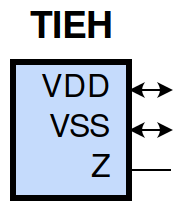
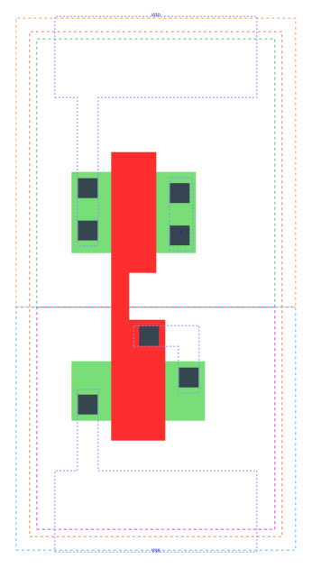

====================================
gf180mcu_fd_sc_mcu9t5v0__tieh
====================================

**gf180mcu_fd_sc_mcu9t5v0__tieh symbol**

**gf180mcu_fd_sc_mcu9t5v0__tieh schematic**

.. image:: sc9_sch/TIEH_sch.png
    :height: 250px
    :width: 450 px
    :align: center
    :alt: gf180mcu_fd_sc_mcu9t5v0__tieh schematic

**gf180mcu_fd_sc_mcu9t5v0__tieh layout**

.. include:: images.rst
| TIEH is a high Level generator

|
| Attributes

============= ======================
**Attribute** **Value**
area          11.289600 µm\ :sup:`2`
============= ======================

|
| OUTPUT FUNCTIONS

============== ============
**Output Pin** **Function**
Z              1
============== ============

|
| TRUTH TABLE FOR Z

+-------+
| **Z** |
+-------+

|
| FUNCTIONAL SCHEMATIC
| |image653|
| LEAKAGE POWER

================== ==============
**When Condition** **Power (nW)**
default            0.0500
================== ==============

