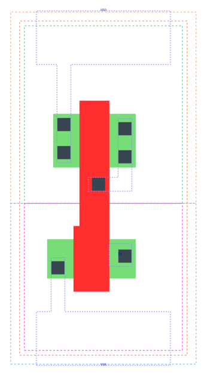

====================================
gf180mcu_fd_sc_mcu9t5v0__tiel
====================================

**gf180mcu_fd_sc_mcu9t5v0__tiel symbol**

.. image:: sc9_sym/TIEL_sym.png
    :height: 200px
    :width: 400 px
    :align: center
    :alt: gf180mcu_fd_sc_mcu9t5v0__tiel symbol

**gf180mcu_fd_sc_mcu9t5v0__tiel schematic**

.. image:: sc9_sch/TIEL_sch.png
    :height: 250px
    :width: 450 px
    :align: center
    :alt: gf180mcu_fd_sc_mcu9t5v0__tiel schematic

**gf180mcu_fd_sc_mcu9t5v0__tiel layout**

.. include:: images.rst
| TIEL is a low Level generator

|
| Attributes

============= ======================
**Attribute** **Value**
area          11.289600 µm\ :sup:`2`
============= ======================

|
| OUTPUT FUNCTIONS

============== ============
**Output Pin** **Function**
ZN             0
============== ============

|
| TRUTH TABLE FOR ZN

+--------+
| **ZN** |
+--------+

|
| FUNCTIONAL SCHEMATIC
| |image656|
| LEAKAGE POWER

================== ==============
**When Condition** **Power (nW)**
default            0.0500
================== ==============

