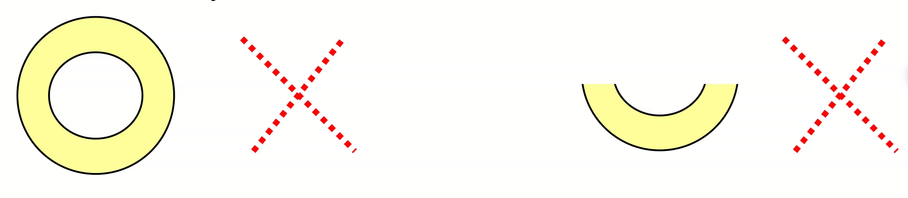
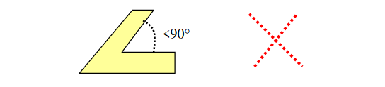
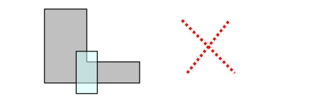
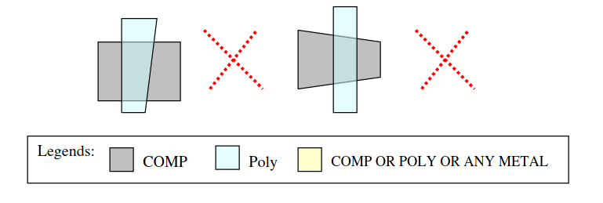
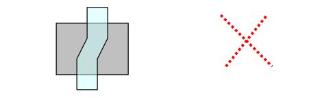
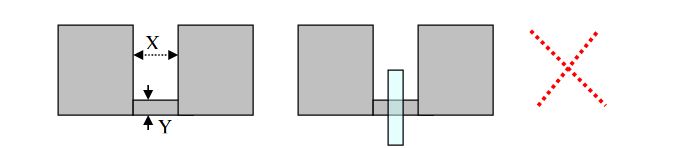
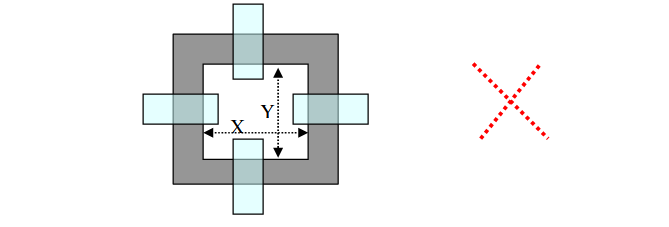
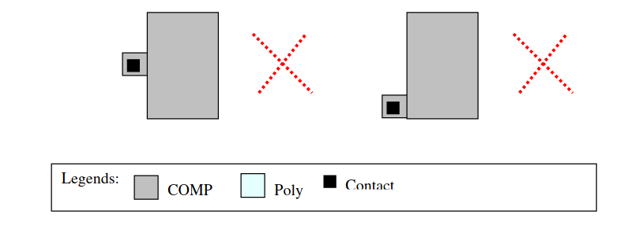
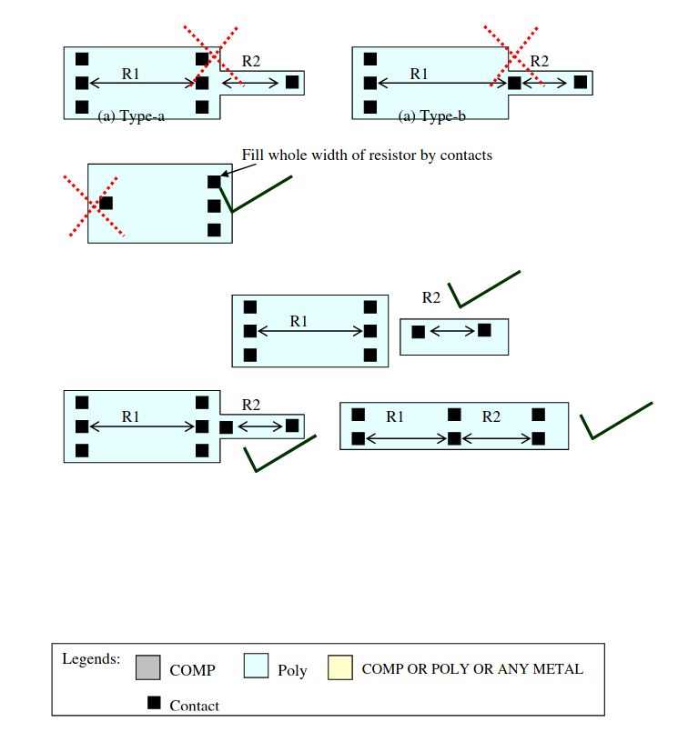

5.1 Guidelines for polygon shapes to be avoided
===============================================

This section describes the shapes or the patterns, which shall be avoided for, better manufacturability and yield.

**SH.1**: Avoid any COMP, POLY and metal circular or arch shapes with exception only for pre-tested metal inductors with IND_MK mark layer.

**SH.2**: Avoid any COMP, poly and metal shapes with acute angles (angles <90 deg). Exceptions are only for pre-tested metal inductors with IND_MK mark layers and lettering (non circuit elements).

**SH.3**: Avoid COMP and poly intercepting with one side COMP wider and other side (as shown below)

**SH.4**: Neither COMP nor poly can be tapered within in the intersect area. (Exceptions only for pre-tested SRAM and other memory cells with mark layer).

**SH.5**: Poly bends in active shall be avoided if accuracy of transistor width is important and also in analog blocks. (Exceptions only for pre-tested SRAM and other memory cells with mark layer). This case the accuracy of circuit speed /timing will degraded.

**SH.6**: Following “U” shape shall be avoided for COMP layer: Especially when X <1.0um and/or Y<0.5um. Exceptions are only for proven memory cells with SRAM bit cell marking layer (Gmcell).

**SH.7**: Following shape of COMP forming transistors shall be avoided in general and more importantly when X and /or Y dimensions are less than 5um. (Exceptions are only for proven memory cells with SRAM bit cell marking layer (Gmcell).

**SH.8**: Contact on COMP in following manner with minimum rules shall be avoided. (Exceptions are only for proven memory cells with SRAM bit cell marking layer (Gmcell).

**SH.9**: Following type-a, type-b and type-c kind of resistor layout shall be avoided: (for matched pair resistors, please refer to matched pair design guidelines in the design rule document).

