5.2 Guidelines for better one layout over the other
===================================================

**DMF.1**: For metal Bus routing: layout-b is better than layout-a

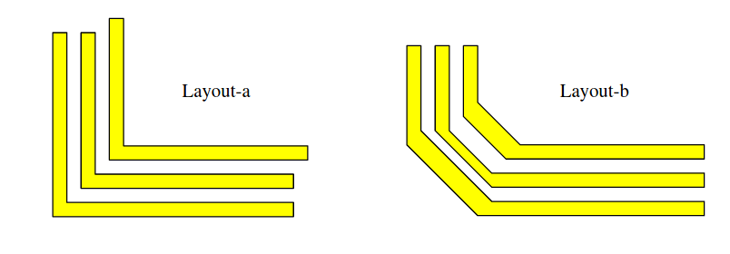

**DFM.2**: For multiple metal line routing: layout-b is better than layout-a; Avoid minimum line width and space if there is a space.

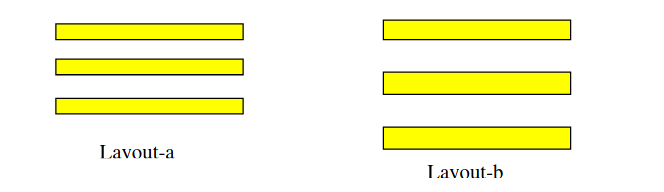

**DMF.3a**: Multiple contacts and via better than the single one (Layout-b better than layout-a)

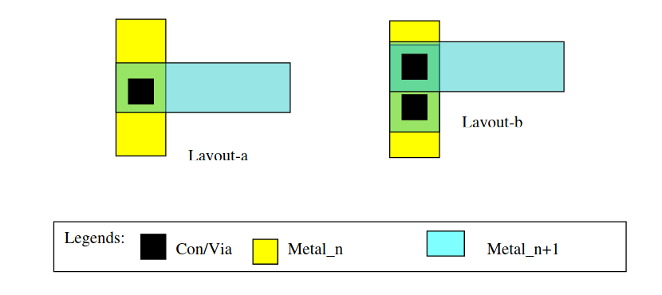

**DMF.3b**: Multiple contacts and via better than the single one (Layout-b better than layout-a)

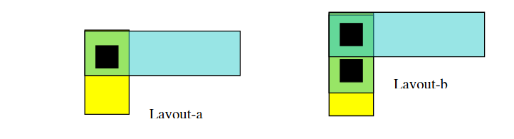

**DMF.4**: In the following active (COMP) contacts Layout-b is better than that of layout-a and layout-C is the best.

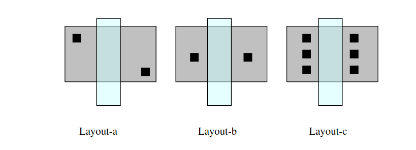

**DMF.5**: In the following poly contacts and metal vias Layout-b is better than that of layout-a.

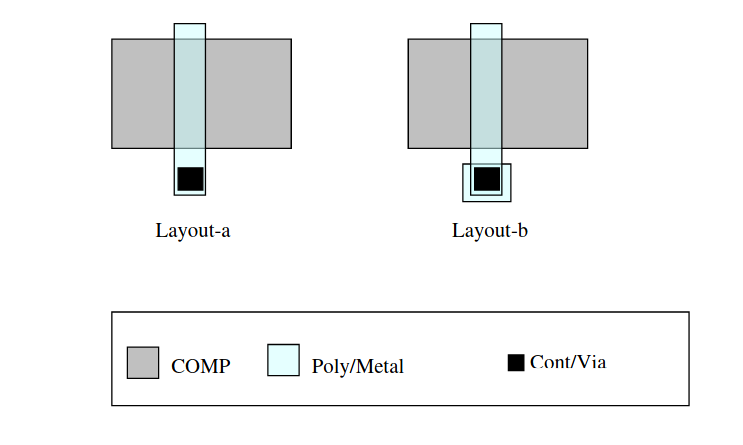

**DMF.6**: In the following transistor layouts, Layout-b (Y2 >Y1) is better than that of layout-a.

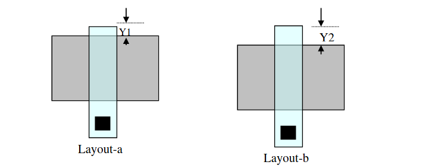

**DFM.7**: Two transistors with common poly gate: Avoid “x” as minimum DR, better to keep it slightly bigger than minimum design rule:

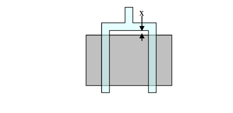

**DFM.8**: Avoid poly on filed at minimum distance (x) when there is active contact nearby:

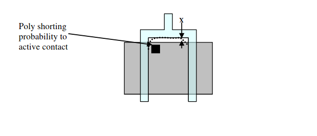

**DFM.9**: For substrate tap effectiveness: Layout-b is better than layout-a, layout-c is more effective than layout-b and layout-d is the best. Layout-a shall be avoided.

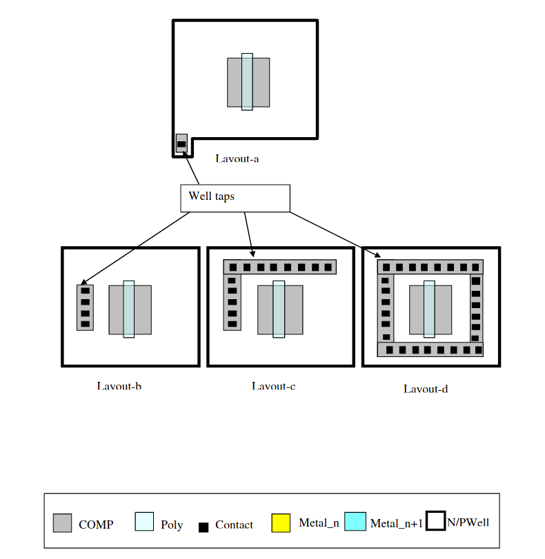

**DFM.10**: In the following layout if T1 , T2 and T3 are indential devices (expected same WXL) then T2 to T3 matching is better than that to T1, T1 will have higher drain resistance due to contact at the active corner.

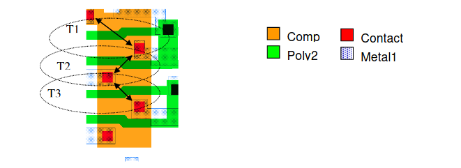

**DFM.11**: If it is desired to have dense logic layout as shown in layout-a, then it is better to keep bigger width (W2) transitor's poly apacing apart and smaller with closer as shown in layout-C. In other word layout C is better than that of layout-b.

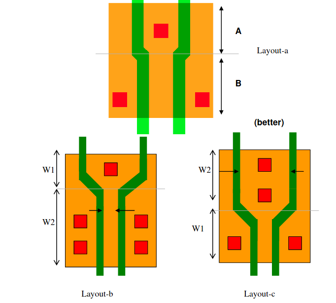

