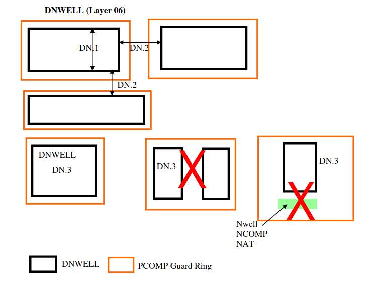
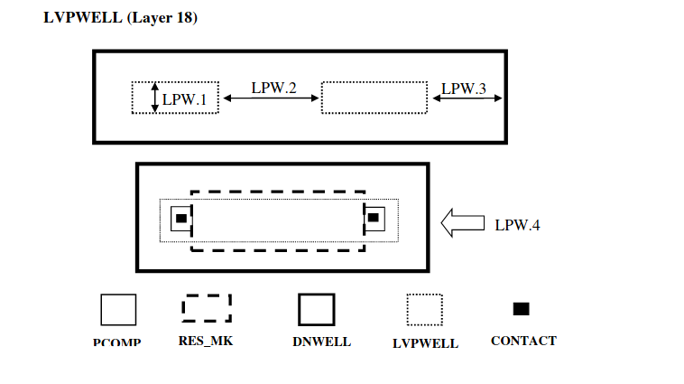
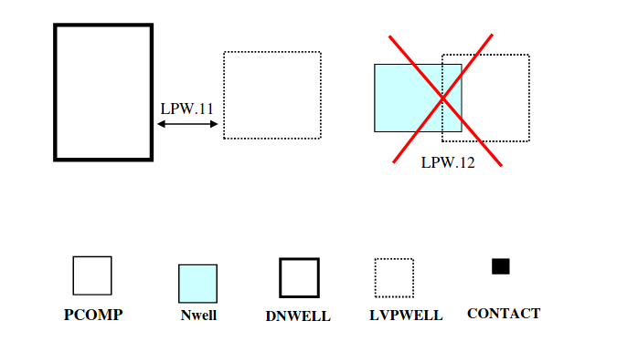

7.0 Layout Rule Description
===========================

The following sub-sections use the terms defined in the table below.

.. csv-table:: LAYOUT RULE DESCRIPTION
    :file: tables_clear/09_LAYOUT_RULE_DESCRIPTION27.csv
    :widths: 300, 400
    :align: center

7.1 Design Geometry Rules
-------------------------

.. csv-table:: Design Geometry Rules
    :file: tables_clear/10_Design_Geometry_Rules27.csv
    :widths: 300, 700
    :align: center

7.2 Dnwell
----------

This layer is defined to put 3.3V and 5V/6V CMOS devices inside deep Nwell for better isolation from substrate noise.

.. csv-table:: DNWELL RULES
    :file: tables_clear/11_DNWELL28.csv
    :widths: 200, 700 , 100
    :align: center

7.3 Lvpwell
-----------

This drawn layer is defined for 3.3V and 5V/6V NMOS body . If this layer is used without DNWELL (outside DNWELL), the body of all those transistors will by default be connected to P-substrate potential. If LVPWELL is designed as a resistor, it is not allowed to be placed outside DNWELL.

**(A) LVPWELL Inside DNWELL**

.. csv-table:: LVPWELL RULES (Inside DNWELL)
    :file: tables_clear/12_LVPWELL29_1.csv
    :widths: 200, 700, 100, 100
    :align: center

.. note::
    \* :ref:`Rules not coded`

    \*\* This note is a layout guide for customer and this rule can be detected by ERC, not by DRC

**(B) LVPWELL Outside DNWELL**

.. csv-table:: LVPWELL RULES (Outside DNWELL)
    :file: tables_clear/12_LVPWELL29_2.csv
    :widths: 200, 700 , 100
    :align: center

7.4 Nwell
---------

This drawn layer is to define the Nwell for both 3.3V & 5V/6V PMOS transistors. For Nwell as a resistor it can only be used outside DNWELL, as by default all Nwell inside DNWELL will be shorted together through DNWELL.

.. csv-table:: NWELL RULES
    :file: tables_clear/13_Nwell31.csv
    :widths: 200, 700, 100, 100
    :align: center

.. image:: images/nwell.png
    :width: 800
    :align: center
    :alt: Nwell

.. note::
    \* :ref:`Rules not coded`

7.5 Comp
--------

These rules apply for COMP inside as well as outside DNWELL unless stated specifically.

.. csv-table:: COMP RULES
    :file: tables_clear/14_COMP33_1.csv
    :widths: 200, 700, 100, 100
    :align: center

**Rules specific to 3.3V/(5V)6V COMP outside DNWELL**

.. csv-table::
    :file: tables_clear/14_COMP33_2.csv
    :widths: 200, 700, 100, 100
    :align: center

.. note::
    \* :ref:`Rules not coded`

    \*\* This rule can be detected by ERC, not by DRC

    \*\* :ref:`Rules not coded`

.. image:: images/comp1.png
    :width: 800
    :align: center
    :alt: COMP

.. image:: images/comp2.png
    :width: 800
    :align: center
    :alt: COMP

.. image:: images/comp3.png
    :width: 800
    :align: center
    :alt: COMP

**3.3V/(5V)6V CMOS Layout Guideline:**

.. image:: images/layout_guide1.png
    :width: 800
    :align: center
    :alt: Layout Guideline

.. image:: images/layout_guide2.png
    :width: 800
    :align: center
    :alt: Layout Guideline

7.6 Dualgate
------------

This layer defines the 5V/6V area. All 5V/6V device area should be covered by this layer.

.. csv-table:: Dualgate RULES
    :file: tables_clear/15_Dualgate40_1.csv
    :widths: 200, 700, 100
    :align: center

**Rules specific to 3.3V/(5V)6V Dualgate outside DNWELL:**

.. csv-table::
    :file: tables_clear/15_Dualgate40_2.csv
    :widths: 200, 700, 100
    :align: center

.. note::
    \* :ref:`Rules not coded`

    \* This rule can be detected by ERC, not by DRC

.. image:: images/dualgate.png
    :width: 800
    :align: center
    :alt: Dualgate

7.7 Poly2
---------

Poly2 defines the Poly2-Gate on CMOS device. The min. channel length for both 3.3V NMOS and PMOS are 0.28um. The min. channel length for 6V NNMOS and PMOS are 0.7um and 0.55um; for 5V are 0.6um and 0.5um.

.. csv-table:: Poly2 RULES
    :file: tables_clear/16_Poly2_42.csv
    :widths: 200, 700, 100, 100 , 100
    :align: center

.. note::
    \* :ref:`Rules not coded`

.. note::

   1. The min. channel length for 6V NNMOS and PMOS are 0.7um and 0.55um; for 5V are 0.6um and 0.5um.

   2. Parasitic capacitance needs to be considered when adding dummy poly2. Customer has the option to use GlobalFoundries's dummy poly2 generation rule. In this case, customer needs to mark out areas of circuit which are sensitive to parasitic capacitance and do not want dummy poly2 fill generated. Customer need to separate circuit Metal1 and Metal2 from dummy metal in order that dummy poly2 can be generated beneath dummy metal. Refer to 4.1 for layer name

.. image:: images/poly2.png
    :width: 800
    :align: center
    :alt: poly2

7.8 Nplus
---------

.. csv-table:: Nplus RULES
    :file: tables_clear/17_Nplus_44.csv
    :widths: 200, 700, 100
    :align: center

.. image:: images/nplus1.png
    :width: 900
    :align: center
    :alt: Nplus

.. image:: images/nplus2.png
    :width: 900
    :align: center
    :alt: Nplus

7.9 Pplus
---------

.. csv-table:: Pplus RULES
    :file: tables_clear/18_Pplus_48.csv
    :widths: 200, 700, 100
    :align: center

.. image:: images/pplus1.png
    :width: 900
    :align: center
    :alt: Pplus

.. image:: images/pplus2.png
    :width: 900
    :align: center
    :alt: Pplus

7.10 Salicide Block (SAB)
-------------------------

.. csv-table:: SAB RULES
    :file: tables_clear/19_SAB_52.csv
    :widths: 200, 700, 100
    :align: center

.. image:: images/sab.png
    :width: 900
    :align: center
    :alt: SAB

7.11 ESD Implant
----------------

This is optional for ESD performance improvement of 5V/6V I/O devices only.

.. csv-table:: ESD RULES
    :file: tables_clear/20_ESD_Implant_54.csv
    :widths: 200, 700, 100
    :align: center

.. image:: images/esd.png
    :width: 800
    :align: center
    :alt: ESD

7.12 Contact
------------

.. csv-table:: Contact RULES
    :file: tables_clear/21_Contact_56.csv
    :widths: 200, 700, 100
    :align: center

.. note::
    \* :ref:`Rules not coded`

.. note::
   1. Applies to all < 0.34μm wide metal lines, excluding metal branches shorter than 0.24μm.

   2. For better yield and reliability try to avoid single contacts on any layer.

.. image:: images/contact.png
    :width: 900
    :align: center
    :alt: Contact

7.13 Metaln (where n = 1 to 5)
------------------------------

.. csv-table:: Metaln RULES
    :file: tables_clear/22_Metaln_58.csv
    :widths: 200, 700, 100
    :align: center

.. image:: images/metal.png
    :width: 800
    :align: center
    :alt: Metaln

7.14 Vian (where n = 1 to 5)
----------------------------

.. csv-table:: Vian RULES
    :file: tables_clear/23_Vian_59.csv
    :widths: 200, 700, 100
    :align: center

.. note::
    \* :ref:`Rules not coded`

.. note::
   1. Applies to all < 0.34μm wide Metal lines, excluding Metal branches shorter than 0.28μm.

   2. Vian is stacked if any portion of it intersects Via [n+1] or Via [n-1], or contact if n=1.

   3. For better yield and reliability try to avoid single vias on any layer (put multiple).

.. image:: images/via.png
    :width: 800
    :align: center
    :alt: Vian

7.15 MetalTop (Thickness 6K/9K*/11K* Å)
---------------------------------------

.. csv-table:: MetalTop RULES
    :file: tables_clear/24_MetalTop_61.csv
    :widths: 200, 700, 100
    :align: center

.. note::
    \* For 9K/11K Å MetalTop.

.. image:: images/metaltop.png
    :width: 900
    :align: center
    :alt: MetalTop (Thickness 6K/9K*/11K* Å)

7.16 3.0um Thick MetalTop Option
--------------------------------

This section describes the design rules for 3um thick Aluminum MetalTop design rules.

.. csv-table:: 3.0um Thick MetalTop RULES
    :file: tables_clear/25_Thick_MetalTop_62.csv
    :widths: 200, 800, 100
    :align: center

.. image:: images/metaltop_3thk.png
    :width: 900
    :align: center
    :alt: 3.0um Thick MetalTop Option

7.17 Mcell
----------

Polarity is Clear

.. csv-table:: Mcell RULES
    :file: tables_clear/26_Mcell_64.csv
    :widths: 200, 500, 100
    :align: center

.. image:: images/mcell.png
    :width: 900
    :align: center
    :alt: Mcell

