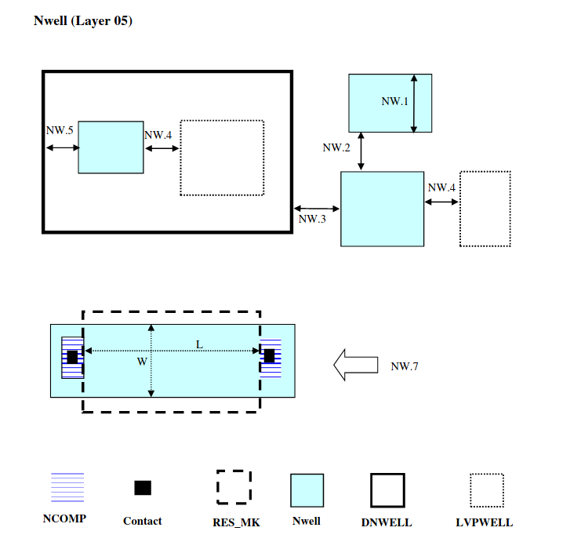

7.4 Nwell
---------

This drawn layer is to define the Nwell for both 3.3V & 5V/6V PMOS transistors. For Nwell as a resistor it can only be used outside DNWELL, as by default all Nwell inside DNWELL will be shorted together through DNWELL.

.. csv-table:: NWELL RULES
    :file: tables_clear/13_Nwell31.csv
    :widths: 200, 700, 100, 100
    :align: center

.. note::
    \* :ref:`Rules not coded`