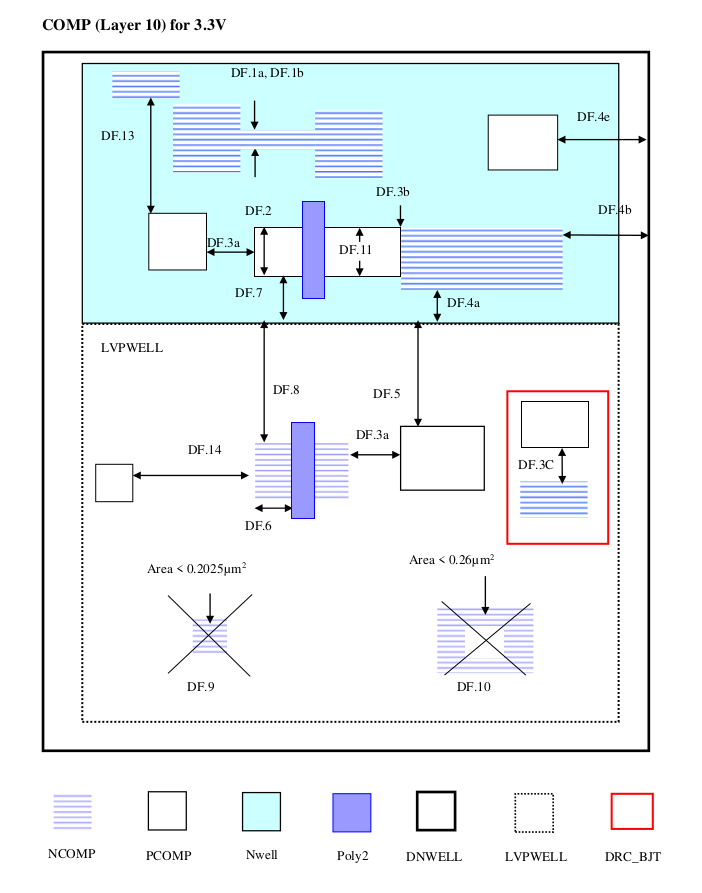
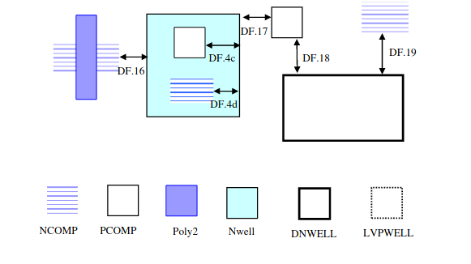
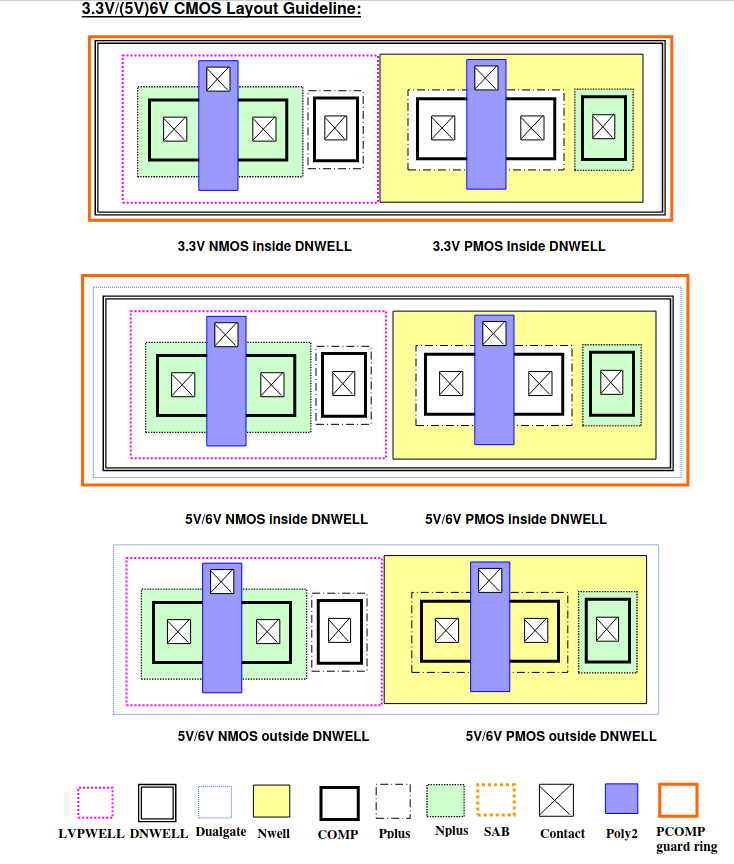
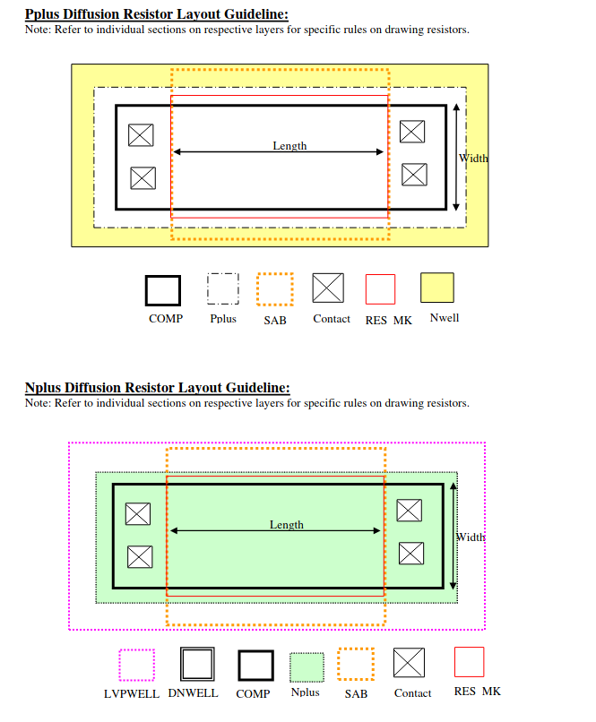

7.5 Comp
--------

These rules apply for COMP inside as well as outside DNWELL unless stated specifically.

.. csv-table:: COMP RULES
    :file: tables_clear/14_COMP33_1.csv
    :widths: 200, 700, 100, 100
    :align: center

**Rules specific to 3.3V/(5V)6V COMP outside DNWELL**

.. csv-table::
    :file: tables_clear/14_COMP33_2.csv
    :widths: 200, 700, 100, 100
    :align: center

.. note::
    \* :ref:`Rules not coded`

    \*\* This rule can be detected by ERC, not by DRC

    \*\* :ref:`Rules not coded`

.. image:: images/comp2.png
    :width: 800
    :align: center
    :alt: COMP

**3.3V/(5V)6V CMOS Layout Guideline:**

