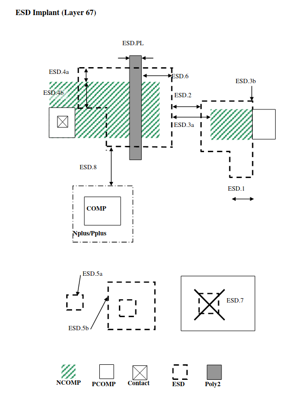

7.11 ESD Implant
----------------

This is optional for ESD performance improvement of 5V/6V I/O devices only.

.. csv-table:: ESD RULES
    :file: tables_clear/20_ESD_Implant_54.csv
    :widths: 200, 700, 100
    :align: center

