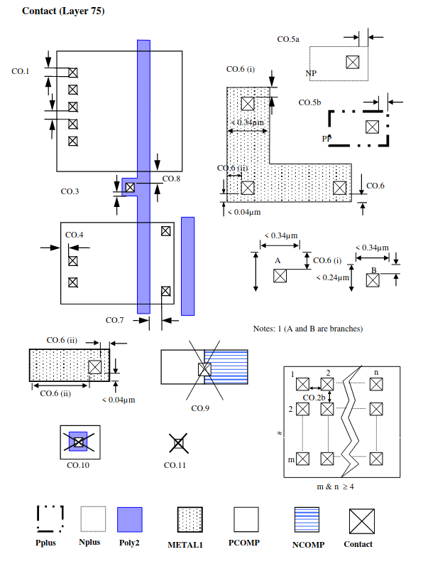

7.12 Contact
------------

.. csv-table:: Contact RULES
    :file: tables_clear/21_Contact_56.csv
    :widths: 200, 700, 100
    :align: center

.. note::
    \* :ref:`Rules not coded`

.. note::
   1. Applies to all < 0.34μm wide metal lines, excluding metal branches shorter than 0.24μm.

   2. For better yield and reliability try to avoid single contacts on any layer.

