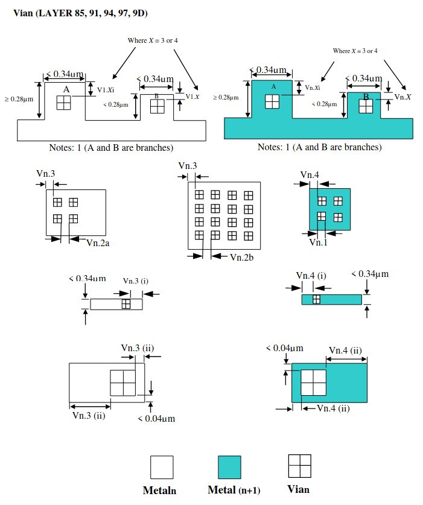

7.14 Vian (where n = 1 to 5)
----------------------------

.. csv-table:: Vian RULES
    :file: tables_clear/23_Vian_59.csv
    :widths: 200, 700, 100
    :align: center

.. note::
    \* :ref:`Rules not coded`

.. note::
   1. Applies to all < 0.34μm wide Metal lines, excluding Metal branches shorter than 0.28μm.

   2. Vian is stacked if any portion of it intersects Via [n+1] or Via [n-1], or contact if n=1.

   3. For better yield and reliability try to avoid single vias on any layer (put multiple).

