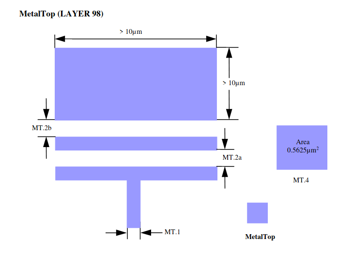

7.15 MetalTop (Thickness 6K/9K*/11K* Å)
---------------------------------------

.. csv-table:: MetalTop RULES
    :file: tables_clear/24_MetalTop_61.csv
    :widths: 200, 700, 100
    :align: center

.. note::
    \* For 9K/11K Å MetalTop.

