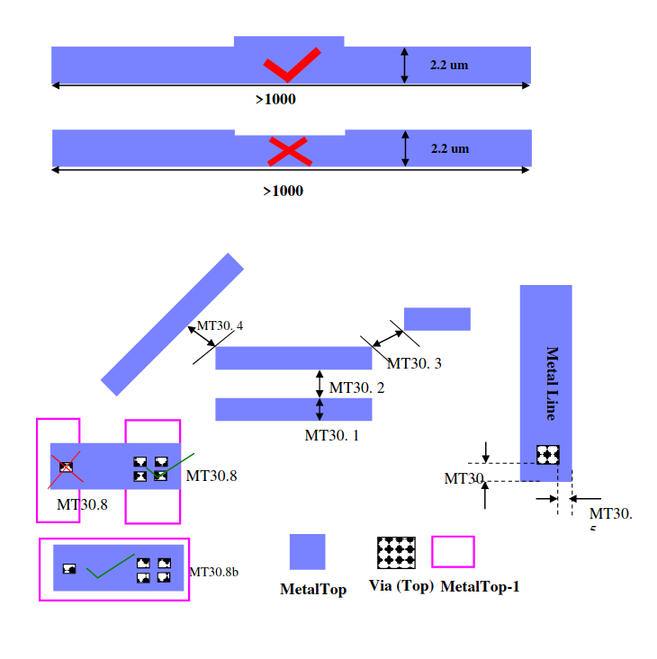

7.16 3.0um Thick MetalTop Option
--------------------------------

This section describes the design rules for 3um thick Aluminum MetalTop design rules.

.. csv-table:: 3.0um Thick MetalTop RULES
    :file: tables_clear/25_Thick_MetalTop_62.csv
    :widths: 200, 800, 100
    :align: center

