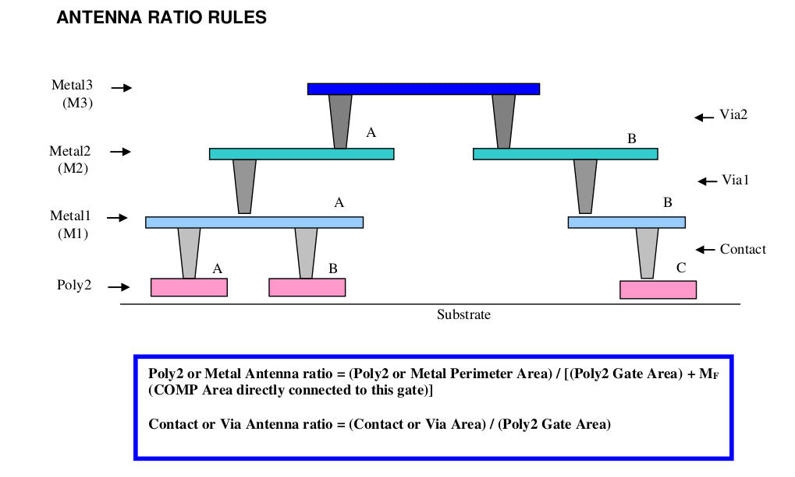
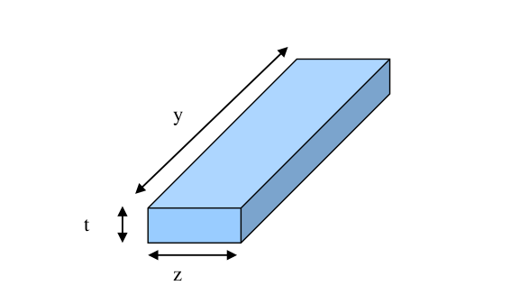

8.0 Antenna Ratio Rules
=======================

An antenna includes all conducting structures on the same layer and the same electrical node that connect to an active area only via layers below it.

.. csv-table:: ANTENNA RATIO RULES
    :file: tables_clear/27_ANTENNA1_66.csv
    :widths: 200, 900, 100
    :align: center

.. note::

   1. Possible repairs to metal antenna nodes, which have a high via count or antenna ratio.

        a.  Add an NCOMP/Substrate diode for NMOS gate, PCOMP/Nwell diode for PMOS gate.

        b. Break the metal close to the gate and jog the metal to an upper metal level.

**Remedy for Antenna Rule violations:**

(1) Connecting antenna diode

.. csv-table::
    :file: tables_clear/28_ANTENNA2_67.csv
    :widths: 200, 900, 100
    :align: center

(2) Other Possible repairs if the Antenna ratio violate the design rule is break the metal close to the gate and jog
the metal to an upper metal level.

.. centered::
    **ANTENNA RATIO RULES**

**Example:**

Illustration on the above antenna ratio calculation: (Terms on the right hand side of the equations below (eg. Metal3) refer to the layout areas of the corresponding structures in the diagram above.)

.. math::

    Antenna_ratio (Metal_3)  = Metal_3/(Poly_{2A} + Poly_{2B} + Poly_{2C})

    Antenna_ratio (M2A)      = Metal_{2A}/(Poly_{2A} + Poly_{2B})

    Antenna_ratio (M2B)      = Metal_{2B}/Poly_{2C}

**Poly2/Metal Perimeter Area calculation**

.. math::

    Poly2/Metal Perimeter Area = 2 [(t X z) + (t X y)]

Where

       y: Poly2/Metal length

       z: Poly2/Metal width

       t: Poly2/Metal thickness

.. csv-table::
    :file: tables_clear/28_ANTENNA3_69.csv
    :widths: 100, 100, 100, 100, 100, 100, 100, 100, 100, 100, 100
    :align: center

