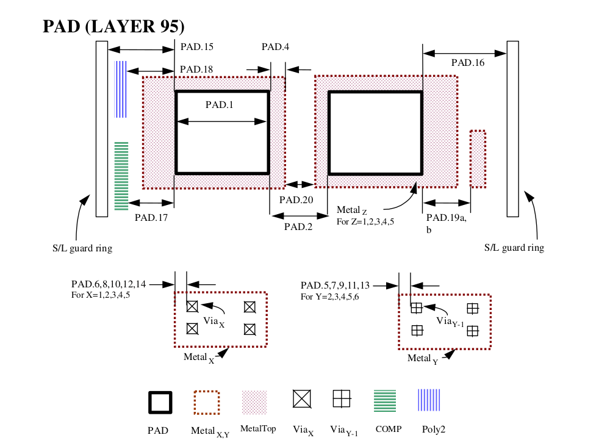
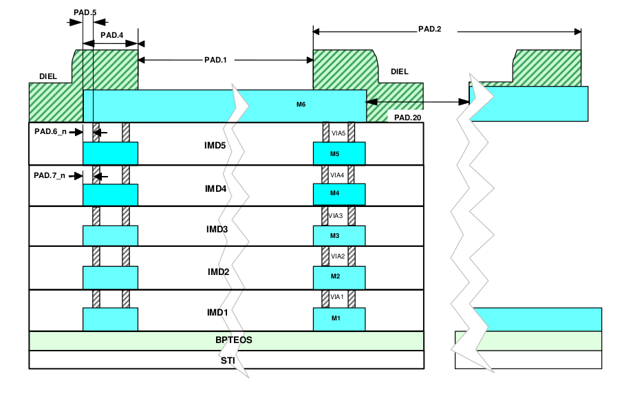

9.2 Bond Pad Guidelines
=======================

.. csv-table:: Bond Pad Guidelines
    :file: tables_clear/29_BondPad2_70.csv
    :widths: 100, 400, 150, 150, 150
    :align: center

.. note::

   1. These are just default numbers for DRC purpose only, however, these are VARIABLE and the customer is advised to use the appropriate value acceptable to their assembly house.

   2. MetalTop is the last Metal of the product, for 4 layer metal product, MetalTop is Metal4.

   3. Top_Via: means the top most via for the product, For 6 layer metal product, Top_via will be Via5, while for 4 layer metal product, Top_Via will be Via3.

   4. MetalTop-1: means the one level lower than the last metal layer, For 6 layer metal product, MetalTop-1 will be Metal5, while for 4 layer metal product, MetalTop-1 will be Metal3.

   5. Those Via under Pad opening oversize by rule PAD.4 but exlcuding PAD will be checked by this rule.

   6. For wedge type pad metal is checked by metal1 to MetalTop interact with pad enclosed by Pad opening oversize by rule PAD.4, for ball type wire bond (with CUP) and gold bump, pad metal checked by MetalTop oversize by rule PAD.4 .

   7. Not recommended to use 6k top metal for cu wire bonding.

