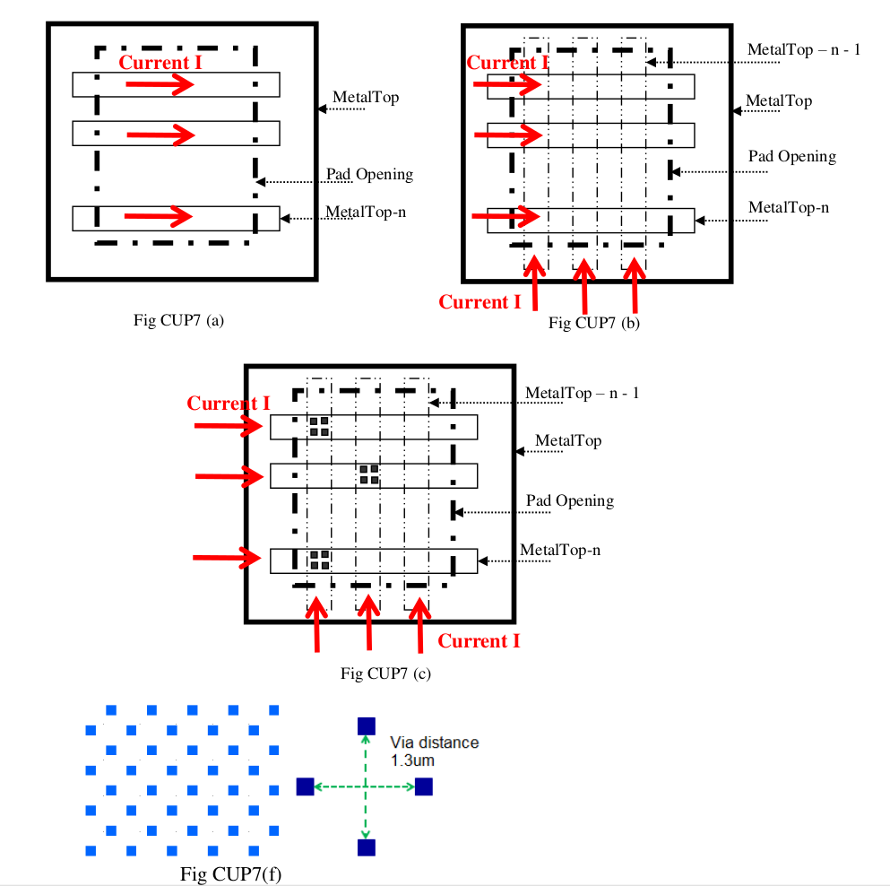

9.3 Circuit-Under-Pad (CUP) Rules
=================================

Active circuits are allowed when ball-type wire-bonding process is used and when bumping/flip chip technology is used. No circuit under pad is allowed when wedge-type wire-bonding process is used. The following additional rules apply to designs when active circuits are used under the pad.

.. note::

    It is strongly recommended to optimize the bonding parameters (bond force, time and power) when using CUP for the first time in the design. Bonding parameters used for pads with no circuits underneath the pad may not necessarily be optimized for CUP application. After performing a design of experiments with bonding parameters, wire-pull and ball-shear tests should be performed to ensure mechanical stability of CUP
    bond pads (no lift-off or cratering of balls for optimized bonding parameters). Cross section of pad area should be taken to make sure that there is no crack underneath the bond pad. By following the design rules described in this section, robust CUP designs can be achieved but because bonding parameters may differ from one
    assembly house to the other, some optimization may be necessary for CUP bond pads when used for the first time.

.. csv-table:: CUP Rules
    :file: tables_clear/30_CUP_73.csv
    :widths: 100, 800, 250, 250
    :align: center

.. note::
    \* :ref:`Rules not coded`

.. note::

   1. This rule cannot be checked by DRC deck; this is just a guideline to the layout engineer to take care.

   2. Top_Via-1: is the one level lower via than top most via, for 6 layer metal product, Top_Via-1 is Via4, for 4Layer metal product, Top_Via-1 is Via2.

