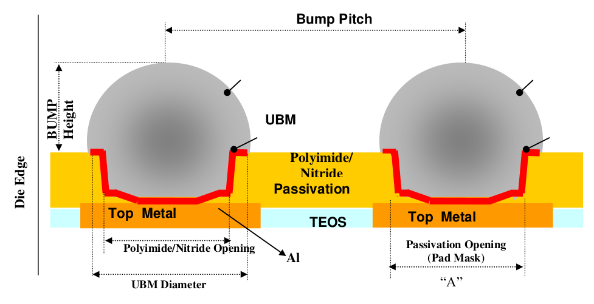

9.4.1 Bump Design guidelines
============================================

There are two types of final passivation schemes for solder bumping. One is solder bump with Nitride passivation and the other is solder bump with polyimide passivation. Standard under bump metallurgy (UBM) structure is shown in Figure 1.0.

    Figure 1.0 Typical bump structure and terminology

