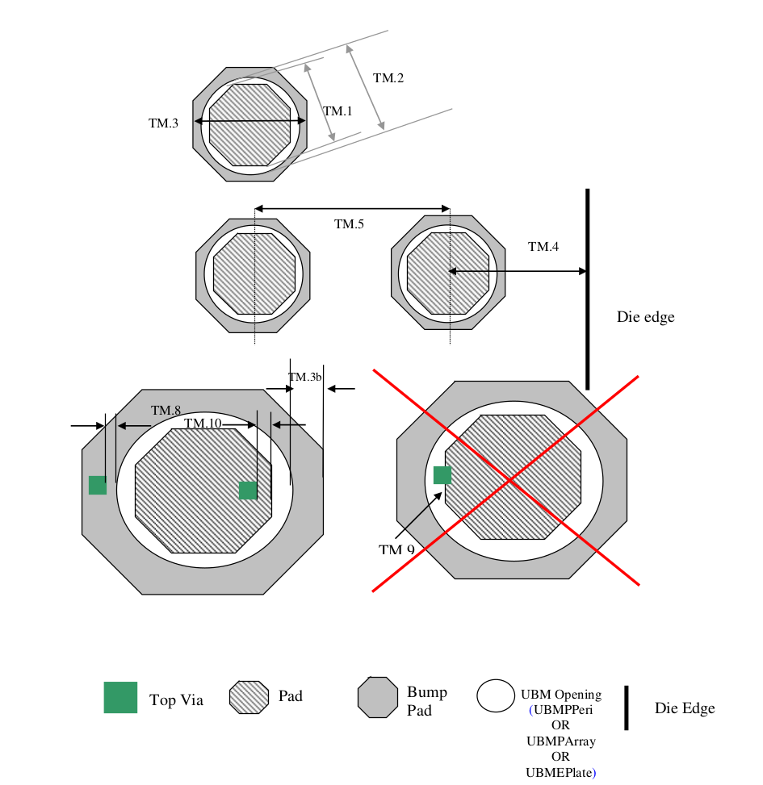

9.4.3 Solder Bump Pad design guidelines
============================================

This section contains the bumping design guidelines for flip chip applications

**Top Metal (Al)**

.. csv-table:: Top Metal (Al)
    :file: tables_clear/31_Top_Metal_76.csv
    :widths: 100, 700, 100
    :align: center

.. note::

    \* Use tolerance of 0.2um for DRC check.

