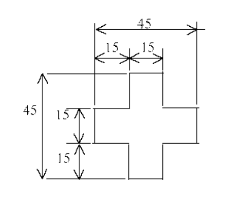

9.4.4 Alignment Mark for bumping process
============================================

Following diagram shows the alignment mark to be drawn in top metal for the flip chip process. For exact location and size conformation respective assembly house shall be consulted.

