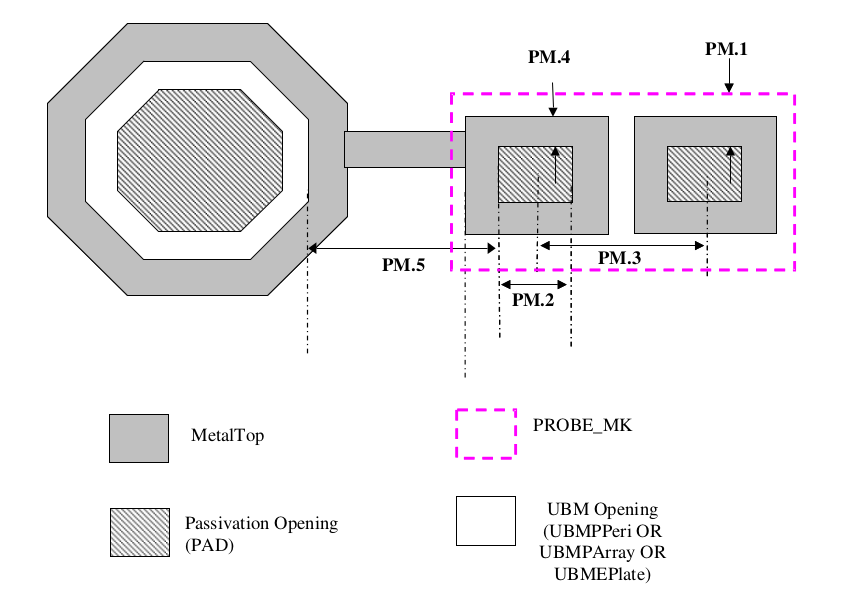

9.4.5 Probe pad design guidelines
============================================

Probe pad are the wafer level test pads, which does not require solder bump on it for the packaging. Following are the design guidelines for test probe pad used together with solder bump pad. Probe pads are identified by the PAD layers covered by PROBE_MK layers.

.. csv-table:: Probe pad
    :file: tables_clear/32_Probe_pad_79.csv
    :widths: 100, 700, 100
    :align: center

1. This value is subject to respective wafer sort house rule.

