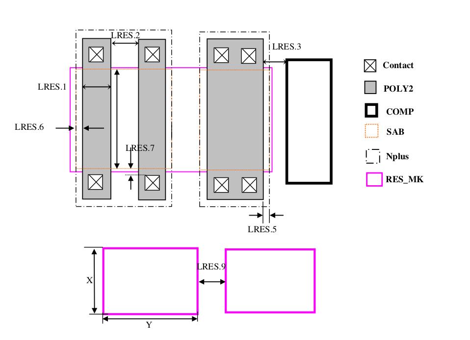

10.2 N+ Poly Resistor (Low SHEET RHO)
=====================================

This section defines the rules for Un-salicide N+ poly resistors. This uses N+ source drain implant to realize N+ poly resistor and does not require any additional processing step if SAB layer is present in the process. Here resistor width is determined by Poly2 width and the resistor length is determined by SAB layer.

.. csv-table:: LRES
    :file: tables_clear/33_ANALOG_DEVICE2_82.csv
    :widths: 100, 700, 100
    :align: center

.. note::
    \* :ref:`Rules not coded`

