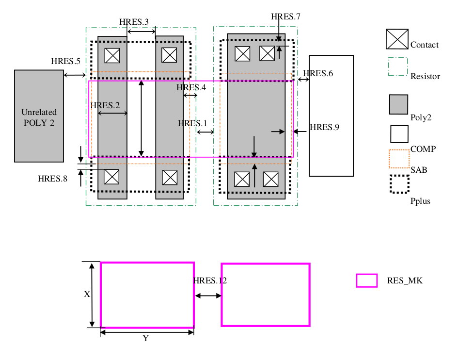

10.3 HRES Poly Resistor (PHRES) (Optional with one additional mask)
===================================================================

This section defines the rules for Un-salicide P-type high sheet resistance poly resistor. This uses one additional mask (L63) to have special implant on high Rs poly resistors. Here resistor width is determined by Poly2 width and the resistor length is determined by Pplus to Pplus space on Poly2. In order to realize this resistor “Resistor” layer must be drawn covering the Poly2.

.. csv-table:: HRES
    :file: tables_clear/33_ANALOG_DEVICE3_84.csv
    :widths: 100, 700, 100
    :align: center

.. note::
    \* :ref:`Rules not coded`

