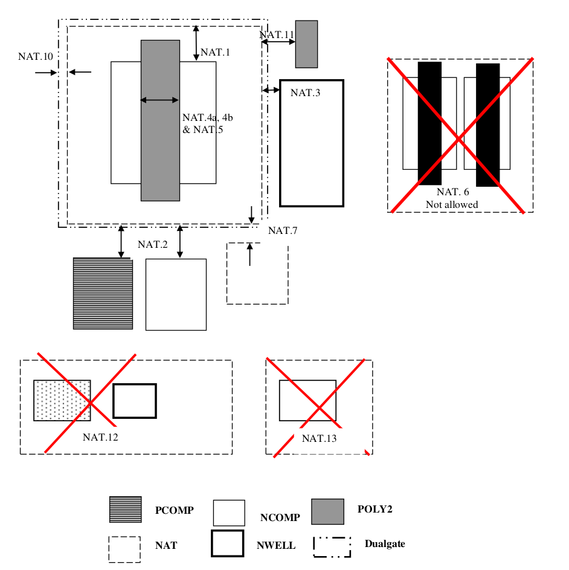

10.5 Native Vt NMOS (Optional)
==============================

This section describes Native NMOS rules. This process supports 3.3V and 5V/6V native Vt NMOS. The difference between 3.3V and 5V/6V native Vt transistor is that the 5V/6V native Vt NMOS need Dualgate layer.

Native Vt NMOS is recognized by NCOMP outside NWELL, interact with Poly2 and NAT.

.. csv-table:: Native Vt NMOS
    :file: tables_clear/36_Native_Vt_NMOS_90.csv
    :widths: 100, 800, 100
    :align: center

