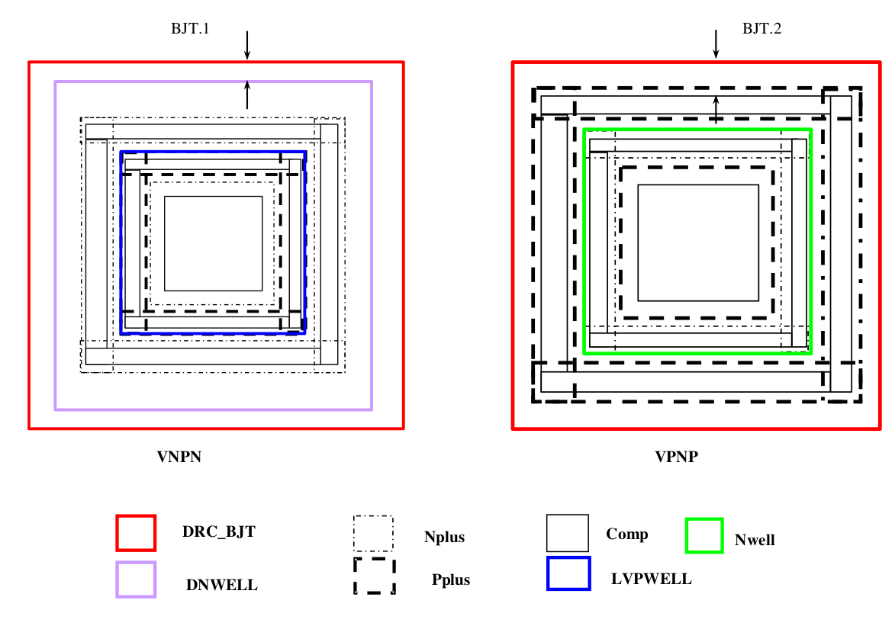

10.7 DRC_BJT Mark Layer
=======================

This layer is used to mark vertical NPN and PNP transistors to avoid design rule violation.

.. csv-table:: DRC_BJT
    :file: tables_clear/38_DRC_BJT_103.csv
    :widths: 100, 500, 100
    :align: center

