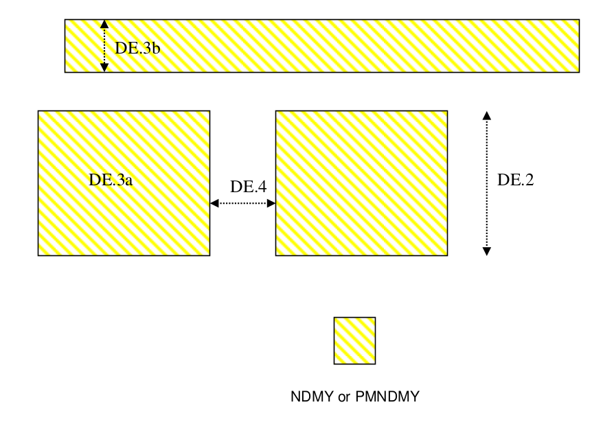

10.8 Design Rules for Dummy Exclude layers (NDMY and PMNDMY)
============================================================

This section describes the design rules for drawing dummy exclude layers “NDMY” for excluding “Dummy COMP” and “PMNDMY” for excluding “Dummy Poly” and “Dummy metal” in that area. There shall be intended minimal use of NDMY layer in active transistor areas so as to provide better STI process margins and active transistor performance.

.. csv-table:: Dummy Exclude layers
    :file: tables_clear/39_Dummy_layers_104.csv
    :widths: 100, 800, 100
    :align: center

.. note::
    \* :ref:`Rules not coded`

