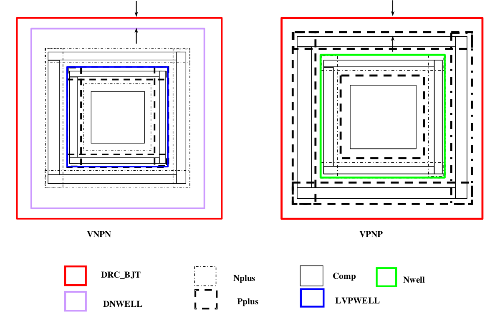

10.9 LVS_BJT Mark Layer
=======================

This layer is used in LVS tool to identify Emitter, Base, and Collector of NPN and PNP transistor.

.. csv-table:: LVS_BJT
    :file: tables_clear/40_LVS_BJT_105.csv
    :widths: 100, 800, 100
    :align: center

