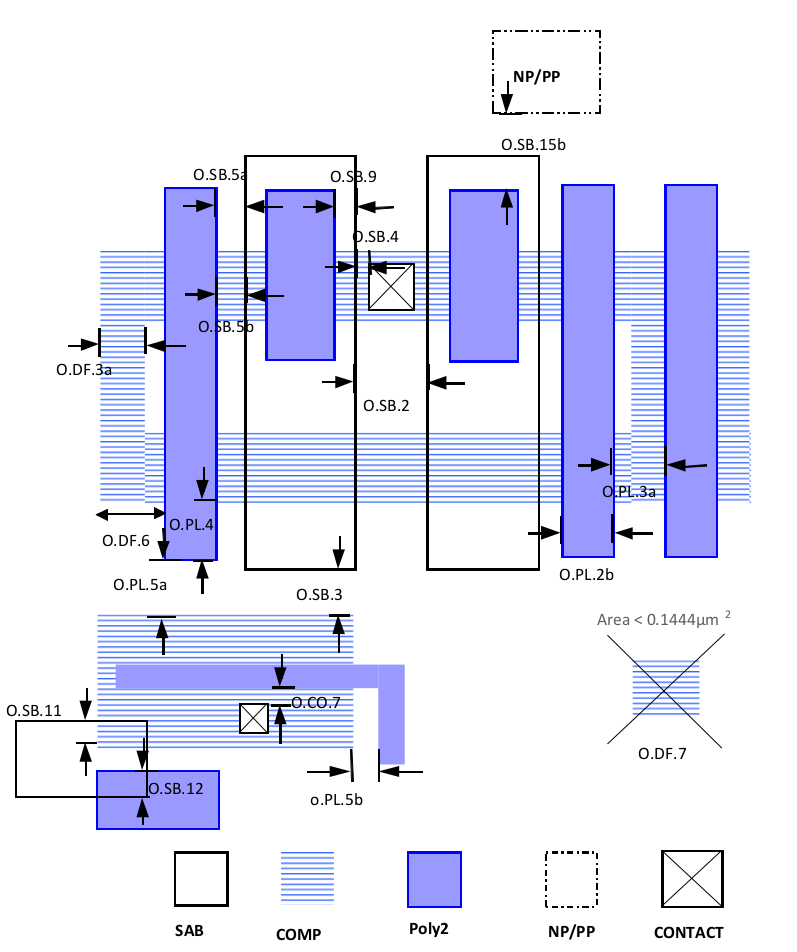
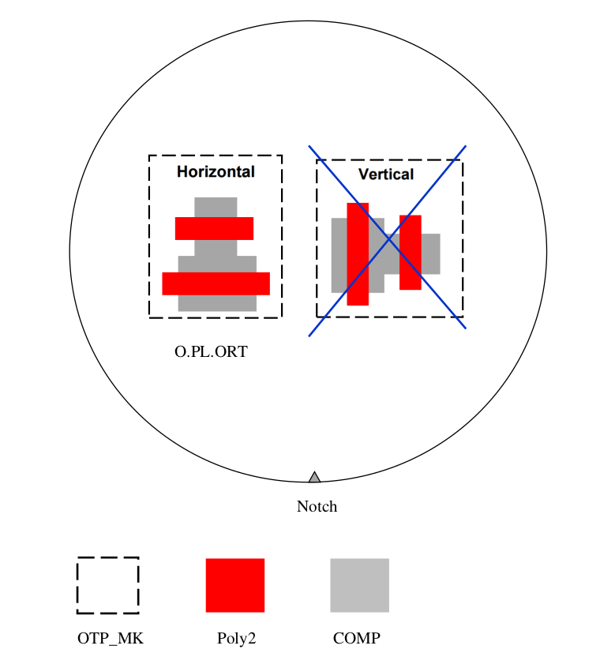

10.10 OTP_MK Mark Layer
=======================

This layer is used to mark 3.3V OTP cells. OTP cells with this marking layer should follow below specific rules which is different from 3.3V/(5V)6V rules.

.. csv-table:: OTP_MK
    :file: tables_clear/41_OTP_MK_Mark_106.csv
    :widths: 100, 800, 150, 150
    :align: center

.. note::
    \* Rules allowed minimum overlap and spacing are 0, so DRC deck will not check those rules
    1. Rule of 5V OTP is set by utilizing “V5_XTOR” and “OTP_MK” marking layer

