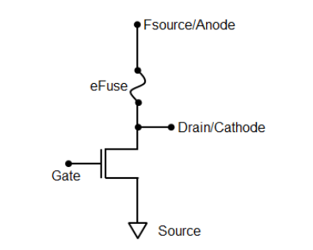
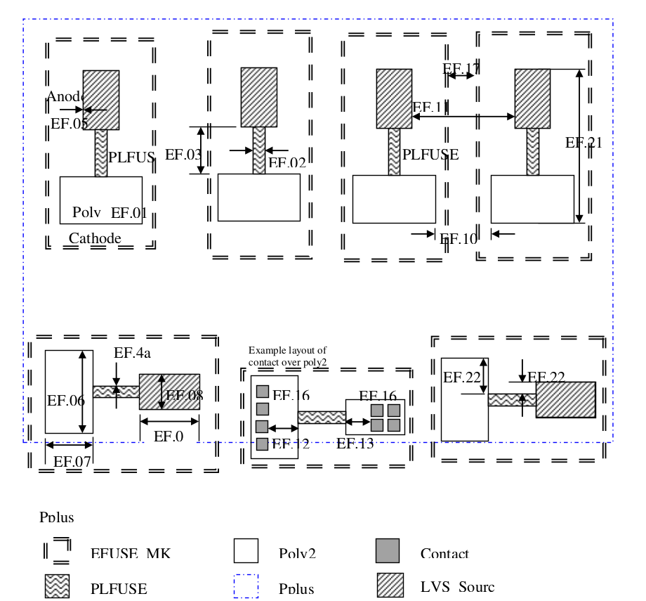

10.11 0.18um MCU eFuse Design Rules
===================================

This section describes the design rules for eFuse. Elements of eFuse are defined by PLFUSE layer (GDS# 125.5), LVS_Source layer (GDS# 100.8) and EFUSE_MK layer (GDS# 80.5), and definitions are as below:
   - Whole eFuse: (Poly2 interact with PLFUSE) inside EFuse_MK and Pplus

   - eFuse Link: (Poly2 and PLFUSE) inside EFUSE_MK

   - Anode: (Poly2 and LVS_Source) inside EFUSE_MK

   - Cathode: Poly2 inside EFUSE_MK not (LVS_Source or PLFUSE)

In normal application, eFuse Cathode is connected to program FET, program current flows from Anode to Cathode. After program, silicide migration happens and resistance will increase sharply.

.. csv-table:: 0.18um MCU eFuse
    :file: tables_clear/42_MCU_eFuse_110.csv
    :widths: 100, 700, 150
    :align: center

