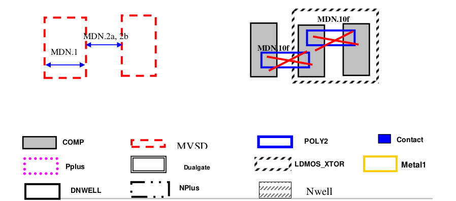
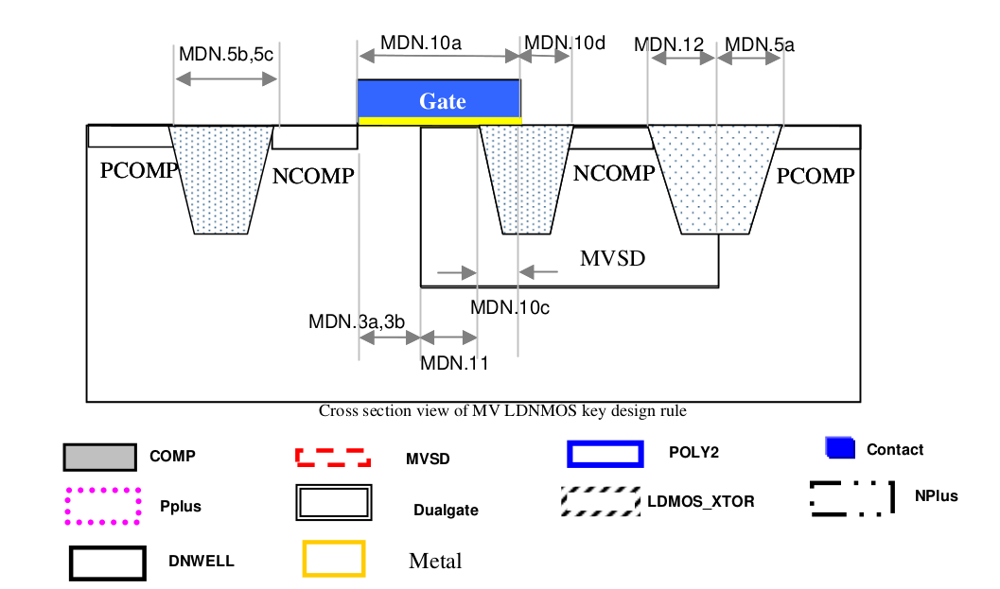
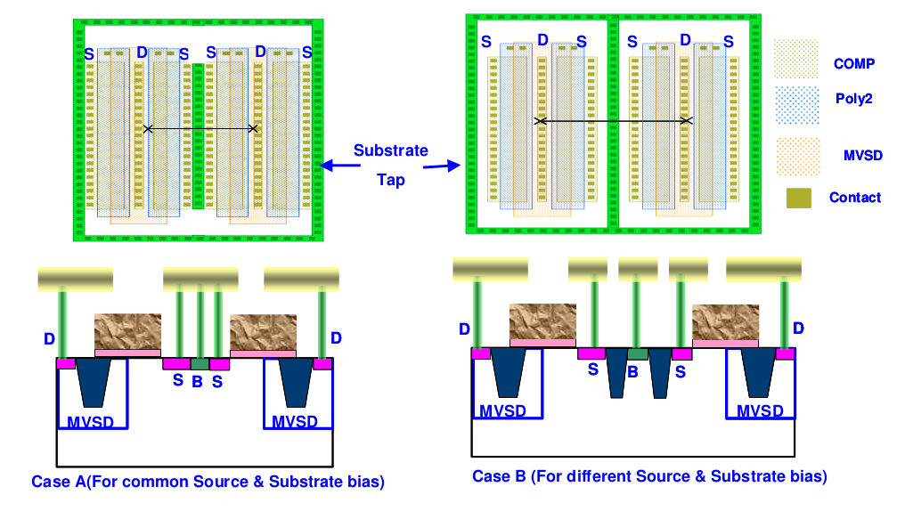
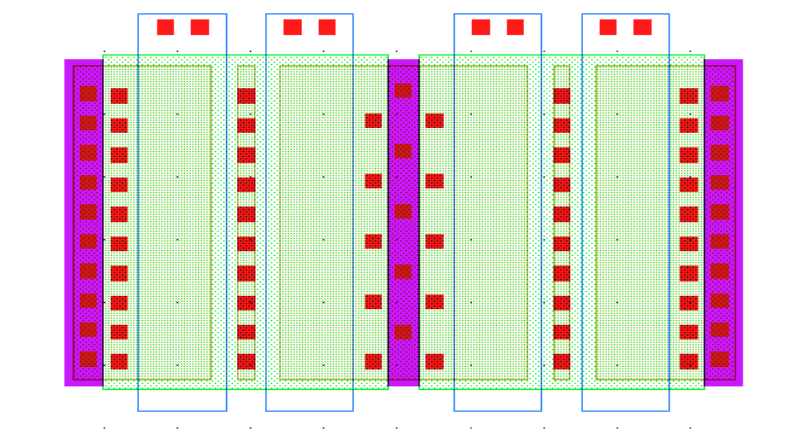
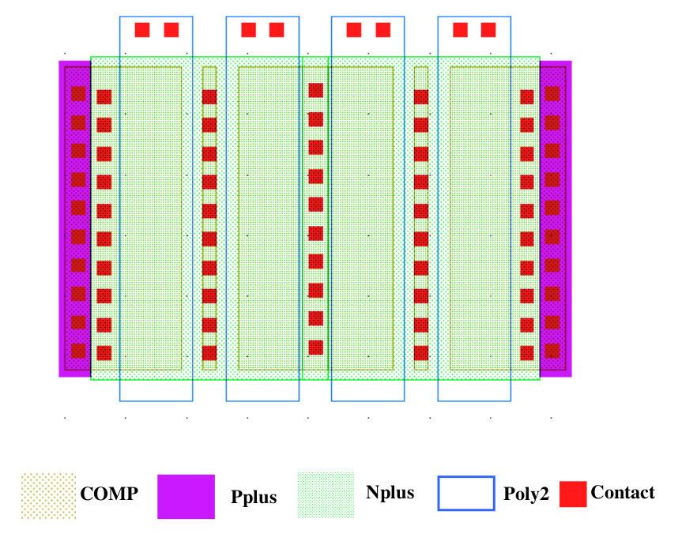

10.12.1 10V LDNMOS rules
==========================================

This is to define N type asymmetrical 10V LDMOS device (LDNMOS). Below is a summary table as how to identify the device. All this kind of device's well share the same potential with P-substrate.

.. csv-table:: High Voltage LDMOS
    :file: tables_clear/43_LDNMOS_112_1.csv
    :widths: 100, 800
    :align: center

.. csv-table:: LDMOS RULES
    :file: tables_clear/43_LDNMOS_112_2.csv
    :widths: 100, 800, 150
    :align: center

.. image:: images/LDMOS1.png
    :width: 600
    :align: center
    :alt: LDMOS

Rule MDN.13d when each LDNMOS transistor has full width butting to well tap

In below example, not every transistor has full width butting to well tap, it violate rule MDN.13d

