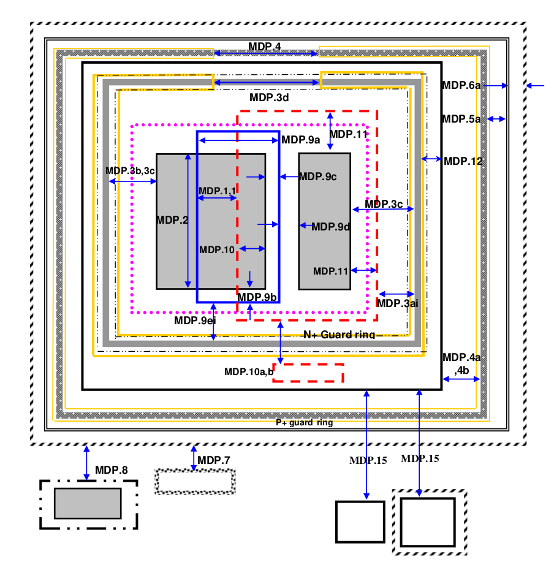
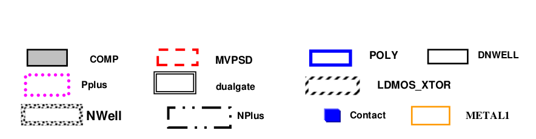
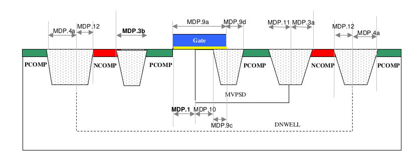
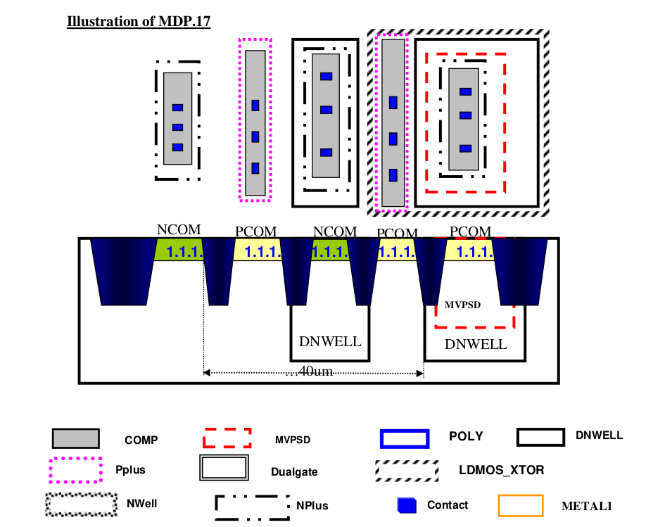

10.12.2 10V LDPMOS rules
==========================================

This is to define P type asymmetrical 10V LDMOS device (LDPMOS) Below is a summary table as how to identify the device.

.. csv-table:: LDPMOS
    :file: tables_clear/44_LDPMOS_117_1.csv
    :widths: 100, 800
    :align: center

.. csv-table:: LDPMOS rules
    :file: tables_clear/44_LDPMOS_117_2.csv
    :widths: 100, 800, 150
    :align: center

