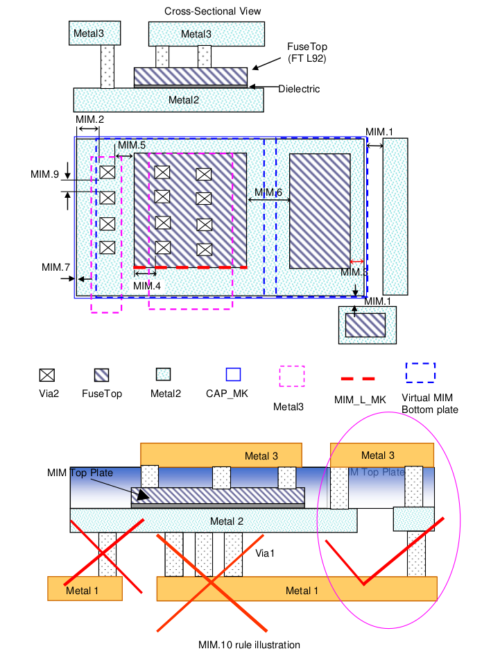

10.4.1 MIM Option A
====================

This section describes rules for MIM (Metal-insulator-Metal) capacitor. FuseTop layer defines the top plate of MIM capacitor and Metal2 layer defines MIM bottom plate. Area of the MIM is determined by FuseTop Layer.

.. csv-table:: MIM Option A
    :file: tables_clear/34_MIM1_86.csv
    :widths: 100, 700, 100
    :align: center

.. note::

   1. Checked by virtual MiM bottom plate which defines as: ((FuseTop@1.06) AND (Metal2 interact FuseTop))

    \* :ref:`Rules not coded`

