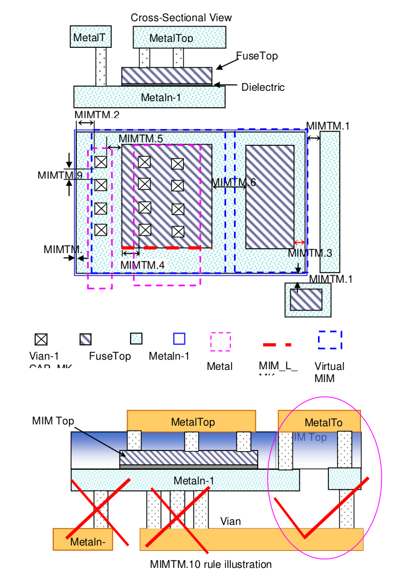

10.4.2 MIM Option B
======================

This section describes rules for MiM (Metal-insulator-Metal) capacitor if MIM capacitor needs to be placed between “Top metal” & “Top metal-1”. FuseTop layer still used to defines the top plate of MiM capacitor and Metaln-1 layer defines MiM bottom plate (n>2, n is the top metal number. i.e: for 4 metal layers process, Top Metal is Metal4, Metaln-1 means Metal3 and Vian-1 means Via3). FuseTop Layer determines area of the MIM.

.. note::

    This option-B only supports 4 or more metal layers process. (For the 3 metal layers process, please refer to option-A).
    Customer will be need to chose either Option-A or Option B MIM in the design kit, Option-A and Option-B MIM can not be used in the same process.

.. csv-table:: MIM Option B
    :file: tables_clear/35_MIM2_88.csv
    :widths: 100, 800, 100
    :align: center

.. note::

    1. Checked by virtual MiM bottom plate which defines as: ((FuseTop @1.06) AND (Metaln-1 interact FuseTop))
    2. These two MIM option (option-A and option-B) not allowed used on same process.

    \* :ref:`Rules not coded`

