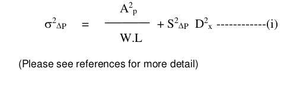
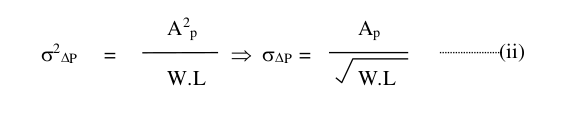

10.6 Match pair layout guidelines
=================================

Most of the analog circuits requires transistors, resistors and capacitors to be drawn as matched pair either 1:1 ratio matching (e.g in OP-Amp input stage) or 1:8 or 1:10 etc (e.g. in Band gap reference circuits).
Other functional blocks needing matched device layout are ADC, DAC, current mirrors and switched-cap filters etc. When such critical matching of the identical devices is required then it is very important to layout them in specific systematic way so as to minimize systematic mismatch in the devices.

Mismatch can be categorized into the following categories:

**(a) Systematic mismatch**

This is caused by the some of the following factors:

    (i)   Lithographic loading and proximity effects.

    (ii)  Pattern etching loading effects (due to difference in pattern density)

    (iii) Difference in layout (orientation, metal overlaps, etc)

    (iv)  Systematic mismatch of plasma damage effect when gates of two transistors are connected to different lengths of metal.

    (v)   Systematic mismatch of mechanical stress (e.g. STI stress, etc) in the vicinity of transistors.

    (vi)  Systematic mismatch of bias applied to neighboring devices affecting either one of the transistors in consideration.

    *This systematic mismatch is very much layout dependent. It is this systematic mismatch, which
    shall be minimized during the layout and these guidelines for the layout helps to minimize this
    systematic mismatch.*

**(b) Stochastic (Random intrinsic) device mismatch:**

This is random and intrinsic to the devices in a given process and is mainly due to:

    (i)   Channel Dopant fluctuations.

    (ii)  Local mobility fluctuations,

    (iii) Polysilicon gate granularity,

    (iv)  Oxide charges and interface states fluctuations.

    (v)   Random variation of transistor's channel length and widths

The mismatch of a device parameter “P” is caused by many single microscopical events of the given mismatch generating process.

where the first term represents the local random variation, and the second term represents systematic global variation, which depends upon the distance :math:`{D_X}`.
The parameters :math:`{A^2_P}` and :math:`{S^2_P}` are process-dependent constants. W and L are the effective width and length of the device and :math:`{\Delta P}` represents the matching performance (referred to the parameter P) of the given technology.

So the random intrinsic device mismatch standard deviation can be given as:

*This parameter “* :math:`{A_P}` *” is characterized for all devices in specific processes and presented in the respective device characterization reports. It is also then used in respective device mismatch models.*

The above equation (ii) also suggests that for random device mismatch it is better to have big length “L” and width “W” for the device to minimize mismatch standard deviation for a given process.

.. admonition:: **Important Notes:**

   - Layout engineers shall consult the circuit design engineer to identify which device pairs are critical for matching.
   - The layout engineers then shall follow these guidelines to draw matched pair to minimize systematic mismatch.
   - These are just guidelines for better matching of devices

.. toctree::
    :glob:

    drm_10_6_1
    drm_10_6_2
    drm_10_6_3

