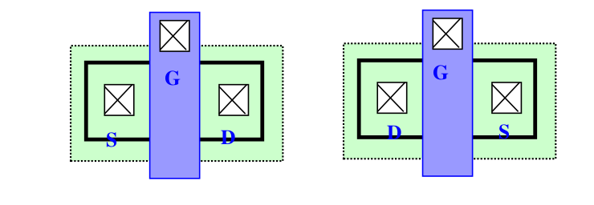
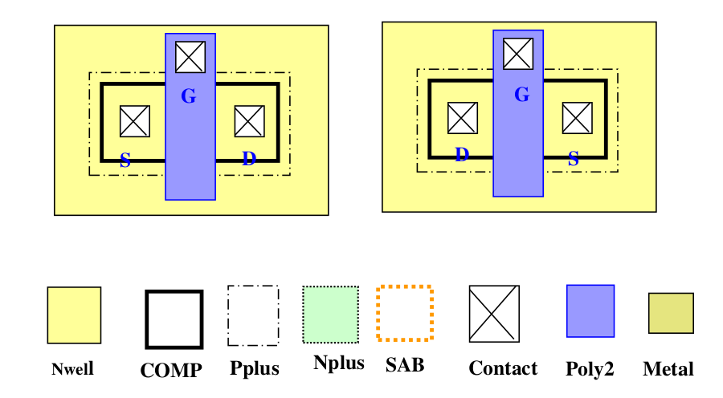
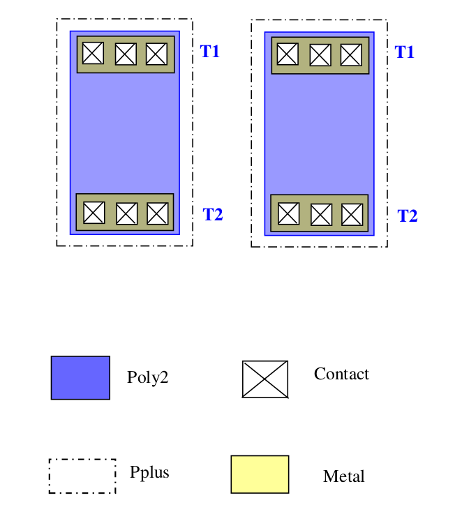

10.6.1 Devices required to be laid out as matched pair
============================================================

Most of the time, the following are the type of devices required to be drawn for a good matched pair

**(1) MOS Transistors**

(a) NMOS Matched pair: Two NMOS of same type (same operating voltage and process layers) required to be matched in electrical characteristics. (S: Source, D: Drain, G: Gate)

(b) PMOS Matched pair: Two PMOS of same type (same operating voltage and process layers) required to be matched in electrical characteristics. (S: Source, D: Drain, G: Gate)

**(2) BJT Transistors**

Two BJT transistors (NPNs or PNPs) of same type (same operating voltage and process layers) required to be matched in electrical characteristics: (E: Emitter, B: Base, C: Collector).

.. image:: images/bjt.png
    :width: 600
    :align: center
    :alt: BJT

**(3) Capacitors**

Two identical (same operating voltage and process layers) capacitor (e.g MIM Caps) required to be matched in electrical characteristics. (T1: Capacitor top plate terminal, T2: capacitor's bottom plate terminal).

.. image:: images/cap.png
    :width: 600
    :align: center
    :alt: Capacitors

**(4) Resistors**

Two identical (same operating voltage and process layers) resistors (e.g Poly resistors) required to be matched in electrical characteristics. (T1: resistors one terminal, T2: Resistor's other terminal).

