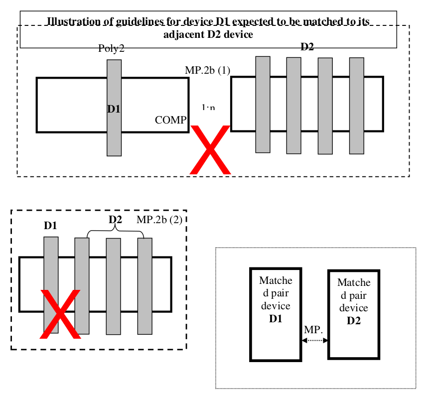
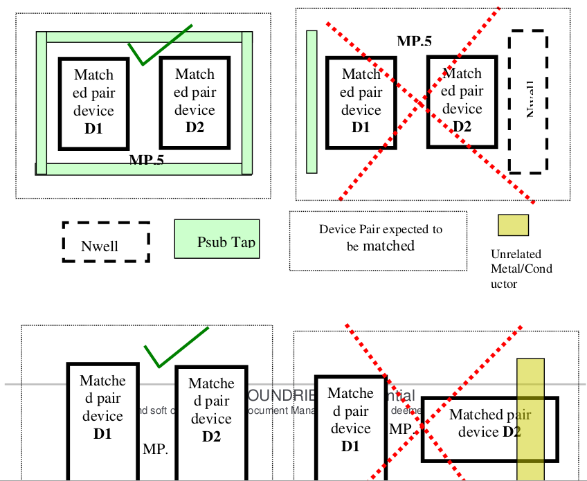
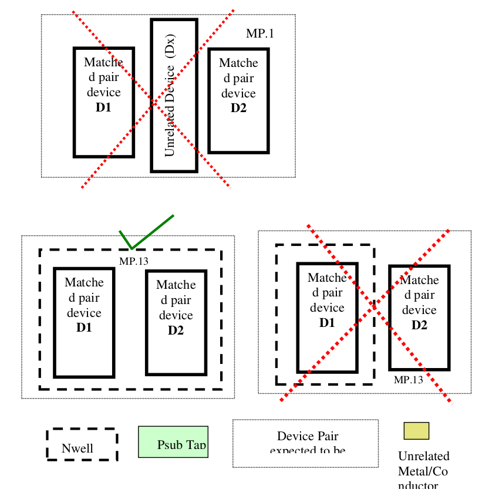

10.6.2 Matched pair layout guidelines
=======================================

.. csv-table:: Matched pair layout guidelines
    :file: tables_clear/37_Matched_pair_layout_guidelines_97.csv
    :widths: 100, 800, 100
    :align: center

.. note::
    10.6.2 Matched pair layout guidelines :ref:`Rules not coded`

