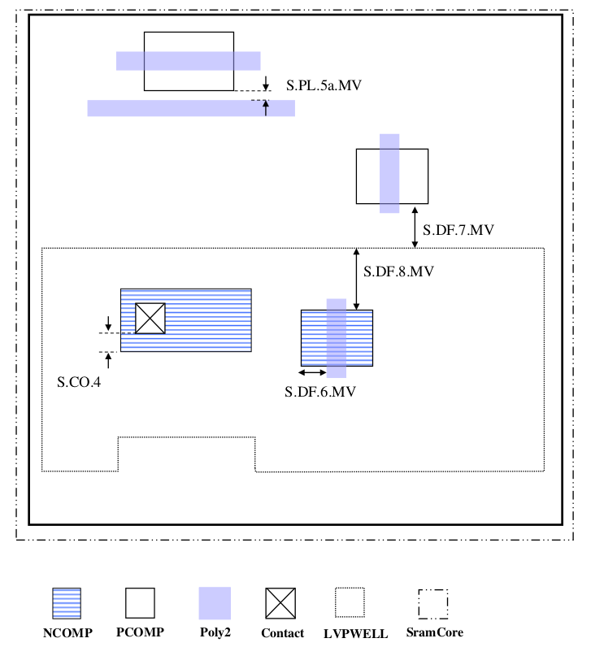

11.1 5V SRAM
============

SramCore layer is used to mark SRAM cells. 5V SRAM cells with marking layer V5_XTOR should follow below specific rules which is different from 3.3V/(5V)6V rules.

.. csv-table:: SRAM RULES
    :file: tables_clear/48_SRAM1_126.csv
    :widths: 100, 800, 150
    :align: center

Below Cell Description provides information about SRAM cell (1) and transistors.

.. csv-table::
    :file: tables_clear/48_SRAM2_126.csv
    :widths: 400, 250
    :align: center

1. SRMA devices are allowed to be inside or outside of DNWELL.

2. SRAM devices follow the logic 5V/6V SPICE models.

