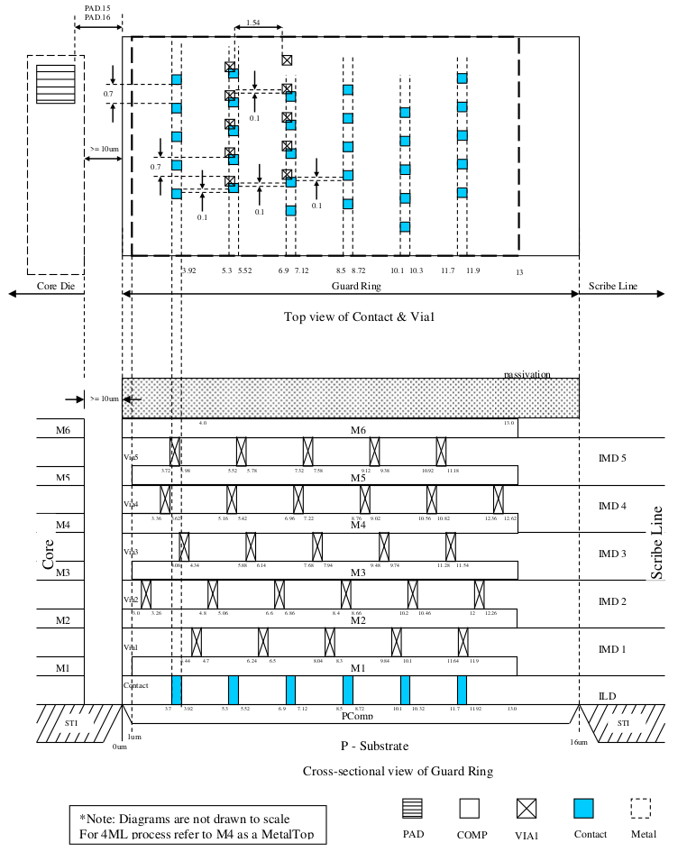
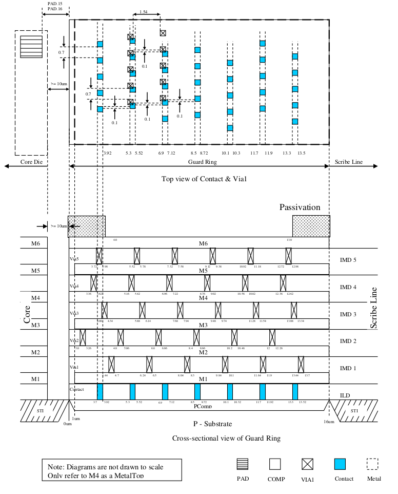

12.2 Six Metal Scribe Line Guard Ring Structure
===============================================

The contact and via rings should consist of the minimum size contacts/vias placed in staggered formation with separation of 0.7µm within each of the rings defined by the coordinates in the table below. X=0 defines the inner (die-side) edge of the guard ring structure.
The guardring structure has been divided into two groups based the packaging process difference. The guard ring in the product uses solders bumping flip-chip need to be protected from chemical attack during solder bumping process.

This diagram is a schematic describing scribe line guard ring layer for COMP, CONT, Via1 & Metal only. For detailed scribe line guard ring layout, please refer to following table.

.. csv-table::
    :file: tables_clear/49_scribeline_guardring1_131.csv
    :widths: 200, 150, 150 , 150
    :align: center

This diagram is a schematic describing scribe line guard ring layer for COMP, CONT, Via1 & Metal only. For detailed scribe line guard ring layout, please refer to following table.

.. csv-table::
    :file: tables_clear/49_scribeline_guardring2_133.csv
    :widths: 200, 150, 150 , 150
    :align: center

