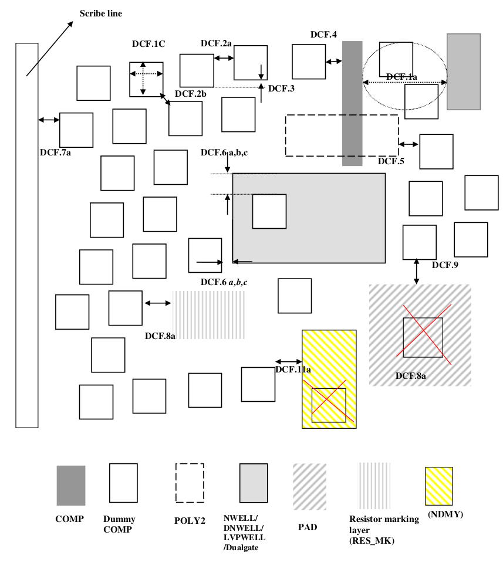
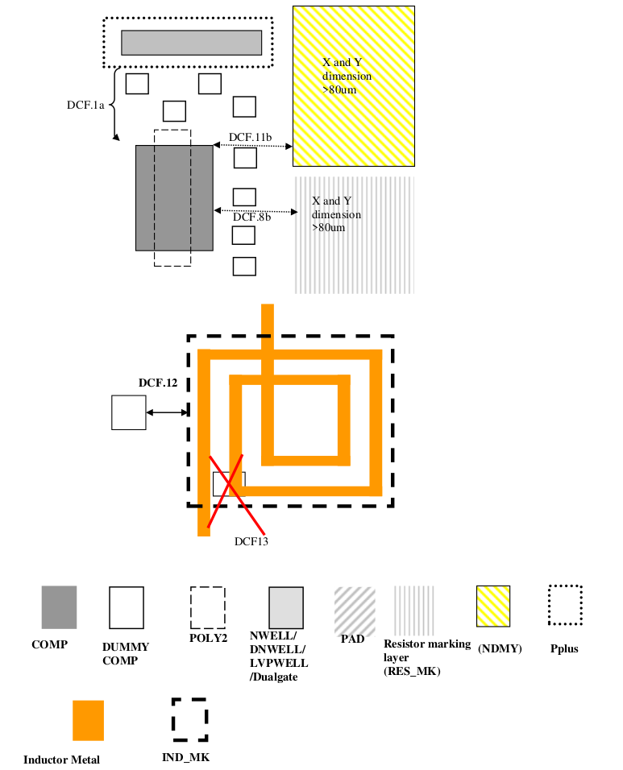
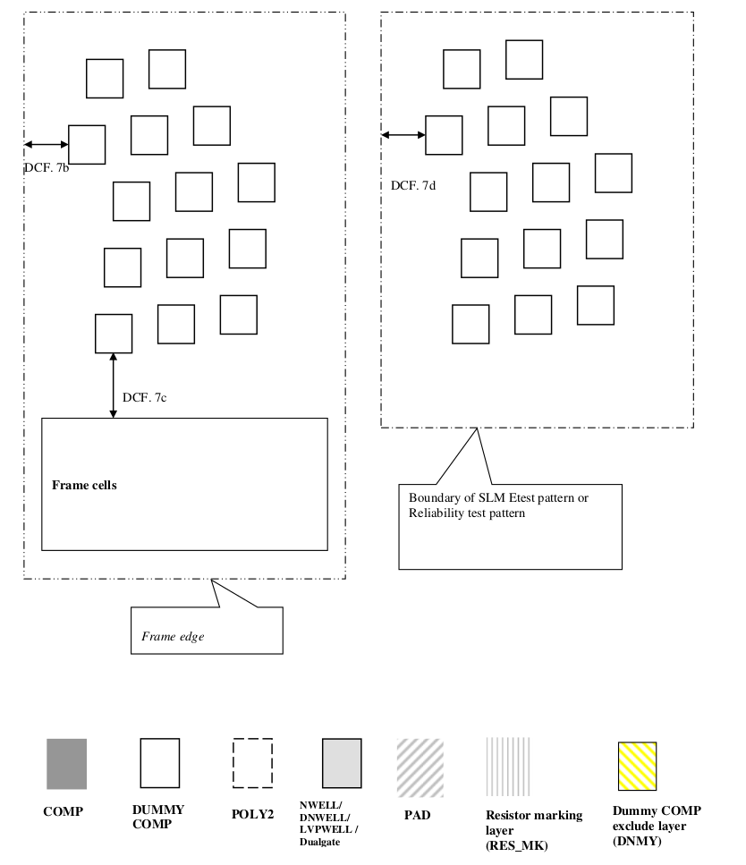

13.1 Design rules for Dummy COMP creation.
==========================================

Dummy COMP rules are required to enable planarization process for shallow trench isolation. Non-functional dummy COMP features are added in large open areas without active features. They are necessary around an isolated active device to minimize STI elevation difference in isolated and dense areas.

It is to be noted that “dummy COMP” shall be drawn in certain systematic way, however dummy features and spacing being much bigger than the lithography and etch capability, the rules are categorized in two category, one for the way of drawing and the other for the DRC (Design rule check) purpose. So, for DRC deck will have only rules marked as “for DRC check” as indicated in last column below. The rules indicated as “for DRC” would imply that they shall be taken care during drawing as well as checked the DRC there after.

.. csv-table:: Dummy COMP rules
    :file: tables_clear/51_Dummy_COMP_136.csv
    :widths: 200, 700, 150 , 250
    :align: center

.. note::

   1. The prime die, frame, SLM Etest patterns and SLM reliability test patterns will have the same dummy COMP generation algorithm.

   2. Use dummy COMP exclude layer for all non-ET patterns in the frame

   \* :ref:`Rules not coded`

