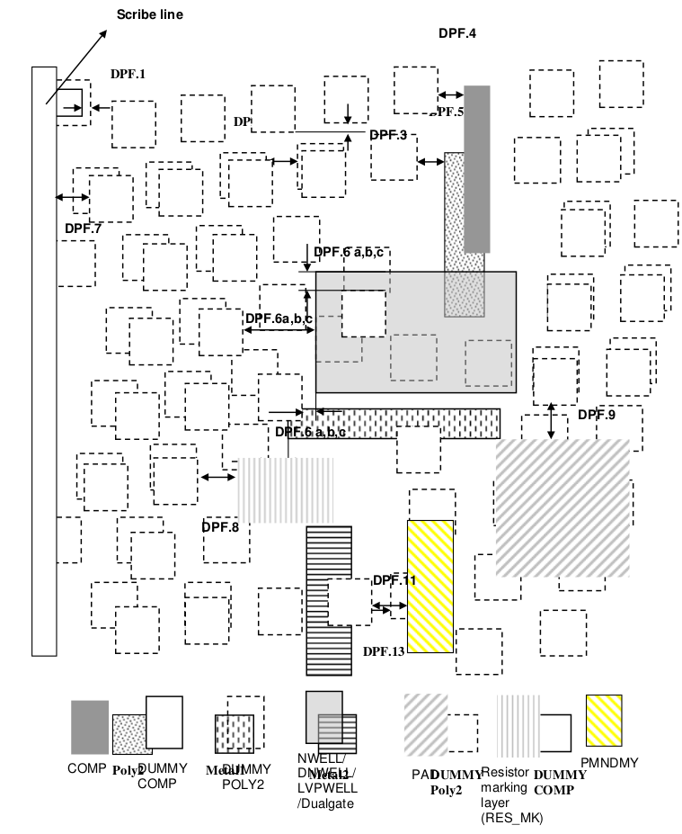
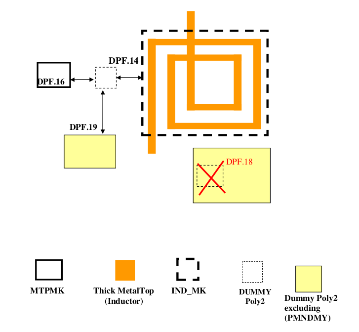

13.2 Design rules for Dummy Poly2 addition
==========================================

Dummy Poly2 Generation is recommended to customer prime die, which does not meet GlobalFoundries Specification for minimum poly2 GDS density (stated under Poly2 rules). Minimum poly2 density is required to ensure good process control of device channel length across chip. No dummy poly2 generation is required for prime die that meets poly2 density specification. Non-functional dummy poly2 features are added over dummy COMP feature with constrains described by the rules below.

This dummy poly2 generation shall be applied, if poly2 total pattern density is less than 14%. It shall be preferably placed at most empty space.

.. csv-table:: Dummy Poly2 rules
    :file: tables_clear/52_Dummy_Poly2_141.csv
    :widths: 200, 700, 150 , 250
    :align: center

.. note::

   1. Dummy Poly2 is only generated in the prime die.

   2. DPF.12 and DPF.13 do not apply to dummy metal fill.

   \* :ref:`Rules not coded`

