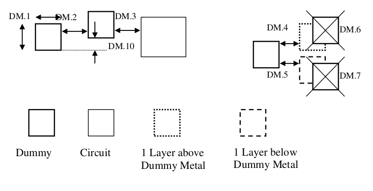

13.3 Design rules for Dummy Metal addition
==========================================

For good metal etch process margin, a minimum metal density is recommended for Metaln and MetalTop. Device (circuit) layouts that does not meet minimum pattern density rule (stated in the metal design rules) shall be added in the dummy metal patterns. Dummy metals are added to improve the overall metal density so as to reduce the potential dishing issue due to CMP also.

**Generation method:**

1) Check the metal density in an area of 200um by 200um at a step of 100um.

2) Add dummy metal if total die metal density is less than 30%

3) Dummy metal size: 2.0um x 2.0 um; space is 1.2um

4) Please follow the following table when generating the Dummy metals:

.. csv-table:: Dummy Metal rules
    :file: tables_clear/53_Dummy_Metal_145.csv
    :widths: 200, 700, 150
    :align: center

.. note::
    \* :ref:`Rules not coded`

