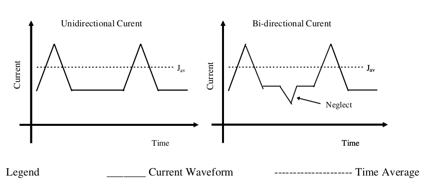

14.2 Electro-migration
======================

The following rules are set with the aim to meet or exceed electro-migration life time of :math:`{T_{0.1}}` > 100K Hours at 85 deg C junction temperature for all metal layers, including via and contacts (both COMP & POLY2 contacts).

**Definition of terms:**

:math:`{T_{0.1}}` is defined as the time to 0.1% cumulative failures, under log-normal distribution

14.2.1 Current
..............

Unidirectional current is defined as the steady value of direct current or the time average value of current always pulsed in the same direction.

Bi-directional current is defined as the value of the current when averaged over one direction with the higher peak current (Ip maximum). The lower peak in the opposite direction is neglected.

.. csv-table:: Maximum Line Current Density per Drawn Width
    :file: tables_clear/54_Electro-migration1_150.csv
    :widths: 400, 200, 200, 200
    :align: center

.. csv-table:: Maximum Line Current Density per Drawn Width
    :file: tables_clear/54_Electro-migration2_151.csv
    :widths: 400, 200, 200, 200
    :align: center

14.2.2 Temperature
..................

The maximum allowable current densities at any other temperatures below 110 deg C with the same reliability can be determined using the following formula:

.. math::
    I = I_0  [e^{Ea/k(1/T-1/T_0)} ]^{1/n}

Where
   - I = current density at absolute temperature T (K)

   - :math:`{I_0}` = current density specified at 110 deg C

   - :math:`{T_0}` = 110 deg C

   - k = Boltzmann's Constant, 8.62x10-5 eV/K

   - Ea= Activation Energy (an assumed value of 0.7eV, based on previous experience is used. Determination of actual Ea will be carried out).

   - n = Current density exponent (an assumed value n=2 based on previous experience is used. Determination of actual n will be carried out).

