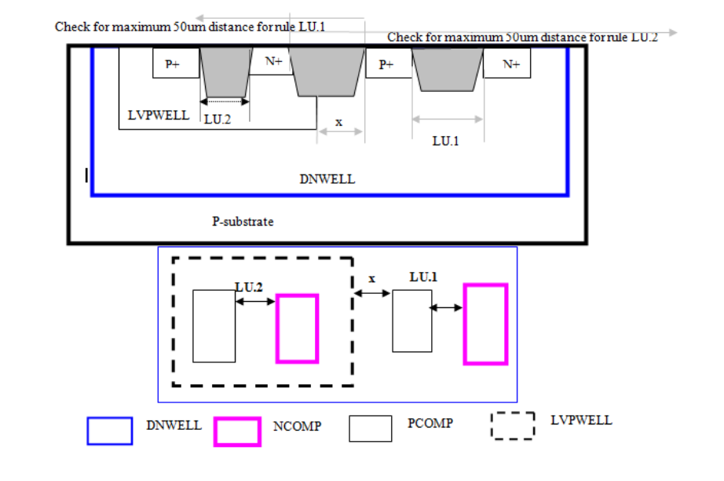
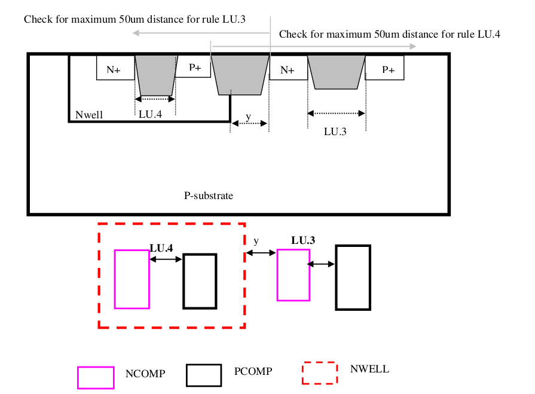

14.3.1 Core Latch-up Rules and Guidelines
===============================================

Critical design guidelines related to latch-up are N-well overlap of PCOMP, external NCOMP to Nwell spacing and Nwell to Psub tap distances.

.. csv-table:: Latch-up Rules
    :file: tables_clear/55_Latch-up_152.csv
    :widths: 200, 800, 200, 200, 300
    :align: center

.. note::
    \* :ref:`Rules not coded`

