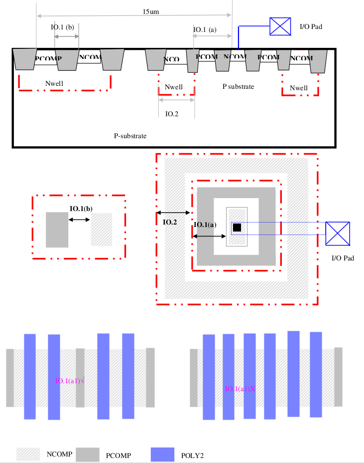
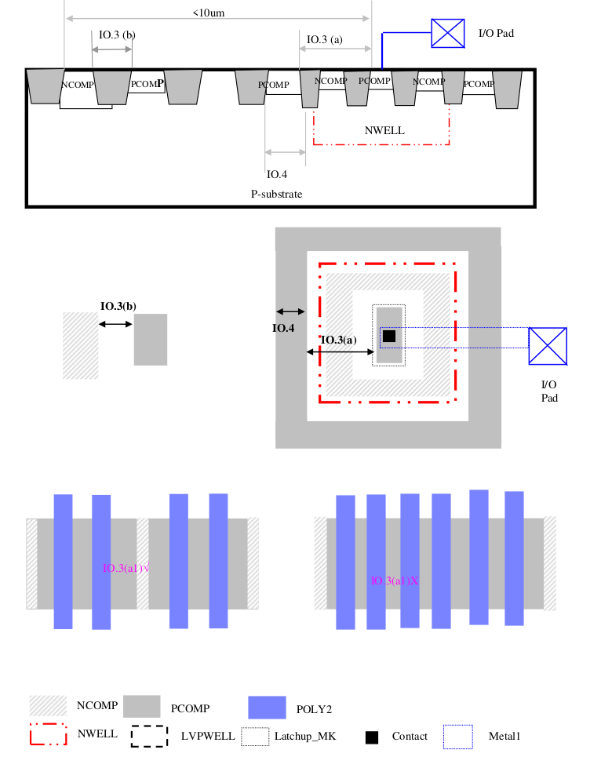

14.3.2 I/O Latch-up Related Rules and Guidelines
====================================================

I/O regions are more susceptible to latch-up because of over voltage (P+ COMP potential exceeding Vdd) and under voltage (N+ COMP potential below Ground) conditions that may occur there. The most latch-up-prone areas are around the diffusions directly connected to a pad driving an off-chip load. The following design guidelines will help prevent latch-up in I/O area.

Use marking layer “Latchup_MK” coinciding with the boundary of the diffusion directly connected to the I/O pad and other diffusions which designer want to applied I/O rules for robust latchup immunity. Examples of such diffusions are:

(a) diodes that can be potentially forward biased, such as ESD diodes;

(b) Nodes that experience significant over voltage with respect to Vdd or under voltage with respect to Vss.

Those pads connected to well tap are considered as power source or ground, which will not be considered as I/O pad. This deck will also auto trace and check the I/O Latchup rule for those Non-well tap diffusion connected to the I/O pad.

.. csv-table:: I/O Latch-up Related Rules
    :file: tables_clear/56_IO_Latch-up1_156.csv
    :widths: 200, 800, 200, 200, 300
    :align: center

.. csv-table::
    :file: tables_clear/56_IO_Latch-up2_158.csv
    :widths: 200, 800, 200, 200, 300
    :align: center

