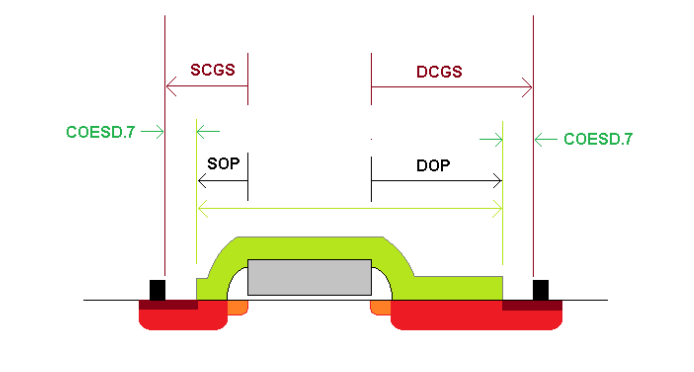
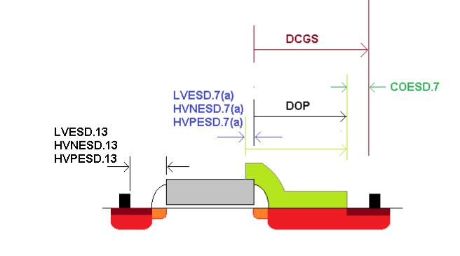

14.4 ESD Layout Guidelines
==========================

The design and layout guidelines provided in this section are intended as a baseline guide for whole-chip ESD design and implementation. In order to achieve robust whole-chip ESD protection, all possible current paths, both intentional and parasitic paths, that is likely to conduct the ESD current during
an ESD event must be evaluated at design phase.

It is important that the ESD current path provided by the ESD protection device is the lowest resistance path, away from the node being protected. Guard rings must be used around ESD device, and ESD devices should be placed as far as possible from the core.

This section describes high-current behavior of three types of ESD protection devices, grounded gate nMOS, grounded gate PMOS and diodes, implemented and characterized in 0.18 um 3.3V/(5V)6V process. Design rules are based on data taken from Transmission Line Pulse (TLP) technique which applies a series of increasing amplitude rectangular pulses of 100 ns width and 10 ns rise time, to the device under test.

Although there exist a common industry-wide acceptance of the TLP technique and the quasi-static device IV obtained from this technique, it is not un-common to see drastic deviations from the TLP based ESD robustness prediction and actual Human Body Model ESD qualification levels achieved. The deviation from waveform shape, and especially effects such as dV/dt, device turn-off during HBM decay time, etc., results in TLP to HBM miscorrelations.

**Definition of Terms:**

MOSFET device has a parasitic bipolar device (formed by drain/body/source terminals) that can be triggered during an ESD event. Characterization of this parasitic lateral bipolar is very important for evaluating the ESD robustness. Under ESD conditions, this parasitic bipolar is triggered when voltage across the MOSFET (Vds) reaches trigger voltage, **Vt1**.

At this point, MOSFET enters into a negative differential resistance region until the voltage reaches **Vsp**, commonly known as snapback holding voltage. There are two commonly used interpretation of the holding voltage:

**Vsp**-the actual measured lowest voltage at the lowest current level after the parasitic device turns-on (Vt1), see figure below.

**Vh**-the lowest possible voltage as determined by an extrapolation of the linear region of the device IV characteristics after the device is turned on, see figure below.

.. image:: images/esd_guide.png
    :width: 600
    :align: center
    :alt: ESD Layout Guidelines

The key difference between these two definitions is that for devices turning-on at higher voltage, Vsp (as determined from the TLP IV curve) is likely to be overestimated due to the TLP tester load-line limitation.

Accurate determination of the lowest voltage across the device after the device is turned-on is critical to ensure that device do not enter latch-up conditions (assuming that current level at Vsp is less than latch-up current requirements).

Beyond Vh or Vsp, the parasitic bipolar is fully turned-on and voltage across transistor gradually increases as current is increased until at some voltage **Vt2** (known as second breakdown voltage) and current It2 (known as second breakdown current), MOSFET goes into thermal runaway and suffers permanent damage due to ESD event. The slope of the TLP IV curve beyond Vsp decreases with effective device width, while it increases with increasing silicide-blocking distance and un-optimized interconnect. To determine ESD performance, Vt1, Vsp, Vt2 and It2 are measured and Ron and Vh are extracted. It2 is, in general, a measurement of ESD robustness of transistor. However, equal importance should be give to Vt2, as this voltage will appear at the protected node, such that this voltage is always lower than the max allowed voltage at that node.

To survive the triggering of parasitic bipolar and stable conductance through parasitic bipolar, salicid block resistance is needed at least at the Drain junction. The option on how the salicided resistor embedded to the MOSFET can be done with different options. In this technology node, the supported salicidation options are as follows

**• Fully gate non-salicidation**

**• Partial gate salicidation**

.. toctree::
    :glob:

    drm_14_4_1
    drm_14_4_2
    drm_14_4_3
    drm_14_4_4
    drm_14_4_5

