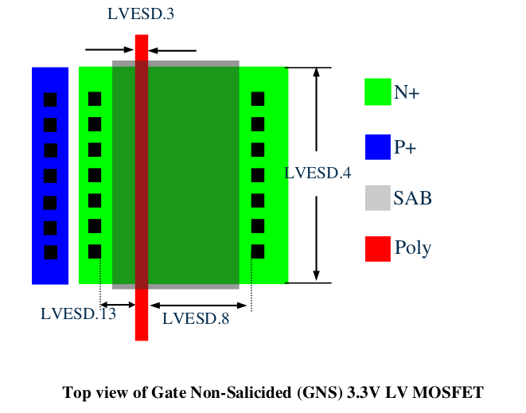

14.4.1 Design Guidelines for 3.3V LV SAB MOSFET Device
===============================================================

When using LV MOSFET (NMOS/PMOS) for ESD protection devices, it shall be marked by ESD_MK mark layer. The following layout guidelines are recommended.

.. csv-table:: 3.3V LV SAB MOSFET Device Rules
    :file: tables_clear/57_LV_SAB_MOSFET_163.csv
    :widths: 300, 800, 200
    :align: center

.. note::

    \* :ref:`Rules not coded`

    \*\* Recommended rules , default OFF.

