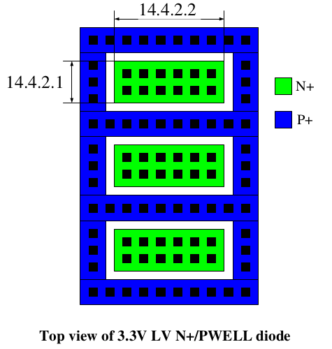
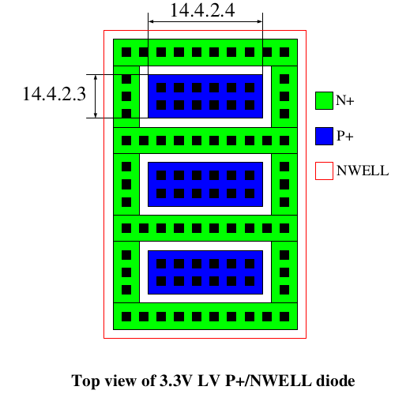
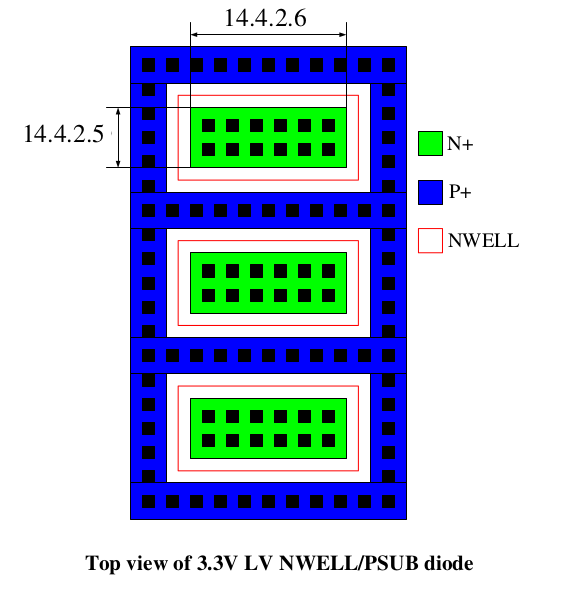

14.4.2 Design Guidelines for 3.3V LV Diode
============================================

The following design guidelines are recommended for 3.3V LV N+/PWELL diode for good ESD protection.

14.4.2.1 Minimum cathode junction width (DL) is 0.36 um. Recommended two rows of contact in the cathode side

14.4.2.2 Recommended maximum cathode finger width (DW) is 40um.

The following design guidelines are recommended for 3.3V LV P+/NWELL diode for good ESD protection.

14.4.2.3  Minimum anode junction width (DL) is 0.36 um. Recommended two rows of contact in the cathode side.

14.4.2.4  Recommended maximum anode finger width (DW) is 40um.

The following design guidelines are recommended for 3.3V LV NWELL/PSUB diode for good ESD protection.

14.4.2.5  Minimum anode junction width (DL) is 1.19 um.

14.4.2.6  Recommended maximum anode finger width (DW) is 40um.

