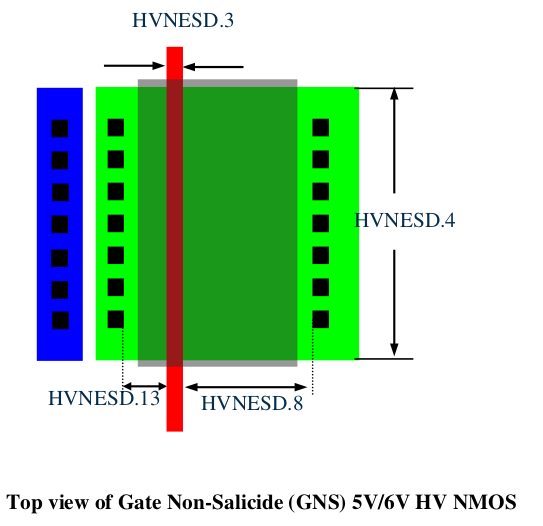

14.4.3 Design Guidelines for 5V/6V HV SAB NMOS Device
======================================================

When using HV NMOSFET for ESD protection devices, it shall be marked by ESD_MK mark layer. The following layout guidelines are recommended.

.. csv-table:: 5V/6V HV SAB NMOS Device Rules
    :file: tables_clear/58_HV_SAB_MOSFET_168.csv
    :widths: 300, 800, 200
    :align: center

.. note::

    \* :ref:`Rules not coded`

    \*\* Recommended rules , default OFF.

