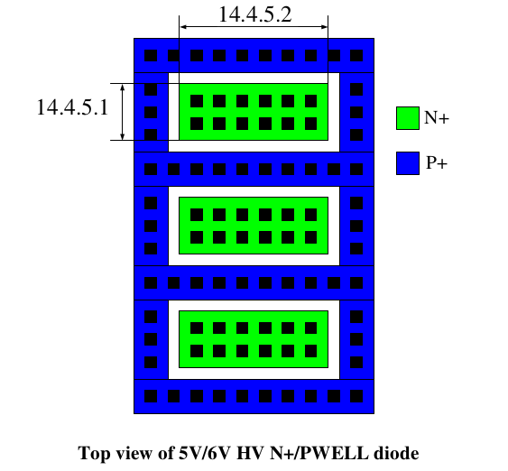
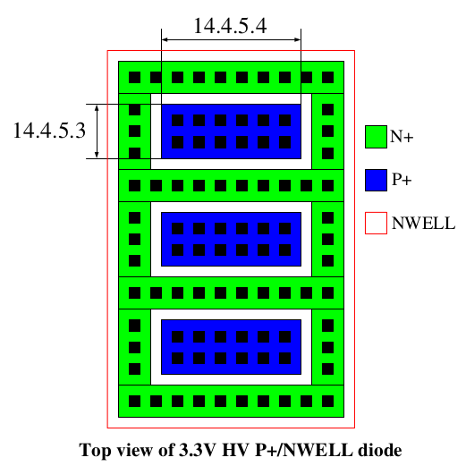

14.4.5 Design Guidelines for 5V/6V HV Diode
============================================

The following design guidelines are recommended for 5V/6V HV N+/PWELL diode for good ESD protection.

14.4.5.1  Minimum cathode junction width (DL) is 0.9 um.

14.4.5.2  Recommended maximum cathode finger width (DW) is 25um.

The following design guidelines are recommended for 5V/6V HV P+/NWELL diode for good ESD protection.

14.4.5.3  Minimum anode junction width (DL) is 0.9 um.

14.4.5.4  Recommended maximum anode finger width (DW) is 25um.

